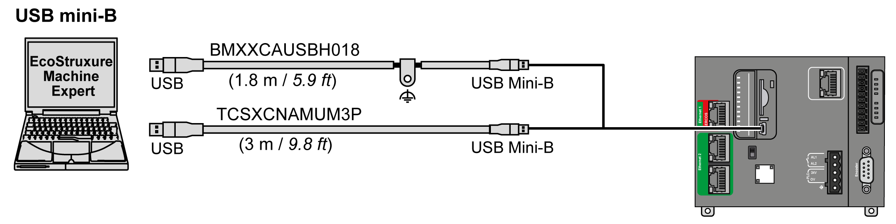
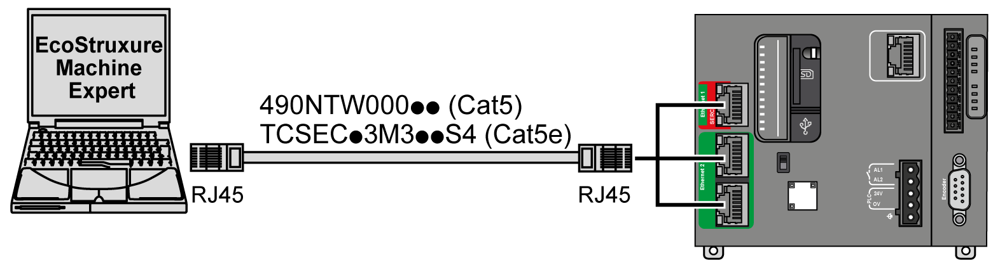

# Connecting the Controller to a PC

## Overview

To transfer, run, and monitor the applications, you can use either a USB cable or an Ethernet connection to connect the controller to a computer with EcoStruxure Machine Expert installed.

| NOTICE | |
| --- | --- |
|  | INOPERABLE EQUIPMENT  Always connect the communication cable to the PC before connecting it to the controller.  Failure to follow these instructions can result in equipment damage. |

## USB Mini-B Port Connection

| Cable Reference | Details |
| --- | --- |
| BMXXCAUSBH018 | Grounded and shielded, this USB cable is suitable for long duration connections. |
| TCSXCNAMUM3P | This USB cable is suitable for short duration connections such as quick updates or retrieving data values. |

NOTE: You can only connect 1 controller or any other device associated with EcoStruxure Machine Expert and its component to the PC at any one time.

The USB Mini-B Port is the programming port you can use to connect a PC with a USB host port using EcoStruxure Machine Expert software. Using a typical USB cable, this connection is suitable for quick updates of the program or short duration connections to perform maintenance and inspect data values. It is not suitable for long-term connections such as commissioning or monitoring without the use of specially adapted cables to help minimize electromagnetic interference.

| WARNING | |
| --- | --- |
|  | UNINTENDED EQUIPMENT OPERATION OR INOPERABLE EQUIPMENT  * You must use a shielded USB cable such as a BMX XCAUSBH0•• secured to the functional ground (FE) of the system for any long-term connection. * Do not connect more than one controller or bus coupler at a time using USB connections. * Do not use the USB port(s), if so equipped, unless the location is known to be non-hazardous.  Failure to follow these instructions can result in death, serious injury, or equipment damage. |

The communication cable should be connected to the PC first to minimize the possibility of electrostatic discharge affecting the controller.

To connect the USB cable to your controller, follow the steps below:

| Step | Action |
| --- | --- |
| 1 | **1a**. If making a long-term connection using the cable BMXXCAUSBH018, or other cable with a ground shield connection, be sure to securely connect the shield connector to the functional ground (FE) or protective ground (PE) of your system before connecting the cable to your controller and your PC.  **1b**. If making a short-term connection using the cable TCSXCNAMUM3P or other non-grounded USB cable, proceed to step 2. |
| 2 | Connect your USB cable to the computer. |
| 3 | Open the protective cover for the USB mini-B slot on the controller. |
| 4 | Connect the mini-B connector of your USB cable to the controller. |

## Ethernet Port Connection

You can also connect the controller to a PC using an Ethernet cable.

To connect the controller to the PC, do the following:

| Step | Action |
| --- | --- |
| 1 | Connect the Ethernet cable to the PC. |
| 2 | Connect the Ethernet cable to any of the Ethernet ports on the controller. |

EIO0000003651.14