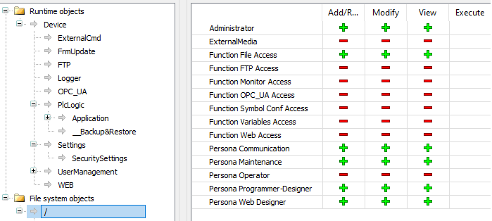

# Updating the Controller Firmware by Controller Assistant

## Before Updating Firmware

Performing a firmware update deletes the application program in the controller, including the configuration files, the user management, the user rights and the Boot Application in non-volatile memory. The certificates are not deleted.

| NOTICE | |
| --- | --- |
|  | LOSS OF APPLICATION DATA  * Perform a backup of the application program to the hard disk of the PC before attempting a firmware update. * Restore the application program to the device after a successful firmware update.  Failure to follow these instructions can result in equipment damage. |

If you remove power to the device, or there is a power outage or communication interruption during the transfer of the application, your device may become inoperative. If a communication interruption or a power outage occurs, reattempt the transfer. If there is a power outage or communication interruption during a firmware update, or if an invalid firmware is used, your device will become inoperative. In this case, use a valid firmware and reattempt the firmware update.

| NOTICE | |
| --- | --- |
|  | INOPERABLE EQUIPMENT  * Do not interrupt the transfer of the application program or a firmware change once the transfer has begun. * Re-initiate the transfer if the transfer is interrupted for any reason. * Do not attempt to place the device into service until the file transfer has completed successfully.  Failure to follow these instructions can result in equipment damage. |

The serial line ports of your controller are configured for the CoDeSys protocol by default when new or when you update the controller firmware. The CoDeSys protocol is incompatible with that of other protocols such as Modbus Serial Line. Connecting a new controller to, or updating the firmware of a controller connected to, an active Modbus configured serial line can cause the other devices on the serial line to stop communicating. Make sure that the controller is not connected to an active Modbus serial line network before first downloading a valid application having the concerned port or ports properly configured for the intended protocol.

| NOTICE | |
| --- | --- |
|  | INTERRUPTION OF SERIAL LINE COMMUNICATIONS  Be sure that your application has the serial line ports properly configured for Modbus before physically connecting the controller to an operational Modbus Serial Line network.  Failure to follow these instructions can result in equipment damage. |

## User Rights for Firmware Update

To update the firmware by Controller Assistant, you must be part of a user group which has access rights to the File system objects > / folder.

In the example below:

* User groups with + symbols have access rights. Users in these groups can update firmware.
* User groups with - symbols do not have access rights. Users in these groups cannot update firmware.

By default:

* Persona Communication, Persona Maintenance, Persona Programmer-Designer and Persona Web Designer groups have access rights.
* Persona Operator group does not have access rights.

For more information, refer to [User Rights](../../../../../api/crossBook?lang=en-US&virtualBookName=D-SE-0095294.html) and [Access Rights](../../SoMProg&topicID=D_SE_0083877).

## Updating Firmware

You have two ways to update the firmware by the Controller Assistant:

* Using an SD card
* Writing on the controller

To execute a complete firmware update of a controller, using an SD card, replacing the Boot application and data, in offline mode, proceed as follows:

| Step | Action | |
| --- | --- | --- |
| 1 | Insert an empty SD card into the PC. | |
| 2 | Click Tools > External Tools > Open controller Assistant. | |
| 3 | On the Home dialog box, click the Update firmware.... button.  **Result**: The Update firmware (step 1 from 4) dialog box is displayed. | |
| 4 | Select the Controller type and the Controller firmware version. | |
| 5 | Click the Next button.  **Result**: The Update firmware (step 2 from 4) dialog box is displayed. | |
| 6 | If needed, change the Communication settings and click the Next button.  **Result**: The Update firmware (step 3 from 4) dialog box is displayed. | |
| 7 | Click the Write to... button.  **Result**: The Update firmware (step 4 from 4) dialog box is displayed. | |
| 8 | Select your SD card in Disk drive and click the Write button.  At the end of the writing, the Home dialog box is displayed. | |

To execute a complete firmware update of a controller, replacing the Boot application and data, writing on the controller in online mode, proceed as follows:

| Step | Action | |
| --- | --- | --- |
| 1 | Click Tools > External Tools > Open controller Assistant. | |
| 2 | On the Home dialog box, click the Update firmware.... button.  **Result**: The Update firmware (step 1 from 4) dialog box is displayed. | |
| 3 | Select the Controller type and the Controller firmware version. | |
| 4 | Click the Next button.  **Result**: The Update firmware (step 2 from 4) dialog box is displayed. | |
| 5 | If needed, change the Communication settings and click the Next button.  **Result**: The Update firmware (step 3 from 4) dialog box is displayed. | |
| 6 | Click the Write on controller... button.  **Result**: The Update firmware (step 4 from 4) dialog box is displayed. | |
| 7 | Select the Controller and click the Connect button.  **Result:** The controller is in `STOPPED` state.  At the end of the writing, the Home dialog box is displayed. A message is displayed to indicate that you must reboot the controller. | |

EIO0000003651.14