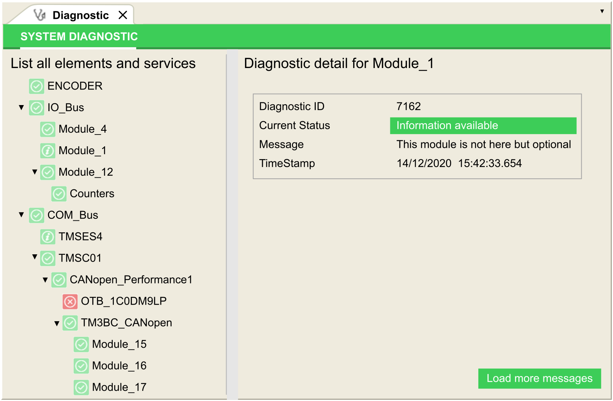

# System Diagnostic

## Presentation

The Diagnostic function displays diagnostic details as messages for the configured elements and services.

## System Diagnostic View

To open the diagnostic view, double click Diagnostic in the Devices tree:

EIO0000003651.14