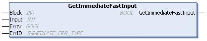

# GetImmediateFastInput: Read Input of an Embedded Expert I/O

## Function Description

This function returns the value of the input, which may be different from the logical value of that input. The value is read directly from the hardware at function call time. Only I0 to I3 can be accessed through this function.

## Library and Namespace

Library name: **SE\_PLCSystem**

Namespace: **SEC**

## Graphical Representation

## IL and ST Representation

To see the general representation in IL or ST language, refer to the chapter [*Function and Function Block Representation*](D-SE-0002384.html#D-SE-0002384).

## I/O Variable Description

The following table describes the input variables:

| Input | Type | Comment |
| --- | --- | --- |
| Block | INT | Not used. |
| Input | INT | Input Index to read from 0...3. |

The following table describes the output variable:

| Output | Type | Comment |
| --- | --- | --- |
| GetImmediateFastInput | BOOL | Value of the input <Input> – FALSE/TRUE. |

The following table describes the input/output variables:

| Input/Output | Type | Comment |
| --- | --- | --- |
| Error | BOOL | FALSE= operation is successful.  TRUE= operation error, the function returns an invalid value. |
| ErrID | [IMMEDIATE\_ERR\_TYPE](D-SE-0032193.html#D-SE-0032193) | Operation error code when Error is TRUE. |

EIO0000003667.09