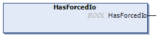

# HasForcedIo: Indicate if an Input or an Output is Forced

## Function Description

This function returns TRUE if an input or an output is forced.

## Graphical Representation



## IL and ST Representation

To see the general representation in IL or ST language, refer to the chapter [*Function and Function Block Representation*](D-SE-0002384_1.html#D-SE-0002384).

## I/O Variable Description

The table describes the output variable:

| Output | Type | Comment |
| --- | --- | --- |
| HasForcedIo | BOOL | TRUE if an input or an output is forced. |

## Example

The following example describes how to use this function:

```
VAR
	hasIo: BOOL;
END_VAR
```

```
hasIo := SEC.HasForcedIo();
```

EIO0000003667.09