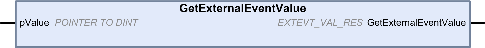

# GetExternalEventValue: Get Current Value of an External Event

## Function Description

Use this function to get the value associated with an external event task.

NOTE: The function must be called from within an external event task.

## Graphical Representation

## IL and ST Representation

To see the general representation in IL or ST language, refer to the chapter [*Function and Function Block Representation*](D-SE-0002384.html#D-SE-0002384).

## I/O Variables Description

This table describes the input variables:

| Inputs | Type | Comment |
| --- | --- | --- |
| pValue | POINTER TO DINT | Address of the variable where the value is copied if the function returns EXTEVT\_VAL\_OK. |

This table describes the output variables:

| Outputs | Type | Comment |
| --- | --- | --- |
| GetExternalEventValue | EXTEVT\_VAL\_RES | Returns one of the following values:   * EXTEVT\_VAL\_OK: Valid value * EXTEVT\_VAL\_FAILED: Unable to obtain value * EXTEVT\_VAL\_NOT\_IN\_EXT\_EVT\_TASK: Function was not called from within an external event task * EXTEVT\_VAL\_NOT\_AVAILABLE: No value available for this external task |

EIO0000003667.09