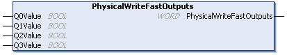

# PhysicalWriteFastOutputs: Write Fast Output of an Embedded Expert I/O

## Function Description

This function writes a state to the Q0 to Q3 outputs at function call time.

## Library and Namespace

Library name: **SE\_PLCSystem**

Namespace: **SEC**

## Graphical Representation

## IL and ST Representation

To see the general representation in IL or ST language, refer to the chapter [*Function and Function Block Representation*](D-SE-0002384.html#D-SE-0002384).

## I/O Variable Description

The following table describes the input variables:

| Input | Type | Comment |
| --- | --- | --- |
| Q0Value | BOOL | Requested value for the output 0. |
| Q1Value | BOOL | Requested value for the output 1. |
| Q2Value | BOOL | Requested value for the output 2. |
| Q3Value | BOOL | Requested value for the output 3. |

The following table describes the output variable:

| Output | Type | Comment |
| --- | --- | --- |
| PhysicalWriteFastOutputs | WORD | Output value of the function. |

NOTE: Only the first 4 bits of the output value are significant and used as a bit field to indicate if the output is written.

* If the bit corresponding to the output is 1, the output is written successfully.
* If the bit corresponding to the output is 0, the output is not written because it is already used by an expert function.
* If the bit corresponding to the output is 1111 bin, all of the 4 outputs are written correctly.
* If the bit corresponding to the output is 1110 bin, Q0 is not written because it is used by an alarm output.

NOTE: Values are applied at the beginning and end of a processing cycle. The function is applying a value within the cycle.

NOTE: If a variable is mapped to more than one of the embedded outputs, the last one of them (ordered from Q0 to Q3) sets the value to the variable at the end of the execution of the function block.

EIO0000003667.09