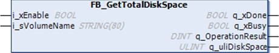

# FB\_GetTotalDiskSpace: Gets the Size of Memory Medium

## Function Block Description

This function block retrieves the amount of free memory space of a memory medium (user disk, system disk, SD card) in bytes.

The size of a remote device cannot be accessed. If a remote device is specified as parameter, then the function returns "-1".

## Library and Namespace

Library name: **PLCSystemBase**

Namespace: ****PLCSystemBase****

## Graphical Representation

## IL and ST Representation

To see the general representation in IL or ST language, refer to the chapter [*Function and Function Block Representation*](D-SE-0002384.html#D-SE-0002384).

## I/O Variable Description

This table describes the input variables:

| Input | Data type | Description |
| --- | --- | --- |
| i\_xEnable | BOOL | Activation entry, executes the operation when the value is `TRUE`. |
| i\_sVolumeName | STRING[80] | Name of the device whose memory size must be accessed:  * System disk: `'/sys'` * User disk: `'/usr'` * SD Card: `'/sd0'` |

This table describes the output variables:

| Output | Data type | Description |
| --- | --- | --- |
| q\_xDone | BOOL | Set to `TRUE` when function block ended. |
| q\_xBusy | BOOL | Set to `TRUE` when function block has been started and is still executing. |
| q\_OperationResult | DINT | Result of the operation, a non zero value indicates an error. |
| q\_uliDiskSpace | ULINT | Memory space in bytes. |

EIO0000003667.09