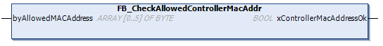

# FB\_CheckAllowedControllerMacAddr: Check If MAC Address Allowed by Controller

## Function Block Description

This function block checks whether a specified MAC address is within the range of MAC addresses allowed for the controller. The application only continues executing if the MAC address matches. Otherwise, the application stops and the controller goes to the HALT state and the system variable [i\_wLastApplicationError](D-SE-0004809.html#D-SE-0004809__D-SE-0004809.2) is updated appropriately.

## Library and Namespace

Library name: **PLCSystemBase**

Namespace: ****PLCSystemBase****

## Graphical Representation

## IL and ST Representation

To see the general representation in IL or ST language, refer to the chapter [*Function and Function Block Representation*](D-SE-0002384.html#D-SE-0002384).

## I/O Variable Description

The following table describes the input variables:

| Input | Type | Comment |
| --- | --- | --- |
| byAllowedMacAddress | ARRAY[0...5] OF BYTE | MAC address to check`[aa.bb.cc.dd.ee.ff]`:   * i\_byMACAddress[0] = aa * ... * i\_byMACAddress[5] = ff |

The following table describes the output variables:

| Output | Type | Comment |
| --- | --- | --- |
| xControllerMacAddressOk | BOOL | TRUE = indicates that the MAC address is allowed for this controller. |

EIO0000003667.09