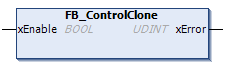

# FB\_ControlClone: Clone the Controller

## Function Block Description

Cloning is possible by SD card or Controller Assistant. When user rights are enabled and the View right FrmUpdate is denied for the ExternalMedia group, the cloning function is not allowed. In this case, the function block enables cloning functionality one time on the next controller power on.

NOTE: You can choose whether user rights are included in the clone on the Clone Management page of the [Web server](../../../../../api/crossBook?lang=en-US&virtualBookName=m262prg&topicID=D_SE_0002960).

This table shows how to set the function block and the user rights:

| Function block setting | When user rights enabled | When user rights disabled |
| --- | --- | --- |
| xEnable = 1 | Cloning is allowed | Cloning is allowed |
| xEnable = 0 | Cloning is not allowed | Cloning is not allowed |

## Library and Namespace

Library name: **PLCSystemBase**

Namespace: ****PLCSystemBase****

## Graphical Representation

## IL and ST Representation

To see the general representation in IL or ST language, refer to the chapter [*Function and Function Block Representation*](D-SE-0002384.html#D-SE-0002384).

## I/O Variable Description

The following table describes the input variables:

| Input | Type | Comment |
| --- | --- | --- |
| xEnable | BOOL | If `TRUE`, enables the cloning functionality one time.  If `FALSE`, disables the cloning functionality. |

The following table describes the output variables:

| Output | Type | Comment |
| --- | --- | --- |
| xError | UDINT | A value of `0` indicates that no error was detected while executing the function block. A non-zero indicates that an error was detected. |

EIO0000003667.09