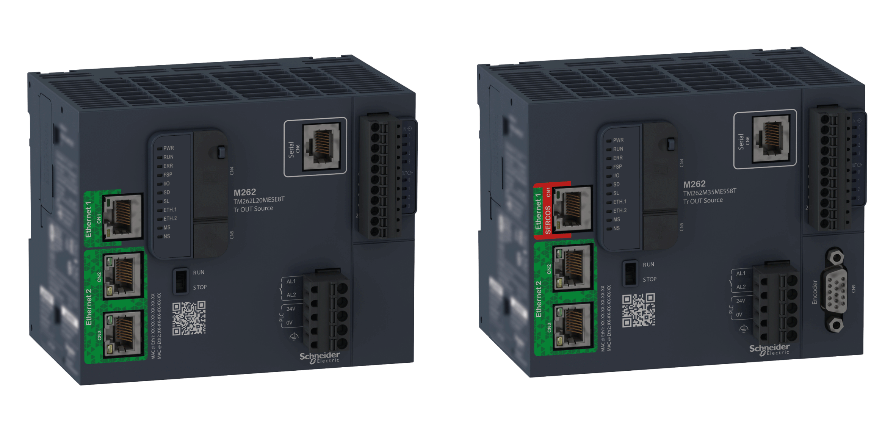

# M262 Logic/Motion Encoder - Library Guide

M262 Logic/Motion Encoder - Library Guide

Modicon M262 Logic/Motion Controller Encoder - Library Guide

This document will acquaint you with the encoder functions and variables offered within the M262 Logic/Motion Controller. The M262 Logic/Motion Controller Encoder library contains functions and variables to get information from and send commands to the encoder system.

This document describes the data type functions and variables of the M262 Logic/Motion Controller Encoder library.

The following knowledge is required:

oBasic information on the functionality, structure, and configuration of the M262 Logic/Motion Controller.

oProgramming in the FBD, LD, ST, IL, or CFC language.

osystem variables (global variables).

EIO0000003675.01

© 2019 Schneider Electric. All rights reserved.