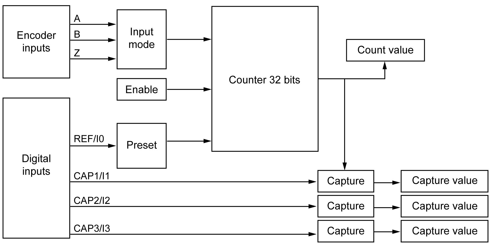
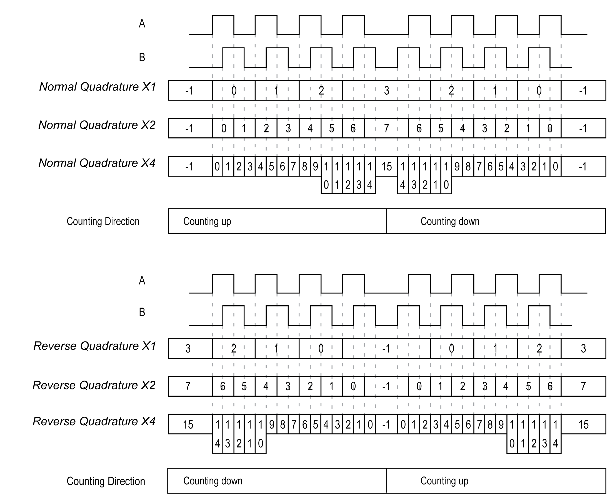
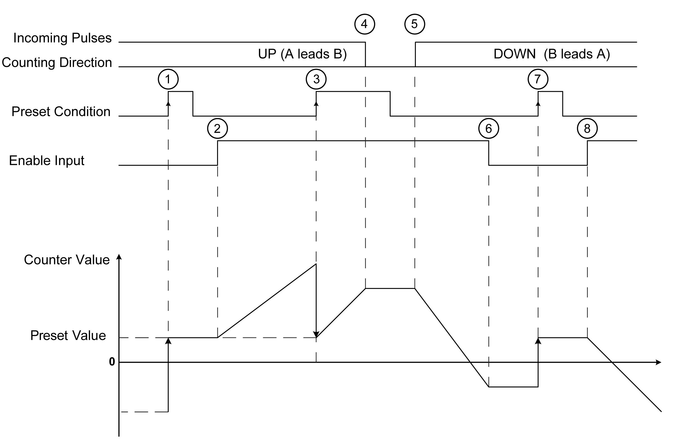

# Incremental Mode Principle Description

Incremental Mode Principle Description

Overview

This section describes the use of the incremental mode to connect incremental encoders.

Principle

The incremental mode behaves like a standard up/down counter, using pulses and counting these pulses.

Positions must be preset and counting must be initialized to implement and manage the incremental mode.

The counter value can be stored in the capture register by configuring an external event.

Principle Diagram

The following diagram provides an overview of the encoder in incremental mode:

Axis Types

The following table presents the two available axis types and corresponding counting modes:

| Axis Type | Comment |
| --- | --- |
| Linear | This mode acts as a finite counter. |
| Rotary | This mode acts as an infinite counter. |

Principle Diagram

The input mode in incremental mode is always quadrature:

| Stage | Action |
| --- | --- |
| 1 | On the rising edge of Preset condition, the counter value is set to the preset value and the counter is activated. |
| 2 | When the Enable condition = 1, the counter starts to increment when the counting direction is up. |
| 3 | The rising edge on the Preset condition loads the Preset value. |
| 4 | When the incoming pulses stop, the counter maintains its value. |
| 5 | When the Enable condition = 1, the counter starts to decrements when the counting direction is down. |
| 6 | When the Enable condition = 0, the counter ignores the pulses applied to the counting inputs A/B. |
| 7 | The rising edge on the Preset condition loads the preset value. |
| 8 | When the Enable condition = 1, the counter starts to decrements when the counting direction is down. |

NOTE: Enable and Preset conditions depend on the configuration. These are described in the [Enable](../M262_Encoder_Function_Blocks/M262_Encoder_Function_Blocks-2.htm#XREF_D_SE_0093487_3) and [Preset](../M262_Encoder_Function_Blocks/M262_Encoder_Function_Blocks-3.htm#XREF_D_SE_0093489_3) function.

EIO0000003675.01

© 2019 Schneider Electric. All rights reserved.