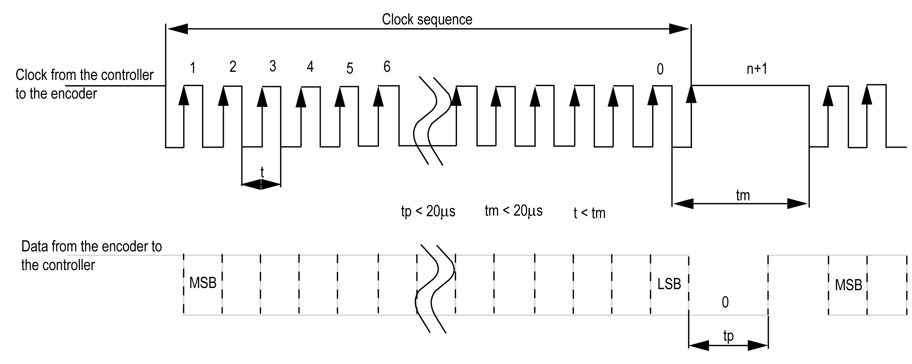

# SSI Mode Principle Description

SSI Mode Principle Description

General

The SSI (Synchronous Serial Interface) mode allows the connection of an absolute encoder.

The position of the absolute encoder is read by an SSI link.

Principle Diagram

The following diagram provides an overview of the encoder in SSI mode:

Principle Diagram

The figure below represents an SSI frame:

Data Information

The data content can be configured to adjust the information from the absolute encoder:

| Parameter | Range | Comment |
| --- | --- | --- |
| Transmission speed | 100 kHz, or  250 kHz, or  500 kHz | – |
| Number of bits per frame | 8...64 bits | Length of frame = implicit number of header bits (0 to 4) + number of data bits (8 to 32) + number of status bits (0 to 4) + number of parity bit (0 or 1). |
| Number of data bits | 8...32 bits | The least significant bits (8…32) indicate resolution per turn and the most significant bits (0…24) indicate the number of turns. |
| Number of data data/turn | 8...16 bits | – |
| Number of status bits | 0...4 bits | – |
| Parity | None  Odd  Even | – |
| Resolution reduction | 0...17 bits | This parameter allows to filter data. The least significant bits are ignored. |
| Binary coding | Binary  Gray | Binary or gray code. |

EIO0000003675.01

© 2019 Schneider Electric. All rights reserved.