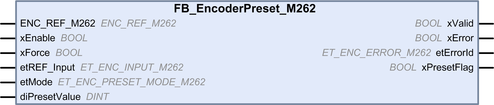

# FB_EncoderPreset_M262: Preset the Encoder

FB\_EncoderPreset\_M262: Preset the Encoder

Function Block Description

This function block is used to preset the encoder, in incremental or SSI mode.

Graphical Representation

IL and ST Representation

To see the general representation in IL or ST language, refer to the chapter [Function and Function Block Representation](../Function_and_Function_Block_Representation/Function_and_Function_Block_Representation-1.htm#XREF_D_SE_0002384_1).

I/O Variable Description

This table describes the input variables:

| Input | Type | Default | Comments |
| --- | --- | --- | --- |
| ENC\_REF\_M262 | ENC\_REF\_M262 | – | Reference of the encoder instance. |
| xEnable | BOOL | FALSE | TRUE enables the encoder preset function, via:  oThe preset mode using REF on I0 and Z on the encoder  oThe xForce input of the function block |
| xForce | BOOL | FALSE | On rising edge, presets and starts the counter if xEnable is TRUE. |
| etREF\_Input | ET\_ENC\_INPUT\_M262 | ENC\_INPUT\_REF\_I0 | Defines the REF input. The only valid value is [I0](../M262_Encoder_Library_Data_Types/M262_Encoder_Library_Data_Types-4.htm#XREF_D_SE_0093495_1). |
| etMode | ET\_ENC\_PRESET\_MODE\_M262 | ENC\_PRESET\_NO | Selects the conditions to preset the counting function with REF and Z [inputs](../M262_Encoder_Library_Data_Types/M262_Encoder_Library_Data_Types-5.htm#XREF_D_SE_0093498_1). |
| diPresetValue | DINT | 0 | Defines the value loaded in the encoder actual value at preset event. |

This table describes the output variables:

| Output | Type | Default | Comment |
| --- | --- | --- | --- |
| xValid | BOOL | FALSE | TRUE indicates that the output values on the function block are valid. |
| xError | BOOL | FALSE | TRUE indicates that an error is detected.  You can trigger a rising edge on xEnable to reset the error. |
| etErrorId | ET\_ENC\_ERROR\_M262 | ENC\_ERROR\_NO | Indicates the code of the detected error when xError is [TRUE](../M262_Encoder_Library_Data_Types/M262_Encoder_Library_Data_Types-3.htm#XREF_D_SE_0093496_1). |
| xPresetFlag | BOOL | FALSE | Set to TRUE for one cycle by the preset of the encoder. |

EIO0000003675.01

© 2019 Schneider Electric. All rights reserved.