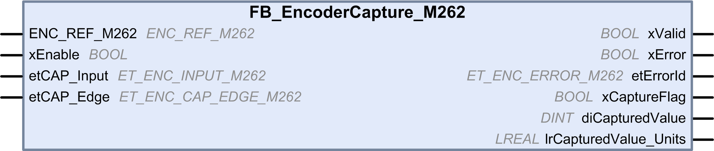

# FB_EncoderCapture_M262: Capture the Encoder Value

FB\_EncoderCapture\_M262: Capture the Encoder Value

Function Block Description

This function block is used to capture the encoder value, in incremental or SSI mode.

To configure several instances of this function block, define different etCAP\_Input.

Graphical Representation

IL and ST Representation

To see the general representation in IL or ST language, refer to the chapter [Function and Function Block Representation](../Function_and_Function_Block_Representation/Function_and_Function_Block_Representation-1.htm#XREF_D_SE_0002384_1).

I/O Variable Description

This table describes the input variables:

| Input | Type | Default | Comment |
| --- | --- | --- | --- |
| ENC\_REF\_M262 | ENC\_REF\_M262 | – | Reference of the encoder instance. |
| xEnable | BOOL | FALSE | TRUE enables the encoder capture function, via the capture input specified by the etCAP\_Input input. |
| etCAP\_Input | ET\_ENC\_INPUT\_M262 | ENC\_INPUT\_CAP\_I1 | Defines the input used for the [capture function](../M262_Encoder_Library_Data_Types/M262_Encoder_Library_Data_Types-4.htm#XREF_D_SE_0093495_1). |
| etCAP\_Edge | ET\_ENC\_CAP\_EDGE\_M262 | ENC\_CAP\_EDGE\_RISING | Indicates the edge detection for [capture input](../M262_Encoder_Library_Data_Types/M262_Encoder_Library_Data_Types-2.htm#XREF_D_SE_0093497_1). |

This table describes the output variables:

| Output | Type | Default | Comment |
| --- | --- | --- | --- |
| xValid | BOOL | FALSE | TRUE indicates that the output values on the function block are valid. |
| xError | BOOL | FALSE | TRUE indicates that an error is detected.  You can trigger a rising edge on xEnable to reset the error. |
| etErrorId | ET\_ENC\_ERROR\_M262 | ENC\_ERROR\_NO | Indicates the code of the detected error when xError is [TRUE](../M262_Encoder_Library_Data_Types/M262_Encoder_Library_Data_Types-3.htm#XREF_D_SE_0093496_1). |
| xCaptureFlag | BOOL | FALSE | TRUE indicates that a cycle is defined by the encoder capture event. xCaptureFlag is therefore TRUE for only one cycle. |
| diCapturedValue | DINT | 0 | Indicates the captured value in pulses, valid at xCaptureFlag rising edge.  Captured value remains until next xCaptureFlag occurs.  Captured value is reset to 0 when xEnable set to FALSE. |
| lrCapturedValue\_Units | LREAL | 0.0 | Indicates the captured value in units, valid at xCaptureFlag rising edge.  Captured value remains until next xCaptureFlag occurs.  Captured value is reset to 0 when xEnable set to FALSE. |

EIO0000003675.01

© 2019 Schneider Electric. All rights reserved.