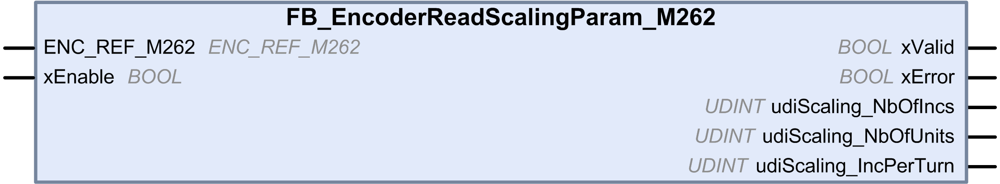

# FB_EncoderReadScalingParam_M262: Read the Scaling Parameter

FB\_EncoderReadScalingParam\_M262: Read the Scaling Parameter

Function Block Description

This function block is used to read the active values of the scaling parameter used to compute the unit value, in incremental or SSI mode.

Graphical Representation

IL and ST Representation

To see the general representation in IL or ST language, refer to the chapter [Function and Function Block Representation](../Function_and_Function_Block_Representation/Function_and_Function_Block_Representation-1.htm#XREF_D_SE_0002384_1).

I/O Variable Description

This table describes the input variables:

| Input | Type | Default | Comment |
| --- | --- | --- | --- |
| ENC\_REF\_M262 | ENC\_REF\_M262 | – | Reference of the encoder instance. |
| xEnable | BOOL | FALSE | TRUE enables the encoder function block reading active values of the scaling parameter used to compute lrCurrentValue\_Unit.  FALSE disables the function block. |

This table describes the output variables:

| Output | Type | Default | Comment |
| --- | --- | --- | --- |
| xValid | BOOL | FALSE | TRUE indicates that the output values on the function block are valid. |
| xError | BOOL | FALSE | TRUE indicates that an error is detected.  You can trigger a rising edge on xEnable to reset the error. |
| udiScalingNbOfIncs | UDINT | 0 | Indicates the active value of udiScalingNbOfIncs to compute lrCurrentValue\_Unit. |
| udiScalingNbOfUnits | UDINT | 0 | Indicates the active value of udiScalingNbOfUnits to compute lrCurrentValue\_Unit. |
| udiScaling\_IncPerTurn | UDINT | 0 | Indicates the active value of udiScaling\_IncPerTurn to compute lrCurrentValue\_Unit. |

EIO0000003675.01

© 2019 Schneider Electric. All rights reserved.