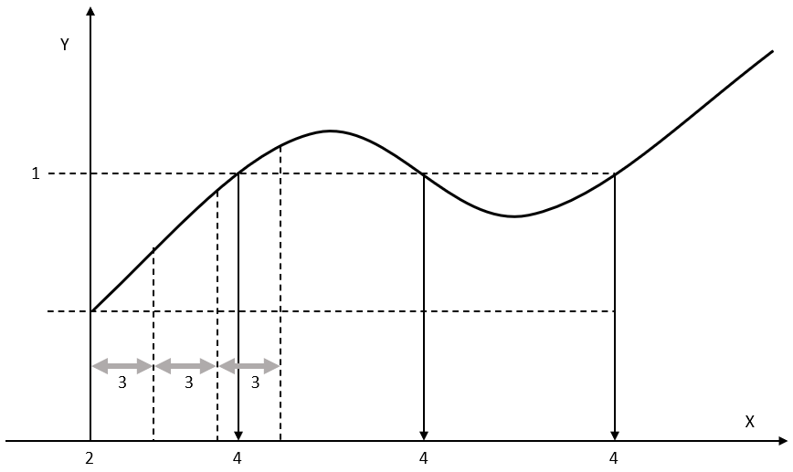

# FC\_GetMasterPositionFromGivenSlavePositionForMultiCam

## Overview

|  |  |
| --- | --- |
| Type: | Function |
| Available as of: | V2.21.2.0 |

## Task

Determines the position of the master axis on the basis of the position of the subordinate axis when a segmented cam is being executed.

## Description

Using the function FC\_GetMasterPositionFromGivenSlavePositionForMultiCam, you can determine the position of the master axis on the basis of the position of the subordinate axis. The function works with segmented cams defined with the structure ST\_MultiCam and executed by the function block MC\_CamIn. Refer to the *CommonMotionTypes Library Guide* for details on the structure ST\_MultiCam. Refer to the *M262 Synchronized Motion Control Library Guide* for details on the function block MC\_CamIn.

The master position is computed numerically using an iterative method which produces the result with an accuracy specified with the input i\_lrAccuracy. The first part of the computation is a linear search which determines the section in which the master position can be found. The starting point of the linear search is provided with i\_lrStartPosition. The size of the sections is specified using i\_lrIncrementalStepSize. If the difference between i\_lrSlavePosition and the Y value at the endpoint of a section has changed sign, the section containing the result has been found.

The following example illustrates how the section containing the master position corresponding to a given subordinate axis position is found in the third iteration of the linear search:

Legend:

1. Subordinate axis position for which the master position is to be determined (i\_lrSlavePosition).
2. Start position for linear search of the section that contains the master position (i\_lrStartPosition) .
3. Size of increment for linear search of the section that contains the master position (i\_lrIncrementalStepSize).
4. Master position to be determined.

The subordinate axis position i\_lrSlavePosition (1) is the position for which the master position (4) is to be determined. The start position i\_lrStartPosition (2) determines the start of the first section. The size of each section is specified with i\_lrIncrementalStepSize (3). In the third section, the difference between the subordinate axis position and the Y value changes sign. This means that the master position to be determined is in this third section.

After the section containing the master position has been determined, a binary search halving the intervals is performed on this section. This search is terminated when the result (q\_lrMasterPosition) has been determined with the accuracy specified (i\_lrSlavePosition - Y(X) is less than or equal to i\_lrAccuracy) or after a maximum of 20 iterations.

NOTE: As illustrated in the example, there can be multiple master positions corresponding to a given subordinate axis position. In such a case, the function returns only a single master position. Other master positions have to be determined using appropriately modified values for i\_lrStartPosition.

The function can be used with the cam types of the enumeration ET\_CamType of the CommonMotionTypes library, with the exception of UserCam. If you use the function with the cam type UserCam, an error is detected (InvalidCamTableID).

## Interface

| Input | Data type | Description |
| --- | --- | --- |
| i\_lrSlavePosition | LREAL | Subordinate axis position for which the master position is to be determined. |
| i\_lrMasterScaling | LREAL | Scaling factor for the master position. The value must be greater than 0. The default value is 1.0. |
| i\_lrSlaveScaling | LREAL | Scaling factor for the subordinate axis position. The value must not be 0. The default value is 1.0.  The subordinate axis scaling factor affects the specified subordinate axis position i\_lrSlavePosition. The subordinate axis position value divided by the subordinate axis scaling is used in the iterative method to determine the master position (which is then divided by i\_lrMasterScaling to produce the final result). Therefore, the value of the subordinate axis position divided by the value of subordinate axis scaling has to be within the limits of the cam definition. |
| i\_stCamTableID | CMT.ST\_MultiCam | Structure ST\_MultiCam of the *CommonMotionTypes* library. |
| i\_lrStartPosition | LREAL | Start position for linear search of the section that contains the master position. The value must be inside the cam profile. |
| i\_lrAccuracy | LREAL | Accuracy to be used for determining the master position. The value must be greater than or equal to 10-6 (1e-6). |
| i\_lrIncrementalStepSize | LREAL | Size of increment for linear search of the section that contains the master position. The value must be greater than the value for i\_lrAccuracy. The ratio of the cam range divided by the value of i\_lrIncrementalStepSize must be less than or equal to 1000. |

| Output | Data type | Description |
| --- | --- | --- |
| q\_lrMasterPosition | LREAL | Calculated master position corresponding to i\_lrSlavePosition |

NOTE: If the value for i\_lrAccuracy is insufficient for a given value for i\_lrIncrementalStepSize, the binary search cannot be completed with the required number of iterations (detected error MaxNumberOfIterationsExceeded). In such a case, increase the value for i\_lrAccuracy or decrease the value for i\_lrIncrementalStepSize.

## Return Value

| Data type | Description |
| --- | --- |
| ET\_Result | Result of the function block execution. Refer to the [ET\_Result Enumeration Elements](D-SE-0096918.html). |

EIO0000004353.07