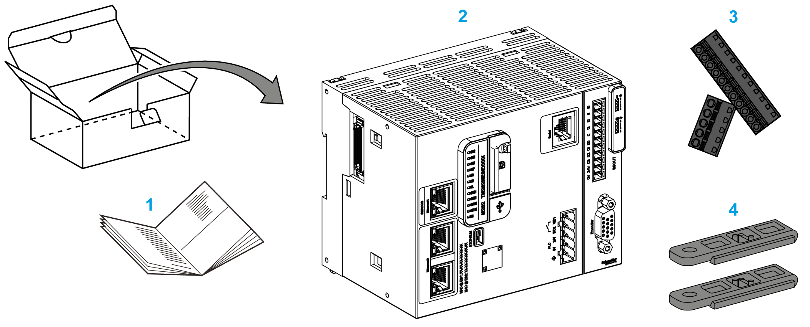

# M262 Logic/Motion Controller Description

## Overview

The M262 Logic/Motion Controller has various powerful features and can service a wide range of applications.

Software configuration, programming, and commissioning are accomplished with the EcoStruxure Machine Expert software, described in detail in the EcoStruxure Machine Expert [Programming Guide](../../../../../api/crossBook?lang=en-US&virtualBookName=SoMProg&topicID=D_SG_0026478), as well as the [M262 Logic/Motion Controller Programming Guide](../../../../../api/crossBook?lang=en-US&virtualBookName=m262prg&topicID=D_SE_0079480).

## Programming Languages

The M262 Logic/Motion Controller is configured and programmed with the EcoStruxure Machine Expert software which supports the following IEC 61131-3 programming languages:

* IL: Instruction List
* ST: Structured Text
* FBD: Function Block Diagram
* SFC: Sequential Function Chart
* LD: Ladder Diagram

The EcoStruxure Machine Expert software can also be used to program the M262 Logic/Motion Controller using CFC (Continuous Function Chart) language.

## Power Supply

The power supply of the M262 Logic/Motion Controller is [24 Vdc](D-SE-0069641.html#D-SE-0069641).

## Real Time Clock

The M262 Logic/Motion Controller includes a [Real Time Clock (RTC) system](D-SE-0069626.html#D-SE-0069626).

The system time is maintained by capacitors when the power is off. The time is maintained for 1 000 hours when the controller is not supplied.

## Run/Stop

The M262 Logic/Motion Controller can be operated externally by the following:

* A hardware [Run/Stop switch](D-SE-0069627.html#D-SE-0069627)
* A [Run/Stop](../../../../../api/crossBook?lang=en-US&virtualBookName=D-SE-0034335.html#D-SE-0034335) operation by a dedicated digital input, defined in the software configuration. For more information, refer to [Configuration of Digital Inputs](../../m262prg&topicID=D_RU_0004567).
* A software command
* The system variable PLC\_W in a Relocation Table
* The Web server [Maintenance: Run/Stop Controller Submenu](../../../../../api/crossBook?lang=en-US&virtualBookName=m262prg&topicID=D_SE_0002960_43)

## Memory

This table describes the different types of memory:

| Memory Type | Size | Use |
| --- | --- | --- |
| RAM | 256 Mbytes, of which 32 Mbytes are available for the application | For the execution of the application and the firmware. |
| Flash | 1 Gbyte | Non-volatile memory dedicated to the retention of the program and data in case of a power interruption. |
| Non-volatile RAM | 512 kbytes | Non-volatile memory dedicated to the retention of the retain-persistent variables, and the diagnostic files and associated information. |

## Embedded Inputs/Outputs

The following embedded I/O types are available:

* Fast inputs
* Fast source outputs

## Encoder

The following encoder modes are available:

* Incremental mode
* SSI mode

## Removable Storage

The M262 Logic/Motion Controller includes an [integrated SD card slot](D-SE-0069628.html#D-SE-0069628).

The main uses of the SD card are:

* Initializing the controller with a new application
* Updating the [controller and expansion module firmware](../../../../../api/crossBook?lang=en-US&virtualBookName=m262prg&topicID=D_SE_0083173)
* [Applying post configuration files to the controller](../../../../../api/crossBook?lang=en-US&virtualBookName=m262prg&topicID=D_SE_0010301)
* Storing recipes, files
* Receiving data logging files

## Embedded Communication Features

The following types of communication ports are available:

* [Ethernet](D-SE-0069651.html#D-SE-0069651)
* [USB Mini-B](D-SE-0069653.html#D-SE-0069653)
* [Serial Line](D-SE-0069654.html#D-SE-0069654)
* [Sercos (Ethernet 1)](D-SE-0081748.html#D-SE-0081748__D-SE-0081748.8)

## Expansion Module and Bus Coupler Compatibility

Refer to the [compatibility tables](../../../../../api/crossBook?lang=en-US&virtualBookName=CompMigr&topicID=D_SE_0094606) in the EcoStruxure Machine Expert Compatibility and Migration User Guide.

## Compatibility with Modicon Edge I/O NTS Devices

Refer to the compatibility tables in the [EcoStruxure Machine Expert](../../../../../api/crossBook?lang=en-US&virtualBookName=CompMigr&topicID=CompatibilityBetweenControllersAndD_3E0165F1) Compatibility and Migration User Guide.

NOTE: To use Modicon Edge I/O NTS devices, you must activate the [OPC UA server](../../../../../api/crossBook?lang=en-US&virtualBookName=m262prg&topicID=D_SE_0099747).

## M262 Logic/Motion Controller References

| Reference | Digital I/O | Power supply | Communication Ports | Terminal Type | Encoder |
| --- | --- | --- | --- | --- | --- |
| M262 Logic Controller:  TM262L• | 4 fast inputs  4 fast source outputs | 24 Vdc | 1 serial line port  1 USB programming port  1 Ethernet port  1 dual port Ethernet switch | Removable spring | – |
| M262 Motion Controller:  TM262M• | 4 fast inputs  4 fast source outputs | 24 Vdc | 1 serial line port  1 USB programming port  1 Ethernet port for fieldbus with Sercos interface  1 dual port Ethernet switch | Removable spring | 1 Encoder port |
| NOTE: You can use the fast inputs/outputs as regular inputs/outputs. | | | | | |

## Delivery Content

The following figure presents the content of the delivery for the M262 Logic/Motion Controller:

**1** M262 Logic/Motion Controller Instruction Sheet

**2** M262 Logic/Motion Controller

**3** Removable spring terminal blocks

**4** Attachment parts

EIO0000003659.12