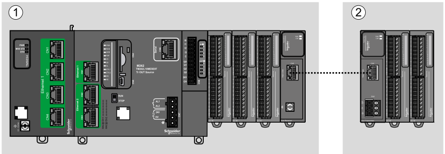
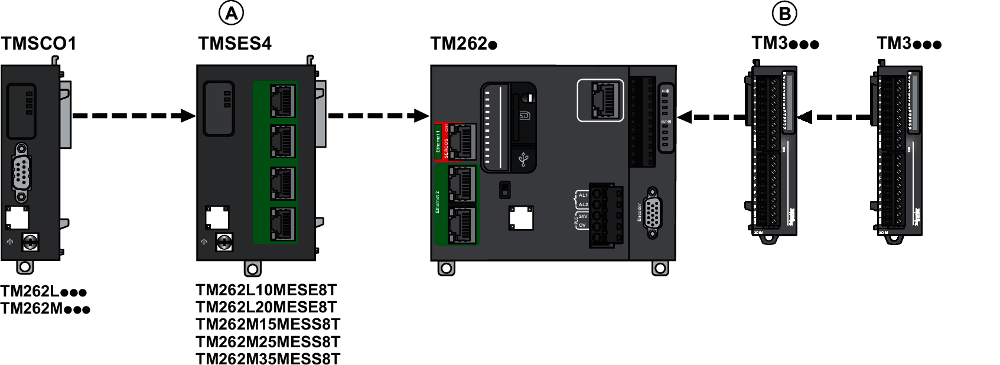
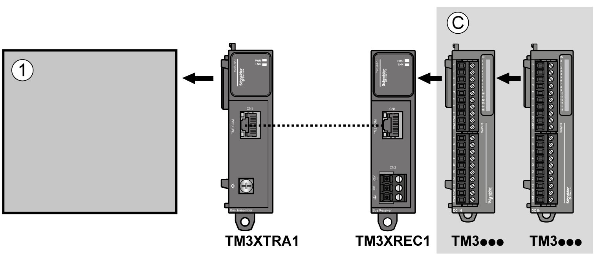
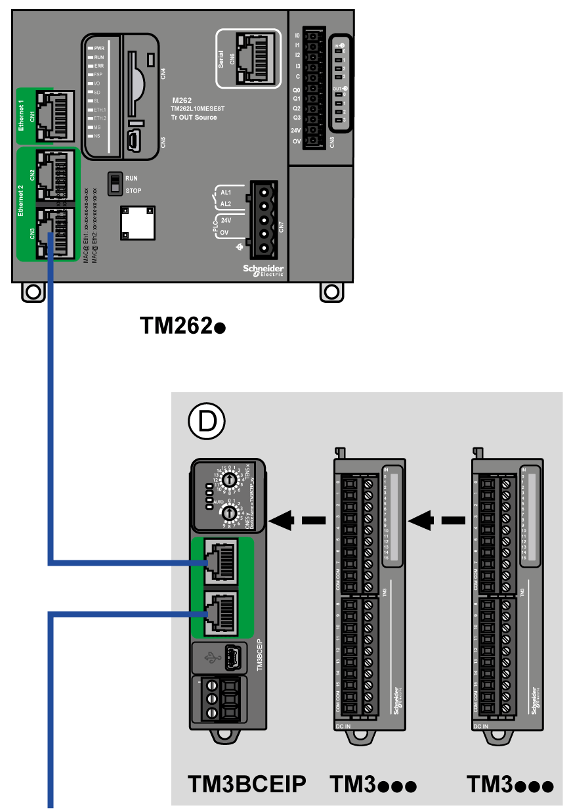

# Maximum Hardware Configuration

## Introduction

The M262 Logic/Motion Controller is a control system that offers an all-in-one solution for motion applications and a scalable solution for logic applications, with optimized configurations and an open, expandable architecture.

## Local and Remote Configuration Principle

The following figure defines the local and remote configurations:

**(1)** Local configuration

**(2)** Remote configuration

## M262 Logic/Motion Controller Local Configuration Architecture

Optimized local configuration and flexibility are provided by the association of:

* M262 Logic/Motion Controller
* TMS expansion modules
* TM3 expansion modules

Application requirements determine the architecture of your M262 Logic/Motion Controller configuration.

The following figure represents the components of a local configuration:

**(A)** TMS expansion modules.

* 1 TMSCO1

  for TM262L01MESE8T and TM262M05MESS8T
* 3 TMSES4 or 2 TMSES4 and 1 TMSCO1 for the other references

TMSCO1 must be the leftmost module connected to the controller.

**(B)** TM3 expansion modules (7 maximum).

## M262 Logic/Motion Controller Remote Configuration Architecture

Optimized remote configuration and flexibility are provided by the association of:

* M262 Logic/Motion Controller
* TMS expansion modules
* TM3 expansion modules
* TM3 transmitter and receiver modules

Application requirements determine the architecture of your M262 Logic/Motion Controller configuration.

The following figure represents the components of a remote configuration:

**(1)** Logic/motion controller and modules

**(C)** TM3 expansion modules (7 maximum)

## M262 Logic/Motion Controller Distributed Configuration Architecture

Optimized remote configuration and flexibility are provided by the association of:

* M262 Logic/Motion Controller
* [TM3 bus couplers](D-SE-0093341.html#D-SE-0093341)
* [TM5 fieldbus interface](D-SE-0093414.html#D-SE-0093414)

This figure shows the components of a distributed architecture:

**(D)** TM3 distributed modules

## Maximum Number of Modules

The following table shows the maximum configuration supported:

| References | Maximum | Type of Configuration |
| --- | --- | --- |
| TM262L01MESE8T  TM262M05MESS8T | 7 TM3 expansion modules  1 TMSCO1 | Local |
| TM262L10MESE8T  TM262M15MESS8T  TM262L20MESE8T  TM262M25MESS8T  TM262M35MESS8T | 7 TM3 expansion modules  3 TMS expansion modules composed of:   * up to 3 TMSES4 * up to 1 TMSCO1 | Local |
| TM3XREC1 | 7 TM3 expansion modules | Remote |
| TM3BCEIP  TM3BCSL  TM3BCCO | 7 TM3 expansion modules without transmitter and receiver  14 TM3 expansion modules with transmitter and receiver | Distributed |
| NOTE: TM3 transmitter and receiver modules are not included in a count of the maximum number of expansion modules. | | |

NOTE: The configuration with its TMS and TM3 expansion modules is validated by the software in the Configuration window.

NOTE: In some environments, the maximum configuration populated by high power consumption modules, coupled with the maximum distance allowable between the TM3 transmitter and receiver modules, may present bus communication issues although the software allows for the configuration. In such a case you will need to analyze the power consumption of the modules chosen for your configuration, as well as the minimum cable distance required by your application, and possibly seek to optimize your choices.

EIO0000003659.12