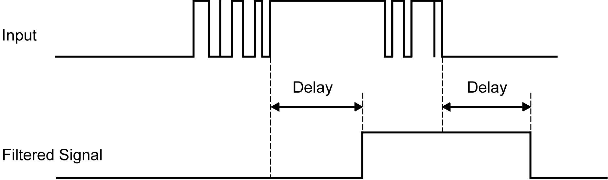

# Input Management

## Overview

The M262 Logic/Motion Controller features 4 fast digital inputs.

The following functions are configurable:

* Filters (depends on the function associated with the input).
* All inputs can be used for the Run/Stop function.
* The inputs can be either latched or used for events (rising edge, falling edge, or both) and thus be linked to an external task.

NOTE: All inputs can be used as regular inputs.

## Input Management Functions Availability

Embedded digital inputs can be configured as functions (Run/Stop, events).

Inputs not configured as functions are used as regular inputs.

## Filter Principle

The filter is designed to reduce the bouncing effect at the inputs. Setting the filter value allows the controller to ignore some sudden changes of input levels caused by electrical noise. The filter is only available on the fast inputs.

The following timing diagram illustrates the anti-bounce filter effects:

## Latching

Latching is a function that can be assigned to the M262 Logic/Motion Controller fast inputs. This function is used to memorize (or latch) any pulse with a duration that is less than the M262 Logic/Motion Controller scan time.

When a pulse is shorter than one scan, the controller latches the pulse, which is then updated in the next scan. This latching mechanism only recognizes rising edges. Falling edges cannot be latched. Assigning inputs to be latched is done in the software I/O Configuration tab.

The following timing diagram illustrates the latching effects:

## Event

An input configured for Event can be associated with an [External Task](../../../../../api/crossBook?lang=en-US&virtualBookName=m262prg&topicID=D_SE_0008842).

## Run/Stop

The Run/Stop function is used to start or stop an application program using an input. In addition to the embedded Run/Stop switch, it is allowed to configure one (and only one) input as an additional Run/Stop command.

For more information, refer to [Run/Stop](D-SE-0069627.html#D-SE-0069627).

| WARNING | |
| --- | --- |
|  | UNINTENDED MACHINE OR PROCESS START-UP  * Verify the state of security of your machine or process environment before applying power to the Run/Stop input. * Use the Run/Stop input to help prevent the unintentional start-up from a remote location.  Failure to follow these instructions can result in death, serious injury, or equipment damage. |

| WARNING | |
| --- | --- |
|  | UNINTENDED EQUIPMENT OPERATION  Use the sensor and actuator power supply only for supplying power to sensors or actuators connected to the module.  Failure to follow these instructions can result in death, serious injury, or equipment damage. |

EIO0000003659.12