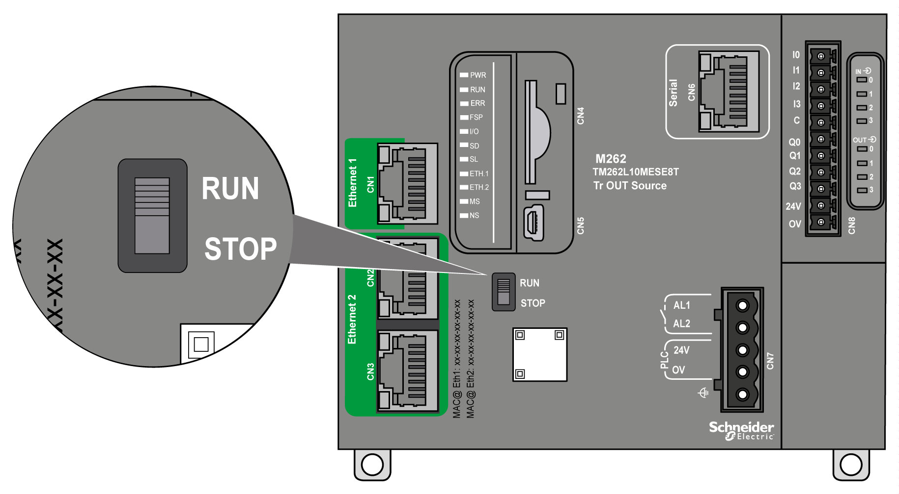

# Run/Stop

## Overview

The M262 Logic/Motion Controller can be operated externally by the following:

* A hardware Run/Stop switch.
* A software command.
* A Run/Stop operation triggered by an embedded digital input. The digital input is defined in the software configuration. For more information, refer to the [M262 Logic/Motion Controller Programming Guide](../../../../../api/crossBook?lang=en-US&virtualBookName=m262prg&topicID=D_SE_0079480).
* The system variable PLC\_W in a [Relocation Table](../../../../../api/crossBook?lang=en-US&virtualBookName=m262prg&topicID=D_SE_0004337).
* The [Web server](../../../../../api/crossBook?lang=en-US&virtualBookName=m262prg&topicID=D_SE_0002960).

The M262 Logic/Motion Controller has a hardware Run/Stop switch, which puts the controller in the RUNNING or STOPPED state.

The interaction of the 2 external operators on the controller state behavior is summarized in the table below:

|  | | **Embedded hardware Run/Stop switch** | | |
| --- | --- | --- | --- | --- |
| **Switch on Stop** | **Stop to Run transition** | **Switch on Run** |
| **Software configurable Run/Stop digital input** | **None** | STOPPED  Ignores external Run/Stop commands. | Commands a transition to RUNNING state (1). | Allows external Run/Stop commands. |
| **State 0** | STOPPED  Ignores external Run/Stop commands. | STOPPED  Ignores external Run/Stop commands. |
| **Rising edge** | Commands a transition to RUNNING state (1). | Commands a transition to RUNNING state. |
| **State 1** | Commands a transition to RUNNING state (1). | Allows external Run/Stop commands. |
| (1) For more information, refer to the M262 Logic/Motion Controller Programming Guide. | | | | |

| WARNING | |
| --- | --- |
|  | UNINTENDED MACHINE OR PROCESS START-UP  * Verify the state of security of your machine or process environment before applying power to the Run/Stop input or engaging the Run/Stop switch. * Use the Run/Stop input to help prevent the unintentional start-up from a remote location, or from accidentally engaging the Run/Stop switch.  Failure to follow these instructions can result in death, serious injury, or equipment damage. |

EIO0000003659.12