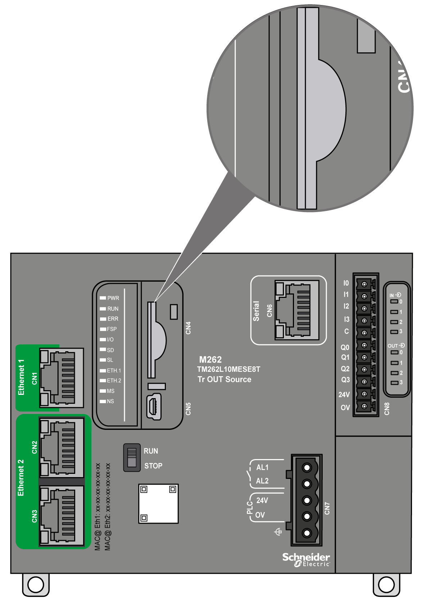
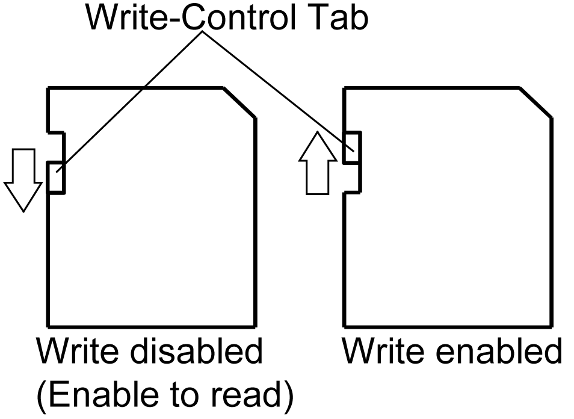
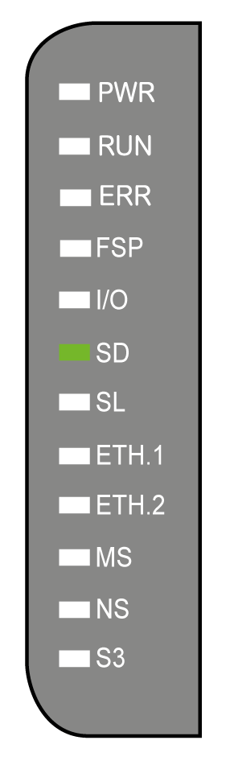

# SD Card

## Overview

The main uses of the SD card are:

* Downloading a new application to the controller without using the software.
* Updating the controller firmware.
* Cloning the controller application or firmware.
* Applying post configuration changes to the controller (for example, changing IP addresses or serial line configuration).
* Applying recipe files.
* Retrieving data logging files.

The SD card file system is FAT32. SD card files can therefore be used directly on your computer.

When handling the SD card, follow the instructions below to help prevent internal data on the SD card from being corrupted or lost or an SD card malfunction from occurring:

| NOTICE | |
| --- | --- |
|  | LOSS OF APPLICATION DATA  * Do not store the SD card where there is static electricity or probable electromagnetic fields. * Do not store the SD card in direct sunlight, near a heater, or other locations where high temperatures can occur. * Do not bend the SD card. * Do not drop or strike the SD card against another object. * Keep the SD card dry. * Do not touch the SD card connectors. * Do not disassemble or modify the SD card. * Use only SD cards formatted using FAT or FAT32.  Failure to follow these instructions can result in equipment damage. |

The M262 Logic/Motion Controller does not recognize NTFS formatted SD cards. Format the SD card on your computer using FAT or FAT32.

When using the M262 Logic/Motion Controller and an SD card, observe the following to avoid losing valuable data:

* Accidental data loss can occur at any time. Once data is lost it cannot be recovered.
* If you forcibly extract the SD card, data on the SD card may become corrupted.
* Removing an SD card that is being accessed (**SD** LED flashing yellow) could damage the SD card, or corrupt its data.
* If the SD card is not positioned correctly when inserted into the controller, the data on the card and the controller could become damaged.

| NOTICE | |
| --- | --- |
|  | LOSS OF APPLICATION DATA  * Backup SD card data regularly. * Do not remove power or reset the controller, and do not insert or remove the SD card while it is being accessed.  Failure to follow these instructions can result in equipment damage. |

The following figure shows the SD card slot:

It is possible to set the Write-Control Tab to prevent write operations to the SD card. Push the tab up, as shown in the example on the right-hand side, to release the lock and enable writing to the SD card. Before using an SD card, read the manufacturer's instructions.

| Step | Action |
| --- | --- |
| 1 | Insert the SD card into the SD card slot: |
| 2 | Push until you hear it “click”: |

## SD Card Slot Characteristics

| Topic | Characteristics | Description |
| --- | --- | --- |
| Supported type | Standard Capacity | SDSC |
| High Capacity | SDHC |
| Global memory | Size | 32 GB maximum (SDHC only) |

## TMASD1 Characteristics

| Characteristics | Description |
| --- | --- |
| Card removal durability | Minimum 1000 times |
| File retention time | 10 years at 25 °C (77 °F) |
| Flash type | SLC NAND |
| Memory size | 256 MB |
| Ambient operation temperature | -10…85 °C (14...185 °F) |
| Storage temperature | -25…85 °C (-13...185 °F) |
| Relative humidity | 95% maximum non-condensing |
| Write/Erase cycles | 3,000,000 (approximately) |

## Status LED

The following figure shows the **SD** status LED:

The following table describes the **SD** status LED:

| Label | Description | LED | |
| --- | --- | --- | --- |
| State | Description |
| **SD** | SD card | Green On | Firmware update completed. |
| Green Flashing | Firmware update or script execution in progress. |
| Yellow On | Firmware update or script execution is unsuccessful. |
| Yellow Flashing | SD card is being accessed (script execution in progress). |
| Off | No SD card activity. |

EIO0000003659.12