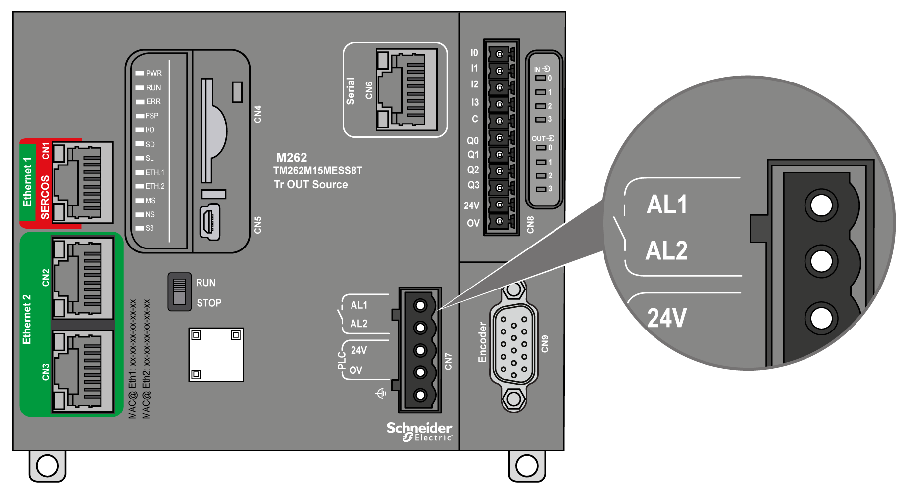

# Alarm Relay

## Introduction

The M262 Logic/Motion Controller has integrated relay connections that can be wired to an external alarm:

For wiring details, refer to [Alarm Relay Wiring](D-SE-0070837.html#D-SE-0070837).

## Characteristics

This table shows the characteristics of the alarm relay:

| Characteristic | | Value | |
| --- | --- | --- | --- |
| Wiring type | | 2 terminals on removable spring terminal block | |
| Output type | | Relay | |
| Contact type | | Normally Open (NO) | |
| Nominal input voltage | | 24 Vdc | |
| Maximum input voltage | | 28.8 Vdc | |
| Input voltage type | | PELV | |
| Contact resistance | | 300 mΩ maximum | |
| Minimum switching load | | 5 V at 100 mA | |
| Maximum current | | 700 mA | |
| Overload protection | | Yes, resettable fuse, maximum 3.2 A | |
| Reverse polarity protection | | Not necessary | |

## Operation

When the controller is energized, the alarm relay is activated and its contact is closed.

The relay contact is opened by one of the following conditions:

* Appearance of an internal hardware error.
* Interruption of the controller power supply.

Perform a power cycle of the controller to recover from a hardware watchdog event and reset the relay output contact to the closed state.

When the controller is de-energized, the alarm relay is deactivated and its contact is opened.

EIO0000003659.12