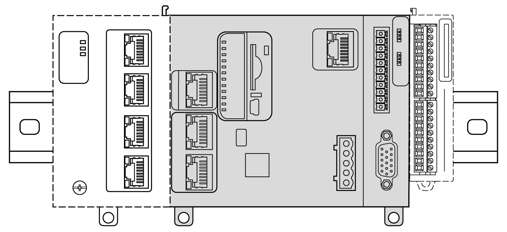
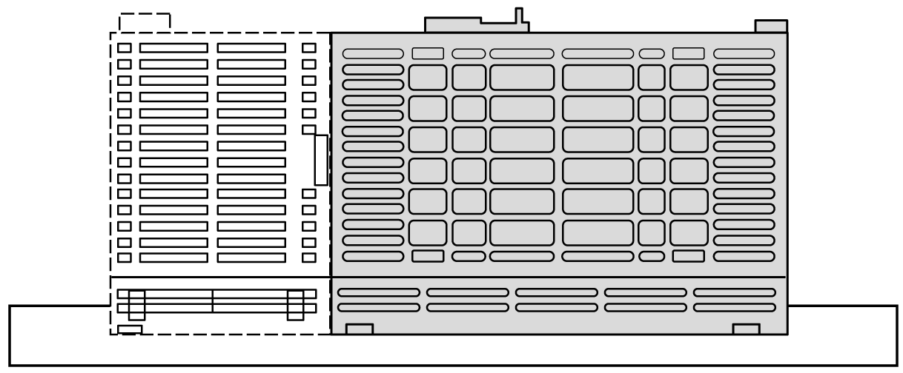
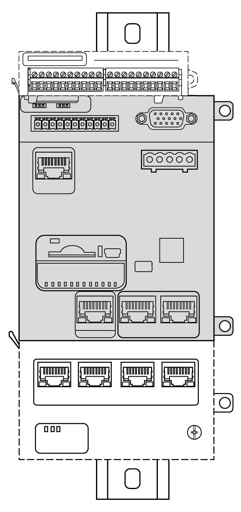
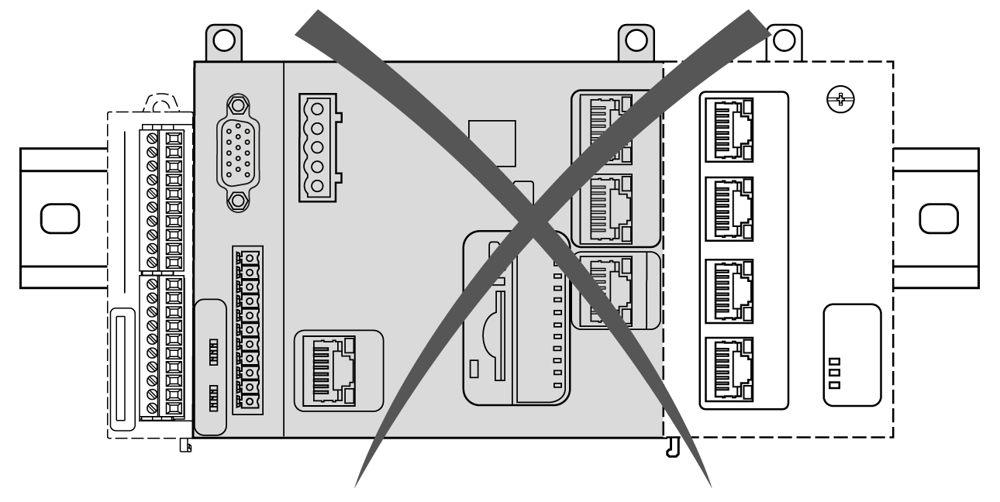
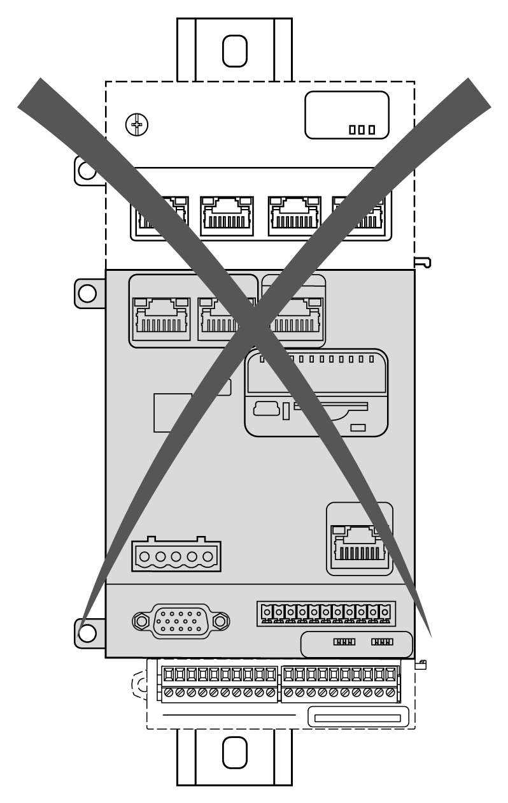
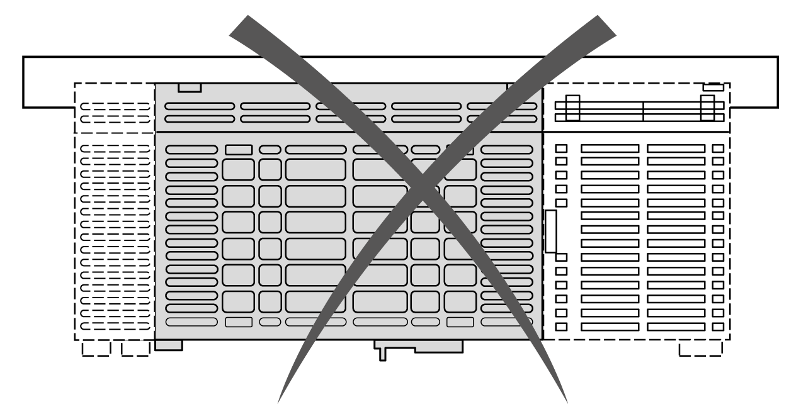
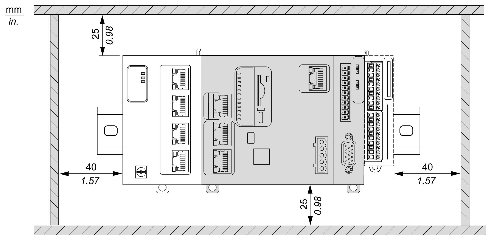
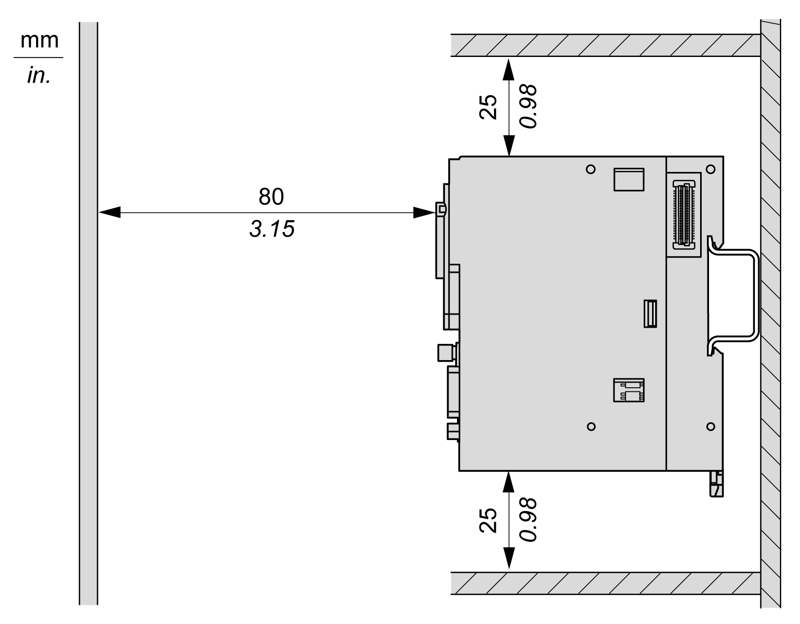

# M262 Logic/Motion Controller Mounting Positions and Clearances

## Introduction

This section describes the correct mounting positions for the M262 Logic/Motion Controller.

NOTE: Keep adequate spacing for proper ventilation and to maintain the operating temperature specified in the [Environmental Characteristics](D-SE-0025088.html#D-SE-0025088).

## Correct Mounting Position

To obtain optimal operating characteristics, the M262 Logic/Motion Controller should be mounted as shown in the figures below:

## Acceptable Mounting Position

The M262 Logic/Motion Controller can also be mounted vertically on a vertical plane as shown below:

NOTE: TM3 expansion modules must be mounted above the controller.

## Incorrect Mounting Positions

The M262 Logic/Motion Controller should only be positioned as shown in the [Correct Mounting Position](#D-SE-0069635__D-SE-0069635.8) figures. The figures below show incorrect mounting positions:

## Minimum Clearances

| WARNING | |
| --- | --- |
|  | UNINTENDED EQUIPMENT OPERATION  * Place devices dissipating the most heat at the top of the cabinet and ensure adequate ventilation. * Avoid placing this equipment next to or above devices that might cause overheating. * Install the equipment in a location providing the minimum clearances from all adjacent structures and equipment as directed in this document. * Install all equipment in accordance with the specifications in the related documentation.  Failure to follow these instructions can result in death, serious injury, or equipment damage. |

The M262 Logic/Motion Controller has been designed as an IP20 product and must be installed in an enclosure. Clearances must be respected when installing the product.

There are three types of clearances to consider:

* The M262 Logic/Motion Controller and all sides of the cabinet (including the panel door).
* The M262 Logic/Motion Controller terminal blocks and the wiring ducts to help reduce potential electromagnetic interference between the controller and the duct wiring.
* The M262 Logic/Motion Controller and other heat generating devices installed in the same cabinet.

The following figures show the minimum clearances that apply to all M262 Logic/Motion Controller references:

EIO0000003659.12