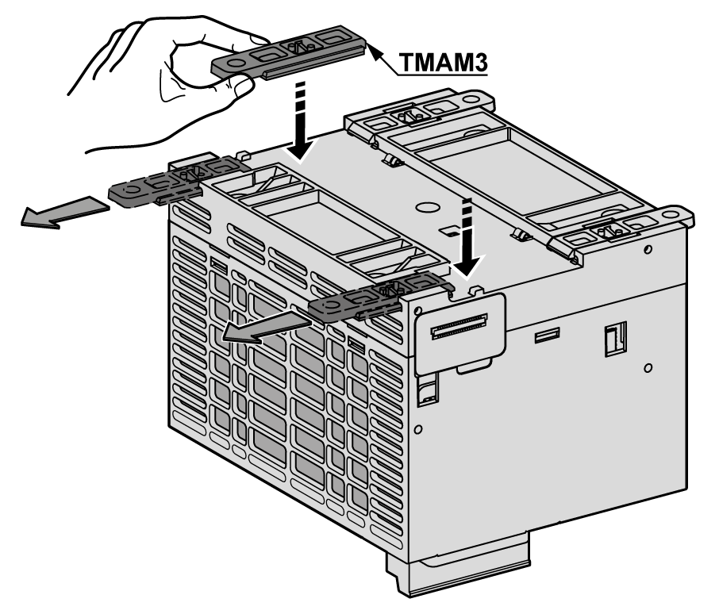
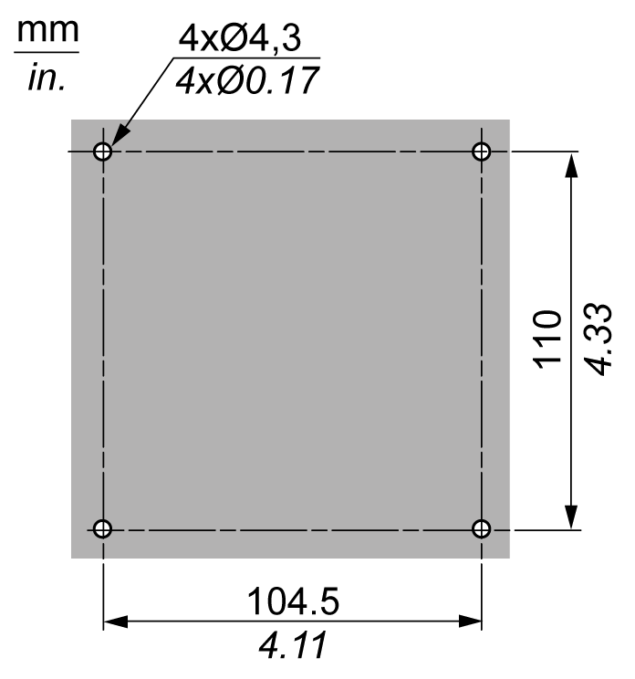
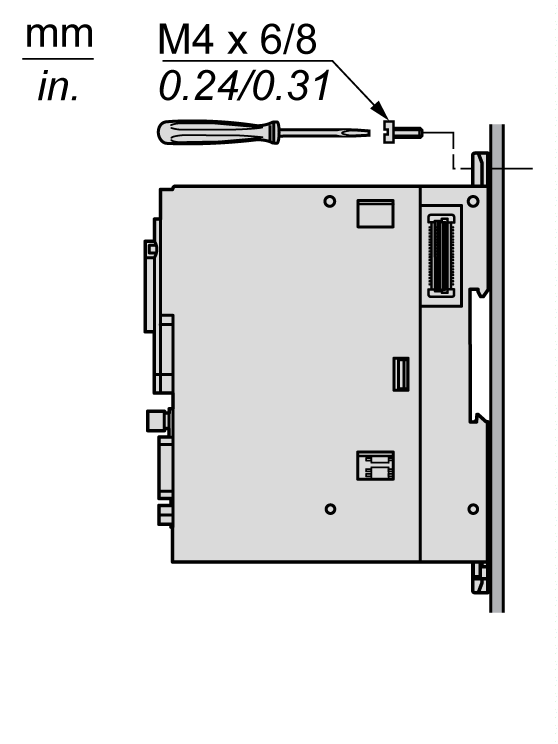

# Mounting a M262 Logic/Motion Controller on a Panel Surface

## Installing the Panel Mounting Kit

Insert [TMAM3](D-SE-0025669.html#D-SE-0025669__D-SE-0025669.8) mounting strips into the slots at the top of the M262 Logic/Motion Controller:

## Mounting Holes

The following figure shows the mounting holes for the M262 Logic/Motion Controller:

Verify that the installation panel or cabinet surface is flat (planarity tolerance: 0.5 mm (0.019 in)), in good condition, and has no jagged edges.

## Mounting the M262 Logic/Motion Controller on a Metallic Panel

If mounting the controller on a horizontal metallic panel, use flat head screws.

EIO0000003659.12