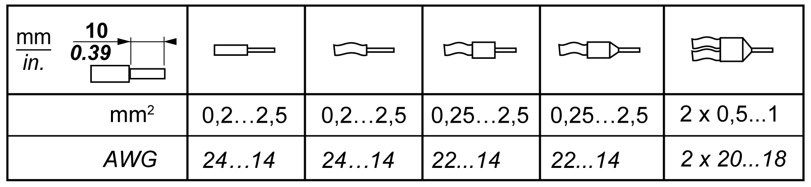
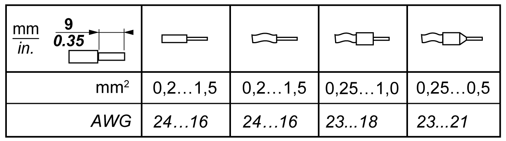
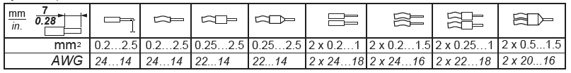
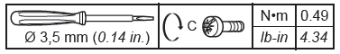
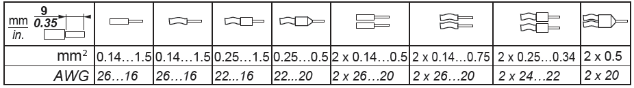
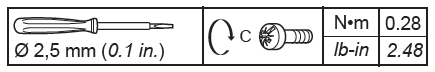

# Wiring Best Practices

## Overview

This section describes the wiring guidelines and associated best practices to be respected when using the M262 Logic/Motion Controller system.

| DANGER | |
| --- | --- |
|  | HAZARD OF ELECTRIC SHOCK, EXPLOSION OR ARC FLASH  * Disconnect all power from all equipment including connected devices prior to removing any covers or doors, or installing or removing any accessories, hardware, cables, or wires except under the specific conditions specified in the appropriate hardware guide for this equipment. * Always use a properly rated voltage sensing device to confirm the power is off where and when indicated. * Replace and secure all covers, accessories, hardware, cables, and wires and confirm that a proper ground connection exists before applying power to the equipment. * Use only the specified voltage when operating this equipment and any associated products.  Failure to follow these instructions will result in death or serious injury. |

| WARNING | |
| --- | --- |
|  | LOSS OF CONTROL  * Perform a Failure Mode and Effects Analysis (FMEA), or equivalent risk analysis, of your application, and apply preventive and detective controls before implementation. * Provide a fallback state for undesired control events or sequences. * Provide separate or redundant control paths wherever required. * Supply appropriate parameters, particularly for limits. * Review the implications of transmission delays and take actions to mitigate them. * Review the implications of communication link interruptions and take actions to mitigate them. * Provide independent paths for control functions (for example, emergency stop, over-limit conditions, and error conditions) according to your risk assessment, and applicable codes and regulations. * Apply local accident prevention and safety regulations and guidelines.1 * Test each implementation of a system for proper operation before placing it into service.  Failure to follow these instructions can result in death, serious injury, or equipment damage. |

1 For additional information, refer to NEMA ICS 1.1 (latest edition), *Safety Guidelines for the Application, Installation, and Maintenance of Solid State Control* and to NEMA ICS 7.1 (latest edition), *Safety Standards for Construction and Guide for Selection, Installation and Operation of Adjustable-Speed Drive Systems* or their equivalent governing your particular location.

## Wiring Guidelines

These rules must be applied when wiring a M262 Logic/Motion Controller system:

* Communication wiring must be kept separate from the power wiring. Route these 2 types of wiring in separate cable ducting.
* Verify that the operating conditions and environment are within the specification values.
* Use proper wire sizes to meet voltage and current requirements.
* Use minimum 75 °C (167 °F) copper conductors (required).
* Use twisted pair, shielded cables for encoder, networks, and serial communication connections.

Use shielded, properly grounded cables for all communication connections. If you do not use shielded cable for these connections, electromagnetic interference can cause signal degradation. Degraded signals can cause the controller or attached modules and equipment to perform in an unintended manner.

| WARNING | |
| --- | --- |
|  | UNINTENDED EQUIPMENT OPERATION  * Use shielded cables for all communication signals. * Ground cable shields for all communication signals at a single point1. * Route communication separately from power cables.  Failure to follow these instructions can result in death, serious injury, or equipment damage. |

1Multipoint grounding is permissible if connections are made to an equipotential ground plane dimensioned to help avoid cable shield damage in the event of power system short-circuit currents.

For more details, refer to [Grounding Shielded Cables](D-SE-0069642.html#D-SE-0069642__D-SE-0069642.5).

NOTE: Surface temperatures may exceed 60 °C (140 °F).

To conform to IEC 61010 standards, route primary wiring (wires connected to power mains) separately and apart from secondary wiring (extra low voltage wiring coming from intervening power sources). If that is not possible, double insulation is required such as conduit or cable gains.

## Rules for Spring Terminal Blocks

The following tables show the cable types and wire sizes for the CN7 **5.08 pitch** removable spring terminal block of the embedded 24 Vdc power supply input / alarm relay terminal connector:

The following tables show the cable types and wire sizes for the CN8 **3.81 pitch** removable spring terminal block of the embedded I/Os connector:

## Rules for Screw Terminal Blocks

The following tables show the cable types and wire sizes for the CN7 **5.08 pitch** removable screw terminal block of the embedded 24 Vdc power supply input / alarm relay terminal connector:

The following tables show the cable types and wire sizes for the CN8 **3.81 pitch** removable screw terminal block of the embedded I/Os connector:

| DANGER | |
| --- | --- |
|  | LOOSE WIRING CAUSES ELECTRIC SHOCK  Tighten connections in conformance with the torque specifications.  Failure to follow these instructions will result in death or serious injury. |

| DANGER | |
| --- | --- |
|  | FIRE HAZARD  Use only the correct wire sizes for the maximum current capacity of the power supplies.  Failure to follow these instructions will result in death or serious injury. |

## Protecting Outputs from Inductive Load Damage

Depending on the load, a protection circuit may be needed for the outputs on the controllers and certain modules. Inductive loads using DC voltages may create voltage reflections resulting in overshoot that will damage or shorten the life of output devices.

| CAUTION | |
| --- | --- |
|  | OUTPUT CIRCUIT DAMAGE DUE TO INDUCTIVE LOADS  Use an appropriate external protective circuit or device to reduce the risk of inductive direct current load damage.  Failure to follow these instructions can result in injury or equipment damage. |

If your controller or module contains relay outputs, these types of outputs can support up to 240 Vac. Inductive damage to these types of outputs can result in welded contacts and loss of control. Each inductive load must include a protection device such as a peak limiter, RC circuit or flyback diode. Capacitive loads are not supported by these relays.

| WARNING | |
| --- | --- |
|  | RELAY OUTPUTS WELDED CLOSED  * Always protect relay outputs from inductive alternating current load damage using an appropriate external protective circuit or device. * Do not connect relay outputs to capacitive loads.  Failure to follow these instructions can result in death, serious injury, or equipment damage. |

AC-driven contactor coils are, under certain circumstances, inductive loads that generate pronounced high-frequency interference and electrical transients when the contactor coil is de-energized. This interference may cause the logic controller to detect an I/O bus error.

| WARNING | |
| --- | --- |
|  | CONSEQUENTIAL LOSS OF CONTROL  Install an RC surge suppressor or similar means, such as an interposing relay, on each TM3 expansion module relay output when connecting to AC-driven contactors or other forms of inductive loads.  Failure to follow these instructions can result in death, serious injury, or equipment damage. |

**Protective circuit A**: this protection circuit can be used for both AC and DC load power circuits.

**C** Value from 0.1 to 1 μF

**R** Resistor of approximately the same resistance value as the load

**Protective circuit B**: this protection circuit can be used for DC load power circuits.

Use a diode with the following ratings:

* Reverse withstand voltage: power voltage of the load circuit x 10.
* Forward current: more than the load current.

**Protective circuit C**: this protection circuit can be used for both AC and DC load power circuits.

In applications where the inductive load is switched on and off frequently and/or rapidly, ensure that the continuous energy rating (J) of the varistor exceeds the peak load energy by 20 % or more.

EIO0000003659.12