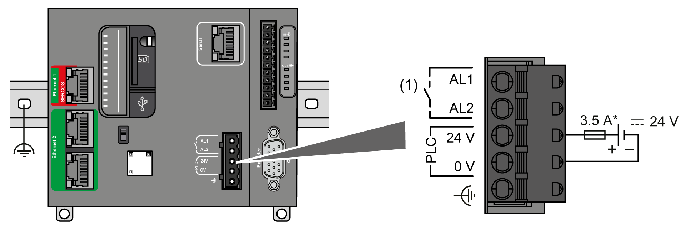

# DC Power Supply Characteristics and Wiring

## Overview

This section provides the characteristics and the wiring diagrams of the DC power supply.

## DC Power Supply Voltage Range

If the specified voltage range is not maintained, outputs may not switch as expected. Use appropriate safety interlocks and voltage monitoring circuits.

| WARNING | |
| --- | --- |
|  | UNINTENDED EQUIPMENT OPERATION  Do not exceed any of the rated values specified in the environmental and electrical characteristics tables.  Failure to follow these instructions can result in death, serious injury, or equipment damage. |

## DC Power Supply Requirements

The M262 Logic/Motion Controller requires a power supply with a nominal voltage of 24 Vdc. The 24 Vdc power supply must be rated Protective Extra Low Voltage (PELV) according to IEC 61140. This power supply is isolated between the electrical input and output circuits of the power supply.

| WARNING | |
| --- | --- |
|  | POTENTIAL OF OVERHEATING AND FIRE  * Do not connect the equipment directly to line voltage. * Use only isolating PELV power supplies and circuits to supply power to the equipment1.  Failure to follow these instructions can result in death, serious injury, or equipment damage. |

1 For compliance to UL (Underwriters Laboratories) requirements, the power supply must also conform to the various criteria of NEC Class 2, and be inherently current limited to a maximum power output availability of less than 100 VA (approximately 4 A at nominal voltage), or not inherently limited but with an additional protection device such as a circuit breaker or fuse meeting the requirements of clause 9.4 Limited-energy circuit of UL 61010-1. In all cases, the current limit should never exceed that of the electric characteristics and wiring diagrams for the equipment described in the present documentation. In all cases, the power supply must be grounded, and you must separate Class 2 circuits from other circuits. If the indicated rating of the electrical characteristics or wiring diagrams are greater than the specified current limit, multiple Class 2 power supplies may be used.

## Controller DC Characteristics

This table shows the characteristics of the DC power supply required for the controller:

| Characteristic | | Value |
| --- | --- | --- |
| Rated voltage | | 24 Vdc |
| Power supply voltage range | | 20.4...28.8 Vdc (ripple ± 10 % Un) |
| Power interruption time immunity | | Min. 3 ms |
| Maximum inrush current | | 40 A |
| Maximum power consumption | | 82 W  Including 25 W max. available for TM3 expansion modules  Including 45 W max. available for TMS expansion modules |
| Isolation | between DC power supply and internal logic | Not isolated |
| between DC power supply and grounding | 780 Vdc |
| Reverse polarity protection | | Yes |

## Power Interruption

The M262 Logic/Motion Controller must be supplied by an external 24 V power supply equipment. During power interruptions, the controller, associated to the suitable power supply, is able to continue normal operation for a minimum of 10 ms as specified by IEC standards.

When planning the management of the power supplied to the controller, you must consider the power interruption duration due to the fast cycle time of the controller.

There could potentially be many scans of the logic and consequential updates to the I/O image table during the power interruption, while there is no external power supplied to the inputs, the outputs or both depending on the power system architecture and power interruption circumstances.

| WARNING | |
| --- | --- |
|  | UNINTENDED EQUIPMENT OPERATION  * Individually monitor each source of power used in the controller system including input power supplies, output power supplies and the power supply to the controller to allow appropriate system shutdown during power system interruptions. * The inputs monitoring each of the power supply sources must be unfiltered inputs.  Failure to follow these instructions can result in death, serious injury, or equipment damage. |

## Controller DC Power Supply Wiring Diagram

The following figure shows the wiring of the controller DC power supply:

**(1)** Alarm Relay

**\*** Type T fuse

For more information on wiring requirements, refer to the [Rules for Terminal Blocks](D-SE-0069640.html#D-SE-0069640__D-SE-0069640.8).

EIO0000003659.12