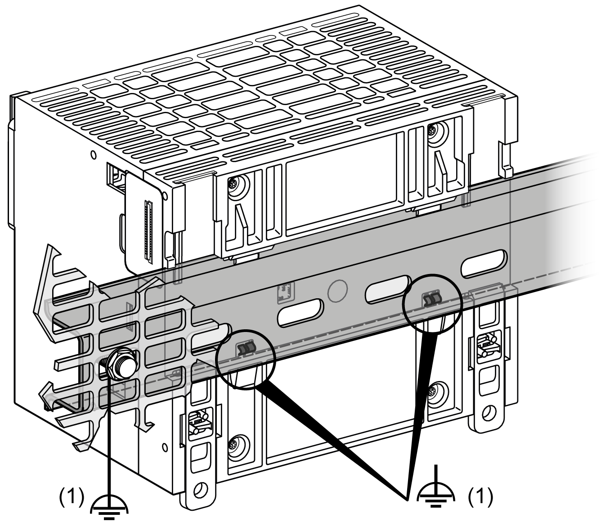
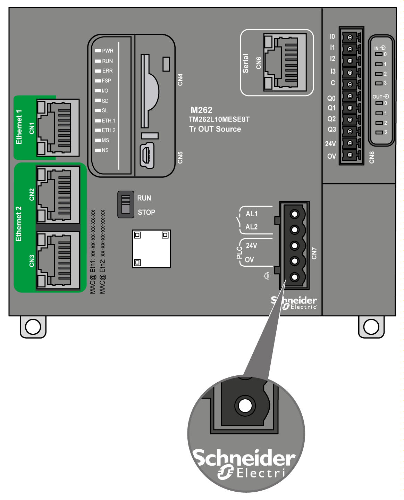
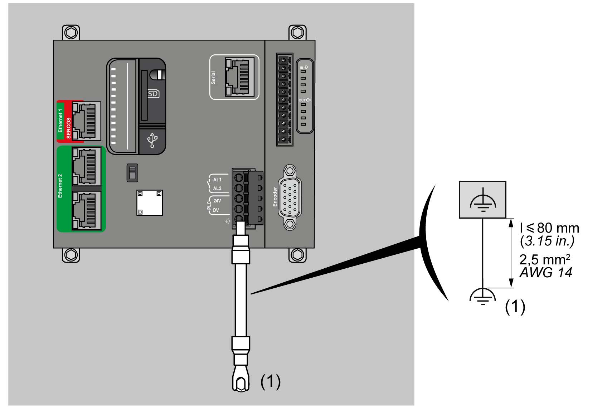
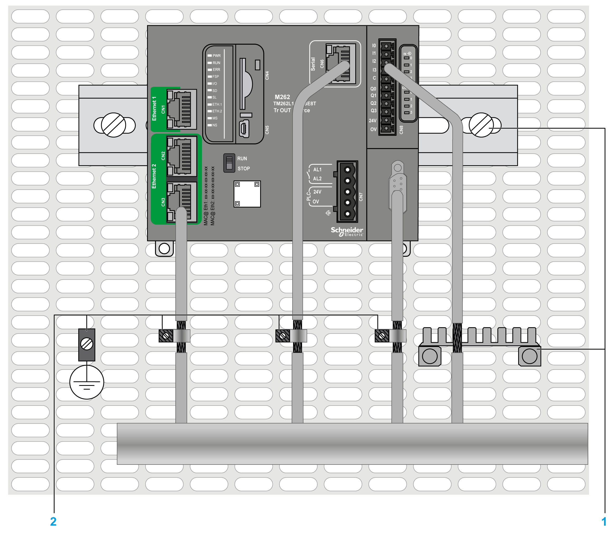
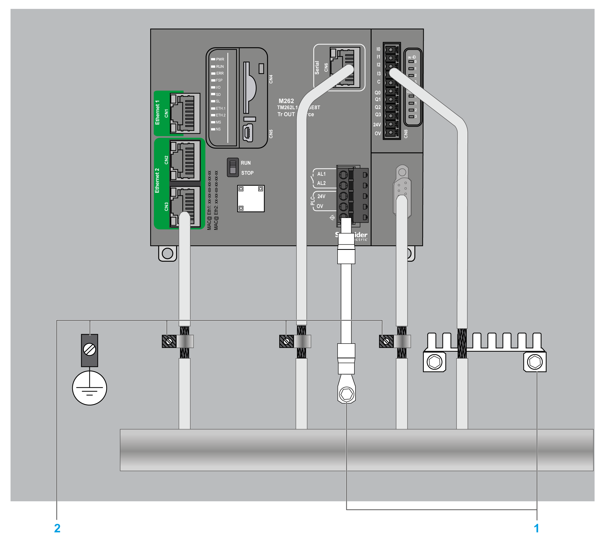

# Grounding the M262 Logic/Motion Controller System

## Functional Earth Ground (FE) on the DIN Rail

The DIN rail for your M262 Logic/Motion Controller controller is common with the functional earth ground (FE) plane and must be mounted on a conductive backplane.

| WARNING | |
| --- | --- |
|  | UNINTENDED EQUIPMENT OPERATION  Connect the DIN rail to the functional earth ground (FE) of your installation.  Failure to follow these instructions can result in death, serious injury, or equipment damage. |

The connection between the functional earth ground (FE) and the M262 Logic/Motion Controller system is made by the DIN rail contacts on the back of the controller and the expansion modules.

**1** Functional earth ground (FE)

**NOTE:** When the M262 Logic/Motion Controller system is mounted on a DIN rail, the functional earth ground (FE) connector on the front face of the controller can be used to help minimize electromagnetic interference:

## Protective Earth Ground (PE) on the Mounting Panel

The protective earth ground (PE) should be connected to the conductive mounting panel by a heavy-duty wire, usually a braided copper cable with the maximum allowable cable section.

## Functional Earth Ground (FE) on the Mounting Panel

Use a functional ground cable to connect the functional ground connector to the conductive backplane:

**(1)** Functional earth ground (FE)

The functional ground cable requires a cross-section of at least 1.5 mm2 (AWG 16) and a maximum length of 80 mm (3.15 in.).

## Shielded Cables Connections

To help minimize the effects of electromagnetic interference, cables carrying fieldbus communication signals must be shielded.

| WARNING | |
| --- | --- |
|  | UNINTENDED EQUIPMENT OPERATION  * Use shielded cables for communication signals. * Ground cable shields for communication signals at a single point 1. * Always comply with local wiring requirements regarding grounding of cable shields.  Failure to follow these instructions can result in death, serious injury, or equipment damage. |

1Multipoint grounding is permissible if connections are made to an equipotential ground plane dimensioned to help avoid cable shield damage in the event of power system short-circuit currents.

The  use of shielded cables requires compliance with the following wiring rules:

* For protective earth ground connections (PE), metal conduit or ducting can be used for part of the shielding length, provided there is no break in the continuity of the ground connections. For functional earth ground (FE), the shielding is intended to attenuate electromagnetic interference and the shielding must be continuous for the length of the cable. If the purpose is both functional and protective, as is often the case for communication cables, the cable must have continuous shielding.
* Wherever possible, keep cables carrying one type of signal separate from the cables carrying other types of signals or power.

The shielding must be securely connected to ground. The fieldbus communication cable shields must be connected to the protective earth ground (PE) with a connecting clamp secured to the conductive backplane of your installation.

The shielding of the following cables must be connected to the protective earth ground (PE):

* Ethernet (unless forbidden by an applicable standard)
* Serial
* Encoder (on TM262M• references)

The embedded I/O shields can be connected to either the protective earth ground (PE) or the functional earth ground (FE).

| DANGER | |
| --- | --- |
|  | HAZARD OF ELECTRIC SHOCK  * The grounding terminal connection (PE) must be used to provide a protective ground at all times. * Make sure that an appropriate, braided ground cable is attached to the PE/PG ground terminal before connecting or disconnecting the network cable to the equipment.  Failure to follow these instructions will result in death or serious injury. |

| WARNING | |
| --- | --- |
|  | ACCIDENTAL DISCONNECTION FROM PROTECTIVE GROUND (PE)  * Do not use the Grounding Bar to provide a protective earth ground (PE). * Use the Grounding Bar only to provide a functional earth ground (FE).  Failure to follow these instructions can result in death, serious injury, or equipment damage. |

The figure below represents an M262 Logic/Motion Controller with shielded cables connected to a DIN rail:

**1** Functional earth ground (FE)

**2** Protective earth ground (PE)

The figure below represents an M262 Logic/Motion Controller with shielded cables connected to a mounting panel:

**1** Functional earth ground (FE)

**2** Protective earth ground (PE)

## Protective Earth Ground (PE) Cable Shielding

To ground the shield of a cable via a grounding clamp:

| Step | Description | |
| --- | --- | --- |
| 1 | Strip the shielding for a length of 15 mm (0.59 in.). |  |
| 2 | Attach the cable to the conductive backplane plate by attaching the grounding clamp to the stripped part of the shielding as close as possible to the base of the M262 Logic/Motion Controller. |  |

NOTE: The shielding must be clamped securely to the conductive backplane to help ensure good contact.

## Functional Earth Ground (FE) Cable Shielding

Connect the shield of a cable via the grounding bar:

| Step | Description | |
| --- | --- | --- |
| 1 | Install the grounding bar directly on the conductive backplane below the M262 Logic/Motion Controller as illustrated. |  |
| 2 | Strip the shielding for a length of 15 mm (0.59 in.). |  |
| 3 | Tightly clamp on the blade connector **(1)** using a nylon fastener **(2)** (width 2.5...3 mm (0.1...0.12 in.)) and appropriate tool. |  |

EIO0000003659.12