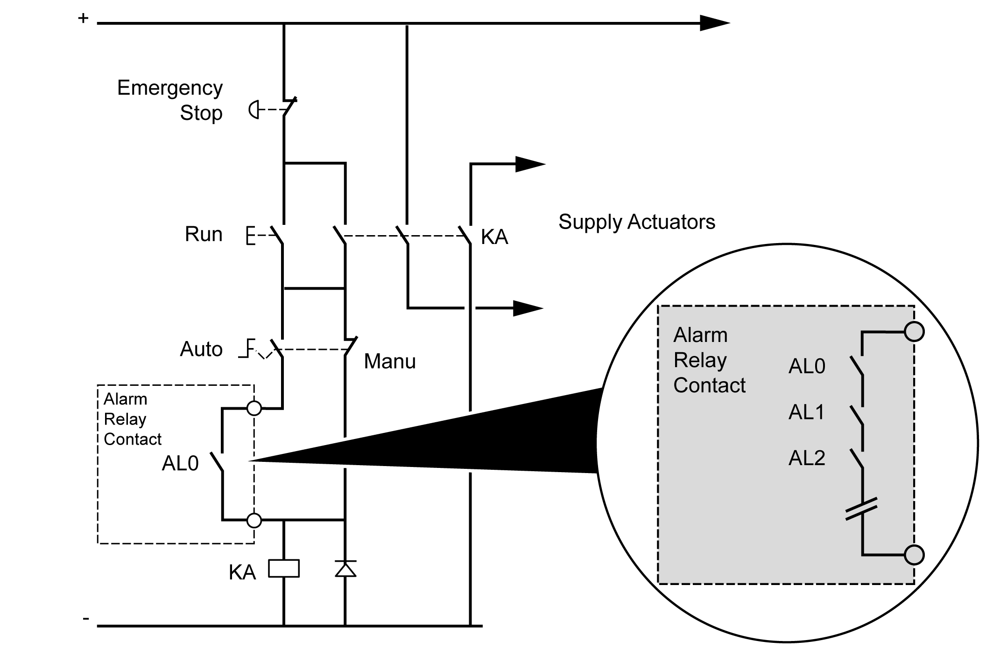

# Alarm Relay Wiring

## Overview

The M262 Logic/Motion Controller has integrated relay connections that can be wired to an external alarm.

## Wiring Stripping and Wire Sizes

The alarm relay is wired by means of a 5.08 mm pitch removable screw terminal block on the front face of the M262 Logic/Motion Controller. For details, refer to [Rules for Terminal Blocks](D-SE-0069640.html#D-SE-0069640__D-SE-0069640.8).

## Using the Alarm Relay for the Actuator Power Supply

Proceed as follows to use the Alarm relay for the actuator power supply:

| Step | Action |
| --- | --- |
| 1 | Switch on the power supply of the M262 Logic/Motion Controller using the main contactor. |
| 2 | When the M262 Logic/Motion Controller is powered on, switch on the output power supply for the actuators using the KA contactor. The following wiring diagram shows an M262 Logic/Motion Controller supplied by direct current:  In AUTO run mode, the KA contactor is controlled by the alarm relay from the power supply module. |

If your system comprises multiple M262 Logic/Motion Controllers installed in multiple racks, set the alarm relay contacts in all controllers in series (AL0, AL1, AL2, and so on), as shown in the following diagram:

EIO0000003659.12