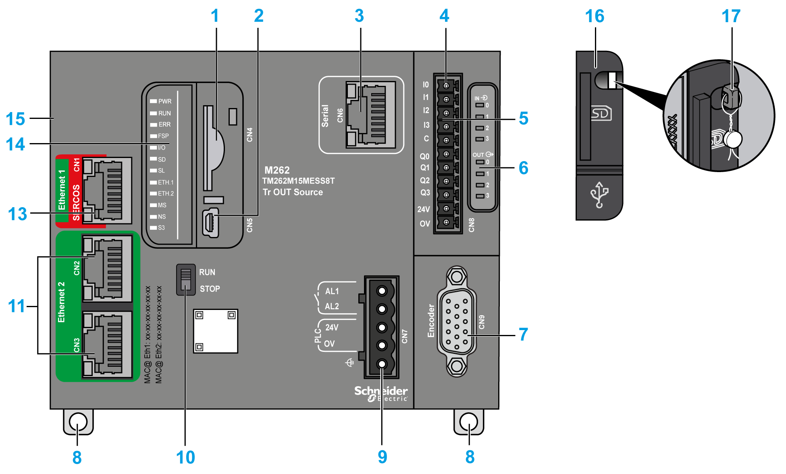
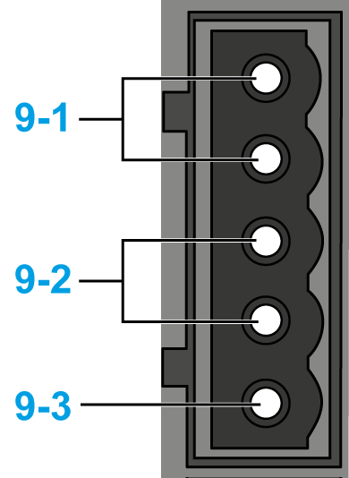
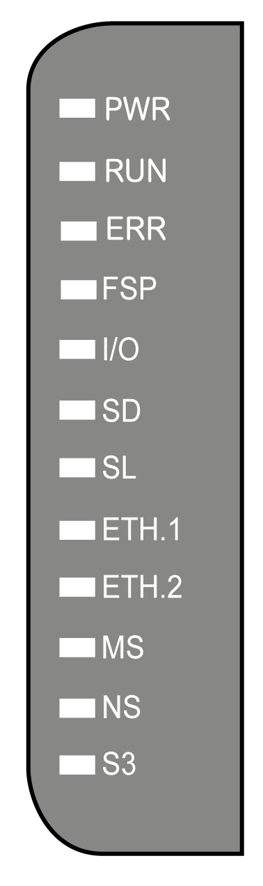
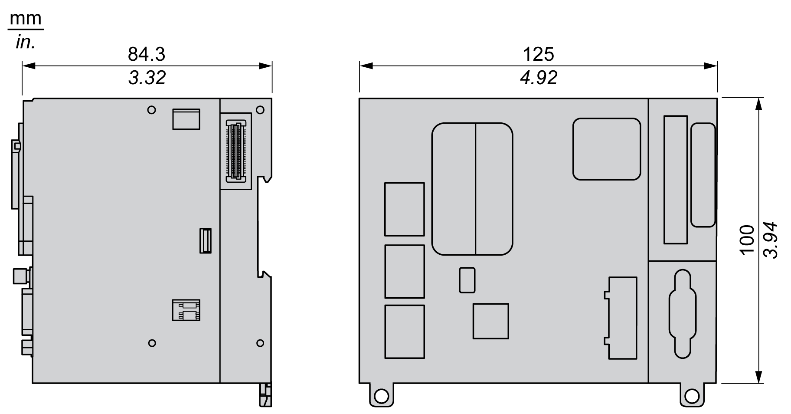

# TM262M15MESS8T Presentation

## Overview

The TM262M15MESS8T motion controller has:

* 4 fast digital inputs
* 4 fast digital outputs (source)
* Communication ports:

  + 1 serial line port
  + 1 USB mini-B programming port
  + 2 Ethernet switched ports
  + 1 Ethernet port for fieldbus with Sercos interface
* Encoder interface (SSI/incremental)

## Description

The following figure shows the different components of the TM262M15MESS8T motion controller:

| N° | Description | Refer to |
| --- | --- | --- |
| 1 | SD card slot | [SD Card](D-SE-0069628.html#D-SE-0069628) |
| 2 | USB mini-B programming port (for terminal connection to a programming PC) | [USB Mini-B Programming Port](D-SE-0069653.html#D-SE-0069653) |
| 3 | Serial line port (type RJ45 (RS-232 or RS-485)) | [Serial Line](D-SE-0069654.html#D-SE-0069654) |
| 4 | Inputs/outputs terminal connector | [Embedded Digital Inputs](D-SE-0081743.html#D-SE-0081743) |
| [Embedded Digital Outputs](D-SE-0081744.html#D-SE-0081744) |
| 5 | TM3 bus connector | [TM3 Expansion Modules](D-SE-0025087.html#D-SE-0025087) |
| 6 | I/O status LEDs | [Fast Inputs Status LEDs](D-SE-0081743.html#D-SE-0081743__D-SE-0081743.8)  [Fast Outputs Status LEDs](D-SE-0081743.html#D-SE-0081743__D-SE-0081743.8) |
| 7 | Encoder connector | [Encoder Interface](D-SE-0081751.html#D-SE-0081751) |
| 8 | Clip-on lock for 35 mm (1.38 in.) top hat section rail (DIN rail) | [Top Hat Section Rail (DIN rail)](TopHatSectionRailDINRail-8CC2B316.html) |
| 9-1 | Alarm relay terminal connector | [Alarm Relay](D-SE-0069668.html#D-SE-0069668) |
| 9-2 | 24 Vdc power supply | [DC Power supply Characteristics and Wiring](D-SE-0069641.html#D-SE-0069641) |
| 9-3 | Functional Earth (FE) grounding connection | [Grounding the M262 Logic/Motion Controller](D-SE-0069642.html#D-SE-0069642) |
| 10 | Run/Stop switch | [Run/Stop](D-SE-0069627.html#D-SE-0069627) |
| 11 | Dual port Ethernet switch | [Ethernet 2 Port](D-SE-0069651.html#D-SE-0069651) |
| 13 | Ethernet 1 / Sercos port | [Ethernet 1 Port](D-SE-0081748.html#D-SE-0081748) |
| 14 | Status LEDs | See below |
| 15 | TMS bus connector | [TMS Expansion Modules](../../../../../api/crossBook?lang=en-US&virtualBookName=m262prg&topicID=D_SE_0036327) |
| 16 | Protective cover (for SD card slot and USB mini-B programming port) | - |
| 17 | Locking hook (optional lock not included) | - |

## Status LEDs

This figure shows the status LEDs:

The following table describes the system status LEDs:

| Label | Function Type | Color | Status | Description | | |
| --- | --- | --- | --- | --- | --- | --- |
| **PWR** | Power | Green/Red | Green OFF/Red OFF | Indicates that power is removed. | | |
| Green ON/Red OFF | Indicates that power is applied, normal operation. | | |
| Green ON/Red 1 flash | Elevated internal operating temperature detected (over 80 °C (176 °F)). Take appropriate measures to reduce the temperature. | | |
| Green ON/Red 2 flashes | Detected error on TM3 power. | | |
| Green ON/Red 3 flashes | Detected error on TMS power. | | |
| Green ON/Red 4 flashes | Detected error on Serial line power. | | |
| **RUN** | Machine status | Green | ON | Indicates that the controller is running a valid application. | | |
| Regular flash | Indicates that the controller is running a valid application that is stopped. | | |
| Single flash | Indicates that the controller is running a valid application that is stopped at a breakpoint. | | |
| OFF | Indicates that the controller does not contain a valid application. | | |
| **ERR** | Internal Error | Red | ON | Indicates that an operating system error has been detected. The **RUN** LED is flashing to indicate that the application is stopped. | | |
| Fast flash | Indicates that the controller has detected a firmware or hardware error. | | |
| Regular flash | Indicates either that a minor error has been detected if **RUN** is ON or flashing, or that no application has been detected if **RUN** is OFF. | | |
| **FSP** | Forced stop | Red | ON | Indicates that the Run/Stop switch or Run/stop input has been activated to force the controller to the STOPPED state. | | |
| Regular flash | Indicates that at least one application variable is being forced. | | |
| **I/O** | I/O error | Red | ON | Indicates that I/O or expansion module errors have been detected. More details on the error detected are provided by:   * The system variables [i\_lwSystemFault\_1 and i\_lwSystemFault\_2](../../../../../api/crossBook?lang=en-US&virtualBookName=m262sys&topicID=D_SE_0004809) * The Diagnostics > Controller submenu of the [Web Server](../../../../../api/crossBook?lang=en-US&virtualBookName=m262prg&topicID=DiagnosticMenu_6CE5F84F) | | |
| **SD** | SD card access | Green | ON | Indicates that a firmware update is completed. | | |
| Green | Regular flash | Indicates that a firmware update or script execution is in progress. | | |
| Yellow | ON | Indicates that a firmware update or script execution is unsuccessful.  NOTE: If the script file is not executed, a log file is generated. The log file location in the controller is /usr/Syslog/FWLog.txt. | | |
| Yellow | Regular flash | Indicates that the SD card is being accessed (script execution in progress). | | |
| - | OFF | No SD card activity. | | |
| **SL** | Serial line | Yellow | Flashing | Indicates communication on the serial line. | | |
| OFF | Indicates no serial communication. | | |
| **ETH.1**  **ETH.2** | Ethernet port status | Green | ON | Indicates that the Ethernet port is connected and the IP address is defined. | | |
| 3 flashes | Indicates that the Ethernet port is not connected. | | |
| 4 flashes | Address conflict detected. Indicates that the configured IP address is already in use. | | |
| 5 flashes | Indicates that the address is the default address. The module is waiting for a BOOTP or DHCP sequence. | | |
| 6 flashes | Indicates that the configured IP address is not valid. The default IP address is being used. | | |
| OFF | Indicates that the Ethernet port is not configured. | | |
| **MS** | EtherNet/IP controller interface status | Red | ON | Indicates that an unrecoverable error has been detected. | | |
| Regular flash | Indicates that a recoverable error has been detected. | | |
| Green | ON | Indicates that the controller interface is functioning normally. | | |
| Regular flash | Indicates that the configuration is missing, incomplete, incorrect or unused. | | |
| Red/Green | Regular flash | Indicates that an error has been detected. | | |
| - | OFF | Indicates that the controller is powered off. | | |
| **NS** | EtherNet/IP network status | Red | ON | Indicates that one or more connections timed out, or that an error is preventing network communications (duplicate IP address, or bus powered off). | | |
| Regular flash | Indicates that a recoverable error has been detected, for example, one or more connections timed out. | | |
| Green | ON | Indicates that the controller interface is functioning normally and network connections are established. | | |
| Regular flash | Indicates that the controller interface is operating normally, but network connections have not been established, or the network configuration is missing, incomplete, or incorrect. | | |
| Red/Green | Regular flash | Indicates that an error has been detected. | | |
| - | OFF | Indicates that the controller is powered off, or is powered on with no IP address configured. | | |
| **S3** | Sercos 3 master status | - | OFF | No Sercos 3 communication. | | |
| Orange | ON | Sercos 3 initialization (phase-up) in progress. | | |
| Green | ON | Sercos 3 operational. | | |
| Red | ON | Sercos 3 error. | | |

This timing diagram shows the difference between the fast flash, regular flash and single flash:

## Dimensions

The following figure shows the external dimensions of the TM262M15MESS8T motion controller:

## Weight

670 g

EIO0000003659.12