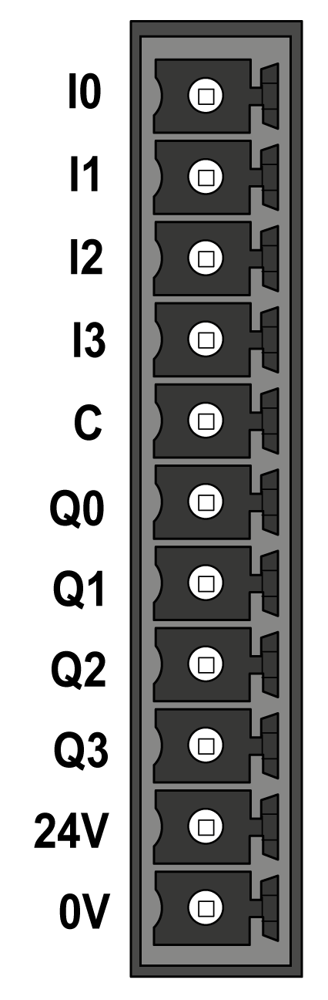
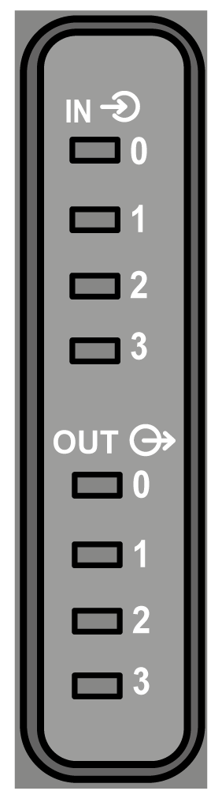
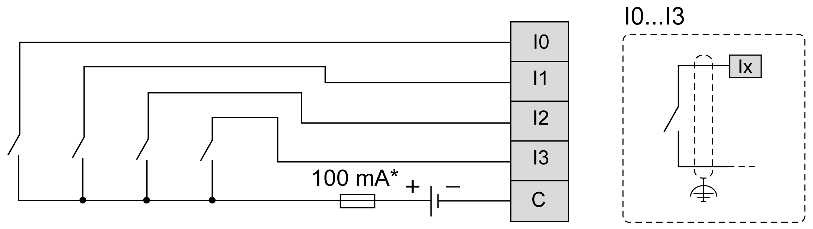

# Digital Inputs

## Overview

The Modicon M262 Logic/Motion Controller has 4 embedded fast digital inputs.

The digital inputs are connected on the front face of the controller.

| DANGER | |
| --- | --- |
|  | FIRE HAZARD  Use only the correct wire sizes for the maximum current capacity of the I/O channels and power supplies.  Failure to follow these instructions will result in death or serious injury. |

| WARNING | |
| --- | --- |
|  | UNINTENDED EQUIPMENT OPERATION  Do not exceed any of the rated values specified in the environmental and electrical characteristics tables.  Failure to follow these instructions can result in death, serious injury, or equipment damage. |

## Digital Input Characteristics

This table presents the characteristics of the digital inputs:

| Characteristic | | Value |
| --- | --- | --- |
| Number of input channels | | 4 (I0...I3) |
| Input type | | IEC61131-2 Type 1 |
| Logic type | | Sink |
| Rated power supply voltage | | 24 Vdc |
| Voltage limit | | 30 Vdc |
| Rated input current | | 7.5 mA |
| Input impedance | | 2.81 kΩ |
| Input limit values | Voltage at state 1 | > 15 Vdc (15...30 Vdc) |
| Voltage at state 0 | < 5 Vdc (0...5 Vdc) |
| Current at state 1 | > 3 mA |
| Current at state 0 | < 1.5 mA |
| Input delay | Turn on time | < 1 μs + filter delay |
| Turn off time | < 1 μs + filter delay |
| Isolation | Between input channels | No |
| Between input and internal logic | 550 Vac for 1 min. |
| Between input and output | 550 Vac for 1 min. |
| Cable | Type | Shielded cable, including COM signal |
| Length | 10 m (32.8 ft) max. |
| Connection type | | Removable spring terminal block |
| Connector insertion/removal durability | | Over 100 times |

## Pin Assignment

The digital inputs are connected on the front face of the controller.

This illustration describes the pin assignment of the connector:

This table describes the pin assignment of the embedded I/O connector:

| Pin | Label | Description |
| --- | --- | --- |
| 1 | **I0** | Digital input 0 |
| 2 | **I1** | Digital input 1 |
| 3 | **I2** | Digital input 2 |
| 4 | **I3** | Digital input 3 |
| 5 | **C** | Inputs common port |

## Status LEDs

This figure shows the I/O status LEDs:

| LED | Color | Status | Description |
| --- | --- | --- | --- |
| 0...3 | Green | On | The corresponding input channel is activated |
| Off | The corresponding input channel is deactivated |

NOTE: The LEDs indicate the logic state of each input.

## Wiring Rules

See [Wiring Best Practices](D-SE-0069640.html#D-SE-0069640).

Electromagnetic perturbations may cause the application to operate in an unexpected manner.

| WARNING | |
| --- | --- |
|  | UNINTENDED EQUIPMENT OPERATION  * Adapt the programmable filtering to the frequency applied at the inputs. * Use shielded cables wherever specified, connected to the functional ground using the grounding bar. * Use a specific 24 Vdc supply for inputs and outputs.  Failure to follow these instructions can result in death, serious injury, or equipment damage. |

## Wiring Diagram

This illustration presents the fast inputs wiring diagram:

**\*** Type T fuse

EIO0000003659.12