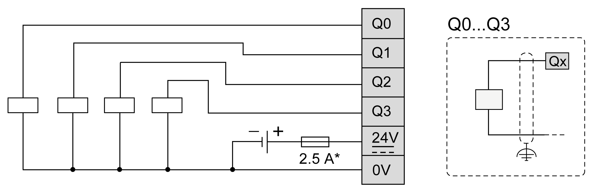

# Digital Outputs

## Overview

The Modicon M262 Logic/Motion Controller has 4 embedded fast digital outputs.

The digital outputs are connected on the front face of the controller.

| DANGER | |
| --- | --- |
|  | FIRE HAZARD  Use only the correct wire sizes for the maximum current capacity of the I/O channels and power supplies.  Failure to follow these instructions will result in death or serious injury. |

| WARNING | |
| --- | --- |
|  | UNINTENDED EQUIPMENT OPERATION  Do not exceed any of the rated values specified in the environmental and electrical characteristics tables.  Failure to follow these instructions can result in death, serious injury, or equipment damage. |

## Fast Outputs Characteristics

The table below describes the characteristics of the embedded digital outputs:

| Characteristic | | Value |
| --- | --- | --- |
| Number of output channels | | 4 outputs (Q0...Q3) |
| Output type | | Transistor |
| Output signal type | | Source (push-pull) |
| Rated output voltage | | 24 Vdc |
| Output current | | 500 mA |
| Total output current | | 2 A |
| Leakage current when switched off | | < 0.01 mA |
| Maximum power of filament lamp | | 1.5 W max. |
| Turn on time | | 1 μs max. |
| Turn off time | | 1 μs max. |
| Protection against short circuit or overload | | Yes. Typical current 5 A per output. Defect managed by group: Q0...Q3 |
| Automatic rearming after short circuit or overload | | Yes, 10 s (enabled/disabled by the software) |
| Isolation | Between output channels | No |
| Between output and internal logic | 550 Vac for 1 minute |
| Between output and input | 550 Vac for 1 minute |
| Cable length | | < 30 m (98.4 ft) |
| Connection type | | Removable spring terminal block |
| Connector insertion/removal durability | | Over 100 times |
| NOTE: Refer to [Protecting Outputs from Inductive Load Damage](D-SE-0069640.html#D-SE-0069640__D-SE-0069640.11) for additional information concerning output protection. | | |

## Pin Assignment

This illustration describes the pin assignment of the connector:

This table describes the pin assignment of the embedded I/O connector:

| Pin | Label | Description |
| --- | --- | --- |
| 6 | **Q0** | Digital output 0 |
| 7 | **Q1** | Digital output 1 |
| 8 | **Q2** | Digital output 2 |
| 9 | **Q3** | Digital output 3 |
| 10 | **24V** | Outputs and encoder 24 Vdc power supply |
| 11 | **0V** | Outputs and encoder 0 Vdc power supply |

## Outputs/Encoder Power Supply Characteristics

This table shows the characteristics of the power supply provided by the controller to the embedded digital outputs and the [encoder interface](D-SE-0003456.html#D-SE-0003456):

| Characteristic | Value |
| --- | --- |
| Nominal voltage | 24 Vdc |
| Power supply voltage range | 20.4...28.8 Vdc (ripple ± 10% Un) |
| Power supply type | PELV |
| Maximum input current | 2.6 A |
| Inrush current | Not limited |
| Voltage drop immunity | No |
| Reverse polarity protection | Yes |
| Overload protection | No. Non-replaceable 4 A slow fuse |
| Overvoltage protection | No |
| Voltage presence detection | Yes, typically >16 V  [I/O Status Codes](../../../../../api/crossBook?lang=en-US&virtualBookName=m262sys&topicID=D_SE_0003363) diagnostic is available in EcoStruxure Machine Expert software. |
| Isolation | 550 Vac for 1 minute |
| Cable length | < 3 m (9.84 ft) |

## Status LEDs

This figure shows the I/O status LEDs:

| LED | Color | Status | Description |
| --- | --- | --- | --- |
| 0...3 | Green | On | The corresponding output channel is activated |
| Off | The corresponding output channel is deactivated |

NOTE: The LEDs indicate the logic state of each output.

## Wiring Rules

See [Wiring Best Practices](D-SE-0069640.html#D-SE-0069640).

Electromagnetic perturbations may cause the application to operate in an unexpected manner.

| WARNING | |
| --- | --- |
|  | UNINTENDED EQUIPMENT OPERATION  * Adapt the programmable filtering to the frequency applied at the inputs. * Use shielded cables wherever specified, connected to the functional ground using the grounding bar. * Use a specific 24 Vdc supply for inputs and outputs.  Failure to follow these instructions can result in death, serious injury, or equipment damage. |

## Fast Outputs Wiring Diagram

This illustration presents the fast outputs wiring diagram:

**\*** Use a type T fuse appropriate for the load, not to exceed 2.5 A

| WARNING | |
| --- | --- |
|  | UNINTENDED EQUIPMENT OPERATION  Ensure that the physical wiring respects the connections indicated in the wiring diagram.  Failure to follow these instructions can result in death, serious injury, or equipment damage. |

EIO0000003659.12