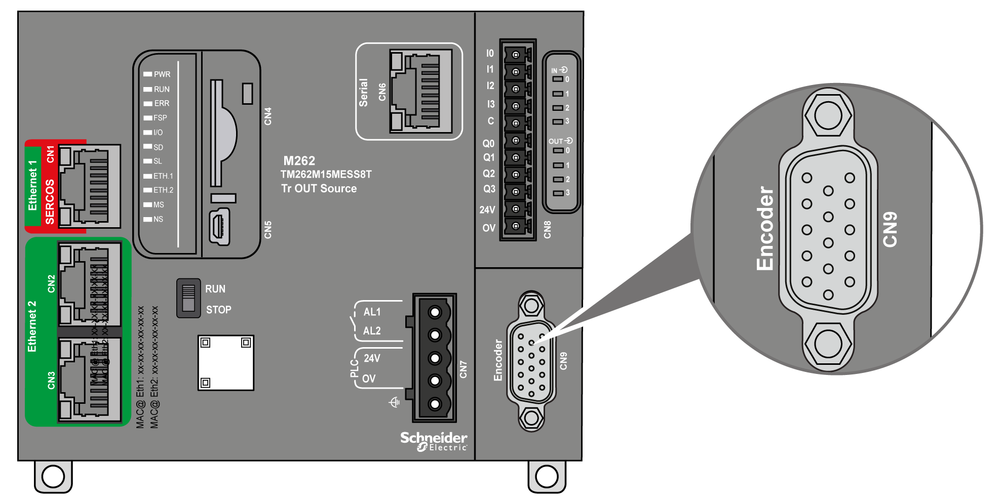
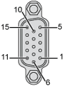
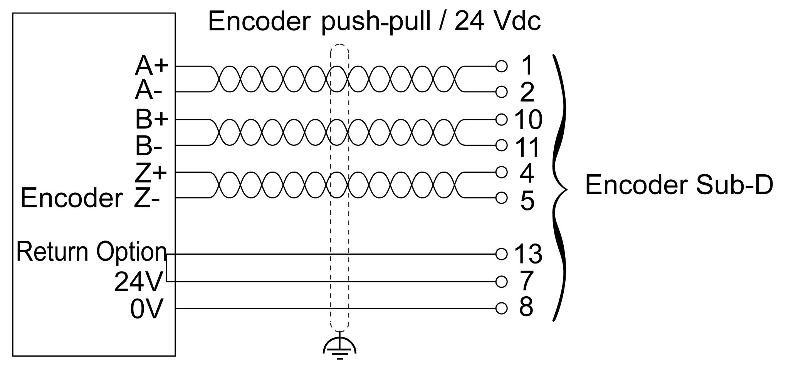
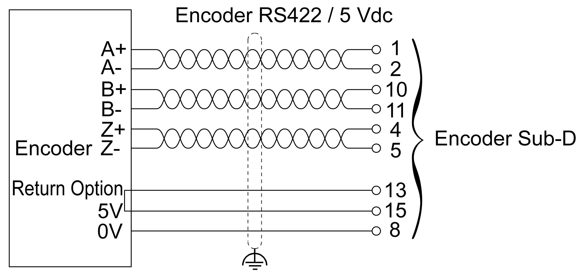
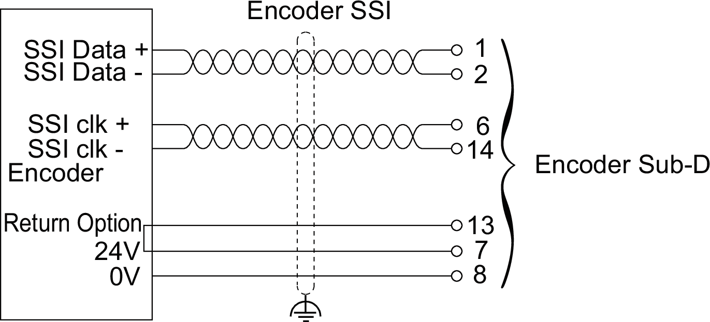
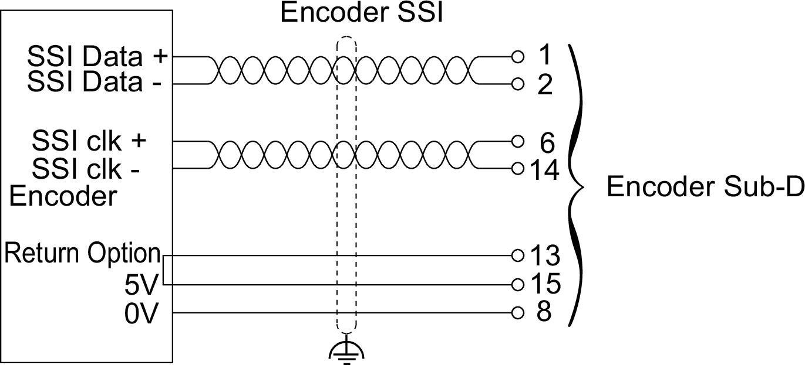
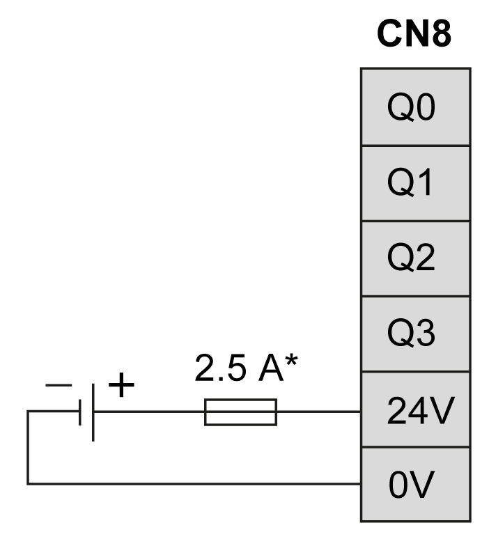

# Encoder Interface

## Overview

The following illustration shows the encoder interface on TM262M• references:

The encoder interface supports the following connection types:

* Incremental (RS422 (5 V) or push-pull (24 V))
* Absolute (SSI)

The advantage of using an Absolute (SSI) encoder for position detection is that the position of the moving object being monitored is retained. On power-up, or restart following a power interruption, the data provided by the encoder can therefore be used without qualification by the controller.

The encoder interface can provide power to the encoder.

The power supply to the encoder interface is provided by the controller through the embedded [digital outputs](D-SE-0081744.html#D-SE-0081744) power supply.

NOTE: You must take into account the consumption of the encoder when sizing the power supply for the embedded digital outputs.

## Characteristics

The table below shows the characteristics of the encoder:

| Characteristics | Description | |
| --- | --- | --- |
| Inputs | Rated input voltage | 5 Vdc |
| Input voltage limits | 28.8 Vdc |
| Rated input current | 1.5 mA at 5 V  8 mA at 24 V |
| Input impedance | 2.85 kΩ |
| Incremental Encoder | Type of signal | A+, A-, B+, B-, Z+, Z- |
| Maximum operating frequency | 200 kHz |
| Number of bits | 32, with configurable frame:   * Number of turns * Number of bits/turn * Binary or gray format * Parity |
| SSI Encoder | Clock frequency | 100 KHz, 250 KHz, or 500 KHz (selectable in the software) |
| Clock voltage | 5 Vdc |
| Power supply to encoder (selectable in the software) | None, 5 Vdc, or 24 Vdc: | |
| None | No power is supplied to the encoder. |
| 5 Vdc | Nominal voltage: 5.1 Vdc ± 5 %  Maximum current: 200 mA  Overcurrent and short circuit protection: No  Encoder power return: Yes (selectable in the software). Typical threshold: 2 V |
| 24 Vdc | Use a regulated and smoothed power supply on the 24 Vdc power inputs of the CN8 terminal connector, with the specific characteristics of voltage limits and ripple factor specified for the encoder.  Nominal voltage: 24 Vdc with -0.7 Vdc typical internal voltage drop  Maximum current: 200 mA  Overcurrent and short circuit protection: Yes. Maximum current < 1.5 A  Encoder power return: Yes (selectable in the software). Typical threshold: 9 V |
| Isolation | Between encoder signals and internal logic | 550 Vac for 1 min. |
| Connector | Type | Removable 15-pin Sub-D HD |
| Insertion/removal durability | > 100 times |
| Cable | Type | Twisted pairs, shielded |
| Length | ≤ 250 kHz: 100 m (328 ft) maximum. See Note below.  500 kHz: 50 m (164 ft) maximum. See Note below. |

NOTE: **Calculation of Maximum Cable Length**

Maximum cable length [m] = Maximum voltage drop for the cable [V] x Wire cross section [mm2] / (Encoder current [A] x 0.0171 [Ω.mm2/m])

where:

Maximum voltage drop for the cable = (Minimum module output voltage - Minimum encoder input voltage) / 2

**Example:**

Encoder consumes 100 mA with a 4.5…5.5 V supply

Minimum module output voltage = 5.1 Vdc x 0.95 = 4.845 Vdc

Maximum voltage drop for the cable = (4.845 Vdc - 4.5 Vdc) / 2 = 0.1725 Vdc

Maximum cable length 0.14 mm2 = 0.1725 x 0.14 / (0.1 x 0.0171) = 14 m

Maximum cable length 0.50 mm2 = 0.1725 x 0.50 / (0.1 x 0.0171) = 50 m

## Pin Assignment

The encoder interface consists of a 15-pin Sub-D HD connector.

The following illustration describes the pins numbering:

The following table describes the pins of the encoder:

| Description | Encoder | Pin | Wire colors |
| --- | --- | --- | --- |
| Incremental encoder | A+ | 1 | Red/white |
| A- | 2 | Brown |
| Z+ | 4 | Orange |
| Z- | 5 | Yellow |
| B+ | 10 | White |
| B- | 11 | Purple |
| Absolute (SSI) encoder | SSI data + | 1 | Red/white |
| SSI data - | 2 | Brown |
| CLKSSI + | 6 | Green |
| CLKSSI - | 14 | Light brown |
| 5 V Encoder supply | + 5 Vdc | 15 | Light purple |
| 0 Vdc | 8 | Pink |
| 24 V Encoder supply | + 24 Vdc | 7 | Blue |
| 0 Vdc | 8 | Pink |
| Encoder power distribution feedback(1) | Supply return | 13 | Light green |
| Shielding | – | Shell | Cable braided shield |
| **(1)** Detection of encoder supply from controller. Default: Raised if signal is absent. | | | |

## Wiring Diagram

The following illustration describes the wiring diagram of an incremental push-pull encoder (24 Vdc power supply to encoder) mounted on the encoder interface:

The following illustration describes the wiring diagram of an incremental RS422 encoder (5 Vdc power supply to encoder) mounted on the encoder interface:

The following illustration describes the wiring diagram of an absolute SSI encoder (24 Vdc power supply to encoder) mounted on the encoder interface:

The following illustration describes the wiring diagram of an absolute SSI encoder (5 Vdc power supply to encoder) mounted on the encoder interface:

**\*** Use a type T fuse appropriate for the load, not to exceed 2.5 A.

EIO0000003659.12