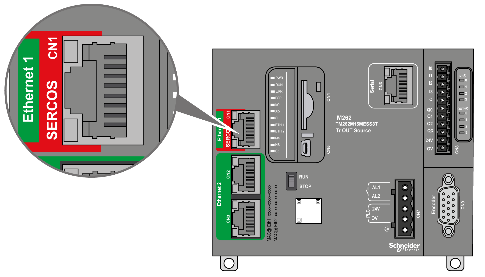

# Ethernet 1 Port

## Overview

The M262 Logic/Motion Controller is equipped with Ethernet communications ports:

| Port Name | Number of Ports | Reference |
| --- | --- | --- |
| Ethernet 1 | 1 (100BASE-T) | TM262L• |
| 1 (100BASE-T / SERCOS) | TM262M• |
| Ethernet 2 | 2 (dual 1000BASE-T Ethernet switch) | TM262• |

## Characteristics

This table describes the physical characteristics of the Ethernet 1 port:

| Characteristic | Description |
| --- | --- |
| Protocols | Modbus TCP, EtherNet/IP, SERCOS III (on TM262M• references) |
| Connector type | RJ45 |
| Auto negotiation | From 10 Mbps half duplex to 100 Mbps full duplex |
| Cable type | Shielded |
| Automatic cross-over detection | MDI/MDIX |

## Ethernet 1 Pin Assignment

This figure shows the Ethernet 1 connector pin assignment:

This table describes the Ethernet 1 RJ45 connector pins:

| Pin N° | 100BASE-T | Description |
| --- | --- | --- |
| 1 | TD+ | Transmit data + |
| 2 | TD- | Transmit Data - |
| 3 | RD+ | Receive Data + |
| 4 | – | Reserved |
| 5 | – | Reserved |
| 6 | RD- | Receive Data - |
| 7 | – | Reserved |
| 8 | – | Reserved |

NOTE: The controller supports the MDI/MDIX auto-crossover cable function. It is not necessary to use special Ethernet crossover cables to connect devices directly to this port (connections without an Ethernet hub or switch).

NOTE: Ethernet cable disconnection is detected every second. In case of disconnection of a short duration (< 1 second), the network status may not indicate the disconnection.

## Status LED

This figure shows the RJ45 connector status LEDs:

This table describes the Ethernet port status LEDs:

| Label | Description | LED | | |
| --- | --- | --- | --- | --- |
| Color | Status | Description |
| 1 | Ethernet link/speed | Green/Yellow | Off | No link |
| Solid yellow | Link at 10 Mbps |
| Solid green | Link at 100 Mbps |
| 2 | Ethernet activity | Green | Off | No activity and no link |
| On | The link is detected, but there is no activity |
| Flashing | Transmitting or receiving data |

## Sercos Port

This illustration presents the location of the Sercos port on TM262M• references:

## Sercos Port Characteristics

| Characteristic | Description |
| --- | --- |
| Standard | Sercos III (Master) |
| Connector type | RJ45 |
| Performances | * TM262M05MESS8T: up to 4 axes synchronized at 1 ms * TM262M15MESS8T: up to 4 axes synchronized at 1 ms * TM262M25MESS8T:    + up to 4 axes synchronized at 1 ms   + up to 8 axes synchronized at 2 ms * TM262M35MESS8T:    + up to 8 axes synchronized at 1 ms   + up to 16 axes synchronized at 2 ms   + up to 24 axes synchronized at 4ms |

## Sercos Port Pin Assignment

This illustration presents the pins of the Sercos port:

This table describes the pin assignment of the Sercos port:

| Pin | Signal | Description |
| --- | --- | --- |
| 1 | TD+ | Transmit data + |
| 2 | TD- | Transmit data - |
| 3 | RD+ | Receive data + |
| 4 | - | Reserved |
| 5 | - | Reserved |
| 6 | RD- | Receive data - |
| 7 | - | Reserved |
| 8 | - | Reserved |

EIO0000003659.12