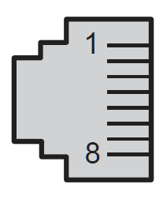
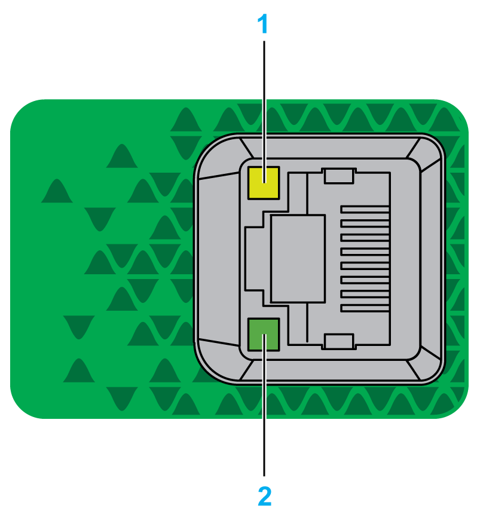

# Ethernet 2 Ports

## Overview

The M262 Logic/Motion Controller is equipped with Ethernet communications ports:

| Port Name | Number of Ports | Reference |
| --- | --- | --- |
| Ethernet 1 | 1 (100BASE-T) | TM262L• |
| 1 (100BASE-T / SERCOS) | TM262M• |
| Ethernet 2 | 2 (dual 1000BASE-T Ethernet switch) | TM262• |

## Characteristics

This table describes the physical characteristics of the Ethernet 2 ports:

| Characteristic | Description |
| --- | --- |
| Protocols | Modbus TCP, EtherNet/IP, Machine Expert (used for data exchange between a [programming PC and the controller](D-SE-0002416.html#D-SE-0002416)). |
| Connector type | RJ45 |
| Auto negotiation | From 100 Mbps half duplex to 1000 Mbps full duplex |
| Cable type | Shielded |
| Automatic cross-over detection | MDI/MDIX |

## Ethernet 2 Pin Assignment

This figure shows the Ethernet 2 RJ45 connector pin assignment:

This table describes the Ethernet 2 connector pin assignment:

| Pin N° | 100BASE-T | 1000BASE-T |
| --- | --- | --- |
| 1 | TD+ | DA+ |
| 2 | TD- | DA- |
| 3 | RD+ | DB+ |
| 4 | – | DC+ |
| 5 | – | DC- |
| 6 | RD- | DB- |
| 7 | – | DD+ |
| 8 | – | DD- |

NOTE: The controller supports the MDI/MDIX auto-crossover cable function. It is not necessary to use special Ethernet crossover cables to connect devices directly to this port (connections without an Ethernet hub or switch).

NOTE: Ethernet cable disconnection is detected every second. In case of disconnection of a short duration (< 1 second), the network status may not indicate the disconnection.

## Status LEDs

This figure shows the status LEDs on the RJ45 connector:

This table describes the Ethernet port status LEDs:

| Label | Description | LED | | |
| --- | --- | --- | --- | --- |
| Color | Status | Description |
| 1 | Ethernet link/speed | Green/Yellow | Off | No link |
| Solid yellow | Link at 100 Mbps |
| Solid green | Link at 1000 Mbps |
| 2 | Ethernet activity | Green | Off | No activity and no link |
| On | The link is detected, but there is no activity |
| Flashing | Transmitting or receiving data |

EIO0000003659.12