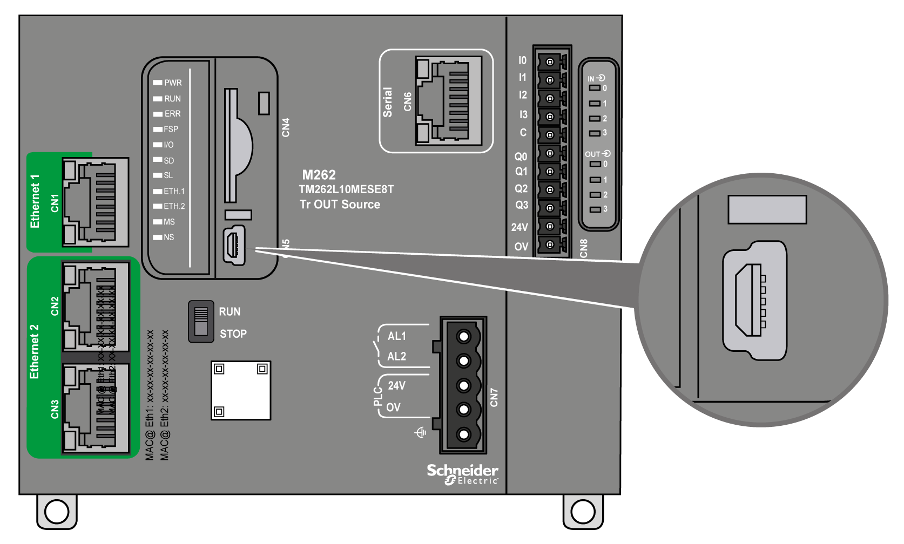

# USB Mini-B Programming Port

## Overview

The USB Mini-B Port is the programming port you can use to connect a PC with a USB host port using EcoStruxure Machine Expert software. Using a typical USB cable, this connection is suitable for quick updates of the program or short duration connections to perform maintenance and inspect data values. It is not suitable for long-term connections such as commissioning or monitoring without the use of specially adapted cables to help minimize electromagnetic interference.

| WARNING | |
| --- | --- |
|  | UNINTENDED EQUIPMENT OPERATION OR INOPERABLE EQUIPMENT  * You must use a shielded USB cable such as a BMX XCAUSBH0•• secured to the functional ground (FE) of the system for any long-term connection. * Do not connect more than one controller or bus coupler at a time using USB connections. * Do not use the USB port(s), if so equipped, unless the location is known to be non-hazardous.  Failure to follow these instructions can result in death, serious injury, or equipment damage. |

The following figure shows the location of the USB Mini-B programming port:

## Characteristics

This table describes the characteristics of the USB Mini-B programming port:

| Parameter | USB Programming Port |
| --- | --- |
| Function | Compatible with USB 2.0 |
| Connector type | Mini-B |
| Isolation | 550 Vac for 1 minute |
| Cable type | Shielded |
| Max. Baud Rate | 12 Mbits/sec |
| Max. cable length | 5 m (16.5 ft) |
| Supported protocols | Machine Expert Protocol  FTP  HTTP  Modbus |

EIO0000003659.12