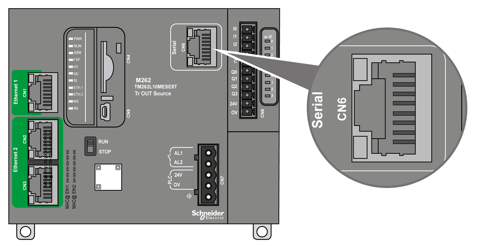

# Serial Line

## Overview

The serial line can be used to communicate with devices supporting the Modbus protocol as either master or slave, ASCII protocol (printer, modem...) and Machine Expert Protocol (HMI,...).

## Characteristics

| Characteristic | | Description |
| --- | --- | --- |
| Function | | RS485 or RS232 software configured |
| Connector type | | RJ45 |
| Isolation | | 550 Vac |
| Baud rate | | 1200...115200 bps |
| Cable | Type | Shielded |
| Maximum length (between the controller and an isolated junction box) | 30 m (98.43 ft) for RS485  15 m (49.21 ft) for RS232 |
| Polarization | | Software configuration is used to connect 576 Ω polarization resistors when the node is configured as a master. |

NOTE: Some devices provide voltage on RS485 serial connections. Do not connect these voltage lines to your controller as they may damage the controller serial port electronics and render the serial port inoperable.

| NOTICE | |
| --- | --- |
|  | INOPERABLE EQUIPMENT  Use only the VW3A8306R•• serial cable to connect RS485 devices to your controller.  Failure to follow these instructions can result in equipment damage. |

## Pin Assignment

The following figure shows the pins of the RJ45 connector:

This table describes the pin assignment of the RJ45 connector:

| Pin | RS232 | RS485 |
| --- | --- | --- |
| 1 | RxD | N.C. |
| 2 | TxD | N.C. |
| 3 | N.C. | N.C. |
| 4 | N.C. | D1 |
| 5 | N.C. | D0 |
| 6 | N.C. | N.C. |
| 7 | N.C. | N.C |
| 8 | Common | Common |
| N.C.: No connection | | |

| WARNING | |
| --- | --- |
|  | UNINTENDED EQUIPMENT OPERATION  Do not connect wires to unused terminals and/or terminals indicated as “No Connection (N.C.)”.  Failure to follow these instructions can result in death, serious injury, or equipment damage. |

## Status LED

See the description of the **SL** [status LED](D-SE-0081739.html#D-SE-0081739__D-SE-0081739.5).

EIO0000003659.12