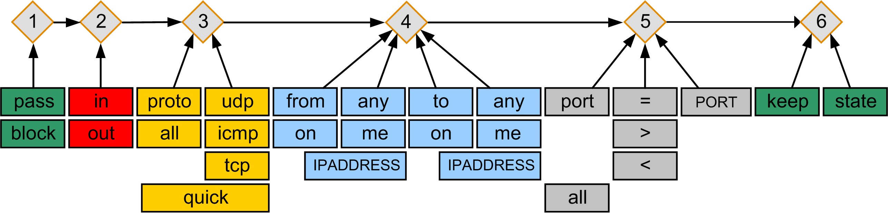

# Firewall Rules

## Overview

The following figure and table present the simplified syntax for the firewall configuration.

NOTE: Keywords in capital letters are placeholders for literal values.

| Item | Description of section | Keyword | Description of keyword |
| --- | --- | --- | --- |
| 1 | Block or pass incoming/outgoing packets unless other rules explicitly allow the packets to pass. | pass | Accepts the specified packet. |
| block | Blocks the specified packet. |
| 2 | Specify the traffic direction (to/from the controller). | in | Specifies an incoming packet. |
| out | Specifies an outgoing packet. |
| 3 | Filter in multiple network topologies with multiple protocols. | proto | Specifies an Internet protocol. |
| all | Specifies all traffic. That is, packets originating from any source and addressed to any destination. |
| udp | UDP packets. |
| icmp | ICMP packets. |
| tcp | TCP packets. |
| quick | Ends processing the configuration file on the first match and immediately takes the action specified in the rule. |
| 4 | Specify interfaces and addresses. | from | Specifies a source address or a source range of addresses. |
| any | Specifies packets originating from any source (with “from” keyword). |
| on | Specifies an interface. |
| me | In an IP filter rule, this keyword specifies any address configured on the system. |
| IPADDRESS | Specifies the IP address.  IPADDRESS supports IPv4 and IPv6 addresses, but IPv6 is not supported by the controller. |
| to | Specifies a destination address or a destination range of addresses. |
| any | Specifies packets addressed to any destination (with “to” keyword). |
| 5 | Specify a port for a UDP or TCP packet.  For more information, refer to [Default Firewall Configuration](DefaultFirewallConfiguration-01C0A634.html). | port | Specifies a port for a UDP or TCP packet. |
| all | Specifies all ports (UDP/TCP). |
| = | equal |
| < | less than |
| > | greater than |
| PORT | Specifies the port number. |
| 6 | Enable stateful inspection.  For more information, refer to [Stateful Inspection (keep state)](FirewallConfigurationFile-01C33CB2.html#FirewallConfigurationFile-01C33CB2__StatefulInspectionkeepState-01DE7257). | keep state | Stateful inspection temporarily opens a port for incoming traffic when an outgoing packet matches the specified rule. With the “keep state” keyword, the firewall tracks the state of an existing connection based on source IP address, destination IP address, source port, destination port, and protocol. |

## Keywords for the Firewall Configuration File

## !

| Keyword | Description | Usage | Additional information |
| --- | --- | --- | --- |
| ! | Inverts a parameter. | “keyword” ! parameter | – |

## all

| Keyword | Description | Usage | Additional information |
| --- | --- | --- | --- |
| all | Specifies all traffic. That is, packets originating from any source and addressed to any destination. | {block | pass} {in | out} all | – |

## any

| Keyword | Description | Usage | Additional information |
| --- | --- | --- | --- |
| any | Specifies packets arriving from any source (with “from” keyword) or addressed to any destination (with “to” keyword). | {block | pass} {in | out} {to | from} any | – |

## block

| Keyword | Description | Usage | Additional information |
| --- | --- | --- | --- |
| block | Blocks the specified packet. | block {in | out} {to | from} address\_scope | address\_scope can be a unique IP address, an address space, or one of the keywords: !, all, me, or any. |

## from

| Keyword | Description | Usage | Additional information |
| --- | --- | --- | --- |
| from | Specifies a source address or range of addresses. | {block | pass} {in | out} from address\_scope | address\_scope can be a unique IP address, an address space, or one of the keywords: !, all, me, or any. |

## icmp

| Keyword | Description | Usage | Additional information |
| --- | --- | --- | --- |
| icmp | Specifies ICMP (Internet Control Message Protocol) packets. | pass in quick proto icmp from any to me keep state | – |

## in

| Keyword | Description | Usage | Additional information |
| --- | --- | --- | --- |
| in | Specifies an incoming packet. | {block | pass} in address\_scope | address\_scope can be a unique IP address, an address space, or one of the keywords: !, all, me, or any. |

## IPADDRESS

| Keyword | Description | Usage | Additional information |
| --- | --- | --- | --- |
| IPADDRESS | Specifies an IP address. | * {block | pass} {in | out} from 192.168.74.3 * {block | pass} {in | out} from 192.168.74.0/24 | IPADDRESS supports IPv4 and IPv6 addresses, but IPv6 is not supported by the controller. |

## keep state

| Keyword | Description | Usage | Additional information |
| --- | --- | --- | --- |
| keep state | Enables stateful inspection.  Stateful inspection temporarily opens a port for incoming traffic when an outgoing packet matches the specified rule. With the “keep state” keyword, the firewall tracks the state of an existing connection based on source IP address, destination IP address, source port, destination port, and protocol.  For more information, refer to [Stateful Inspection (keep state)](FirewallConfigurationFile-01C33CB2.html#FirewallConfigurationFile-01C33CB2__StatefulInspectionkeepState-01DE7257). | {block | pass} {in | out} {to | from} address\_scope keep state | address\_scope can be a unique IP address, an address space, or one of the keywords: !, all, me, or any. |

## me

| Keyword | Description | Usage | Additional information |
| --- | --- | --- | --- |
| me | In an IP filter rule, this keyword specifies any address configured on the system. | {block | pass} {in | out} me | - |

## on

| Keyword | Description | Usage | Additional information |
| --- | --- | --- | --- |
| on | Specifies an interface. | {block | pass} {in | out} on interface[+] address\_scope | * For interface, enter an interface name. The plus sign (+) is used as a wildcard to specify any character or digit in an interface name. * address\_scope can be a unique IP address, an address space, or one of the keywords: !, all, me, or any. |

## out

| Keyword | Description | Usage | Additional information |
| --- | --- | --- | --- |
| out | Specifies an outgoing packet. | {block | pass} out address\_scope | address\_scope can be a unique IP address, an address space, or one of the keywords: !, all, me, or any. |

## pass

| Keyword | Description | Usage | Additional information |
| --- | --- | --- | --- |
| pass | Accepts the specified packet. | pass {in | out} {to | from} address\_scope | address\_scope can be a unique IP address, an address space, or one of the keywords: !, all, me, or any. |

## port

| Keyword | Description | Usage | Additional information |
| --- | --- | --- | --- |
| port | Specifies a port for a UDP or TCP packet.  For more information, refer to [Default Firewall Configuration](DefaultFirewallConfiguration-01C0A634.html). | {block | pass} {in | out} proto proto\_value {to | from} address\_scope port op port\_value | * proto\_value is tcp or udp. * address\_scope can be a unique IP address, an address space, or one of the keywords: !, all, me, or any. * op is a mathematical operator. For example, port 10000 <> 20000 refers to the port numbers less than 10000 and greater than 20000. * port\_value is an individual port or an interval. |

## PORT

| Keyword | Description | Usage | Additional information |
| --- | --- | --- | --- |
| PORT | Specifies the port number. | pass in quick proto tcp from any to me port = 20 | – |

## proto

| Keyword | Description | Usage | Additional information |
| --- | --- | --- | --- |
| proto | Specifies an Internet protocol. | {block | pass} {in | out} proto proto\_value address\_scope [port op port\_value] | * proto\_value is tcp or udp. * address\_scope can be a unique IP address, an address space, or one of the keywords: !, all, me, or any. * op is a mathematical operator. * port\_value is an individual port or an interval. |

## quick

| Keyword | Description | Usage | Additional information |
| --- | --- | --- | --- |
| quick | Ends processing the configuration file on the first match and immediately takes the action specified in the rule. | {block | pass} {in | out} quick address\_scope | address\_scope can be a unique IP address, an address space, or one of the keywords: !, all, me, or any. |

## tcp

| Keyword | Description | Usage | Additional information |
| --- | --- | --- | --- |
| tcp | Specifies TCP (Transmission Control Protocol) packets. | pass in quick proto tcp from any to me port = 20 keep state | – |

## to

| Keyword | Description | Usage | Additional information |
| --- | --- | --- | --- |
| to | Specifies a destination address or a destination range of addresses. | {block | pass} {in | out} to address\_scope | address\_scope can be a unique IP address, an address space, or one of the keywords: !, all, me, or any. |

## udp

| Keyword | Description | Usage | Additional information |
| --- | --- | --- | --- |
| udp | Specifies UDP (User Datagram Protocol) packets. | pass in quick proto udp from any to me port = 1202 keep state | – |

EIO0000005527.01