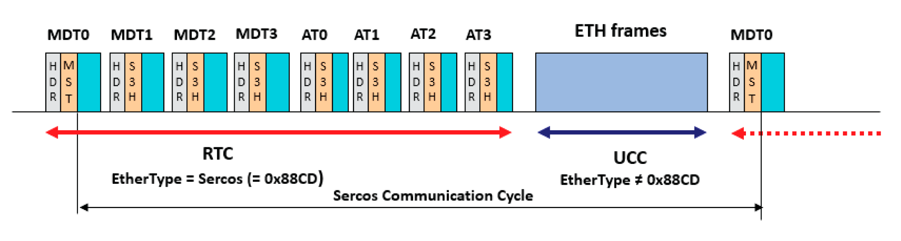

# Sercos Communication Cycle

## Communication Cycle

Communication under Sercos takes place at cyclic intervals. The Sercos specifications provide for cycle times between 31.25 µs to 65 ms. The Modicon M660 controller offers cycle times of 1 ms, 2 ms or 4 ms. The selection of the appropriate cycle time depends on a range of factors such as application requirements, installed hardware, amount of data to be transferred, etc.

The communication cycle is divided into two logical channels, the real-time channel RTC and the non-real-time channel UCC. The following illustration presents a Sercos [communication cycle in communication phase CP4](SercosCommunicationStateMachineAndC-494E57D2.html#SercosCommunicationStateMachineAndC-494E57D2__CommunicationStatesCommunicationPha-494E5165):

MDTs and ATs are transmitted in the real-time channel. The maximum number of MDTs and ATs per cycle is four each (MDT0 to MDT3 and AT0 to AT3) as shown in the illustration. At least one MDT and one AT must be transmitted during one cycle. Refer to [Sercos Telegram](SercosTelegram-494E27C0.html) for details on Sercos telegrams.

The communication cycle starts when the MST (header with synchronization signal) of an MDT0 is finished. The communication cycle is terminated with the MST of the next MDT0.

Once the MDTs and ATs are transmitted, Sercos releases the calculated time slot for transmission of Ethernet frames over the Unified Communication Channel (UCC). This channel is closed before the next MST is sent to start a new cycle. Depending on the configuration, it is also possible to transmit the MDTs, open the UCC, and close it again for transmission of the ATs in the running cycle.

## Cyclic Communication Between Master and Subordinate Devices

During a communication cycle, the master transmits the Sercos MDTs and the ATs. They are passed on to each subordinate device on the line or ring (following the physical topological position on the line or ring) and then returned to the master the same way (loopback).

The MDTs and ATs contain real-time application data in the so-called connections of the Sercos data field transmitted over the Real-Time-Channel (RTC). Typical examples of application data include reference or target values for a drive in the MDTs and values from the drive in the ATs, or the input and output data for and from an I/O module.

## Cyclic Communication Between Subordinate Devices (Cross-Communication)

Sercos provides for peer-to-peer communication between individual subordinate devices during a single communication cycle, referred to as Cross-Communication (CC). In a master-to-subordinate-device-only communication architecture, it is not possible to pass data from one subordinate device to another within one communication cycle. Instead, the data is transmitted from a subordinate device to the master which then transmits it to the other subordinate device in the next communication cycle. This introduces delays due to multiple cycles and increases the load on the master.

For example, if multiple axes are to be synchronized with a signal from a machine encoder in a master-to-subordinate-device-only system, the master must receive the signal from the encoder in one cycle and transmit it to the drives of the axes in the next cycle.

Sercos allows for cyclic subordinate-device-to-subordinate-device communication using the ATs which are passed on from subordinate device to subordinate device. As a result of the loopback at the end of the line, each AT passes each subordinate device twice (with the exception of the last subordinate device on the line in a line topology) so that a subordinate device can even access data from a subsequent subordinate device.

## Non-Cyclic Sercos Communication Over the RTC

The Service Channel (SVC) is part of the Sercos data field and uses the RTC. However, the data transmitted over the SVC is not cyclic data. The SVC is used by the master to read and write [Sercos parameters](SercosParametersIDN-494E6D96.html) values of a subordinate device or execute [procedure commands](SercosParametersIDN-494E6D96.html#SercosParametersIDN-494E6D96__ProcedureCommands-494E6243).

Reading or writing a parameter or executing a more complex procedure command may take multiple cycles and is therefore non-cyclic. The time required for reading or writing a parameter depends on the cycle time, the application, the amount of data and a range of other factors.

Communication over the SVC is possible in [communication phases](SercosCommunicationStateMachineAndC-494E57D2.html#SercosCommunicationStateMachineAndC-494E57D2__CommunicationStatesCommunicationPha-494E5165) CP2, CP3, and CP4.

## Non-Cyclic Ethernet Communication Over the UCC

The part of the Sercos telegram not required for RTC communication is available for non-real-time, non-cyclic communication over the Unified Communication Channel (UCC). The UCC can be used for transmission of Ethernet telegrams (ETH) with IP-based protocols (such as TCP/IP and UDP/IP).

Sercos-compliant devices support passing of UCC frames though their Sercos interface. A Sercos device may, for example, provide a Web server to allow for HTTP communication. In addition, the UCC can be used to transmit frames from other Ethernet-compliant fieldbuses across a Sercos bus.

The amount of data transmitted during the RTC part of a cycle determines the time and amount of data allotted to UCC traffic.

EIO0000005527.01