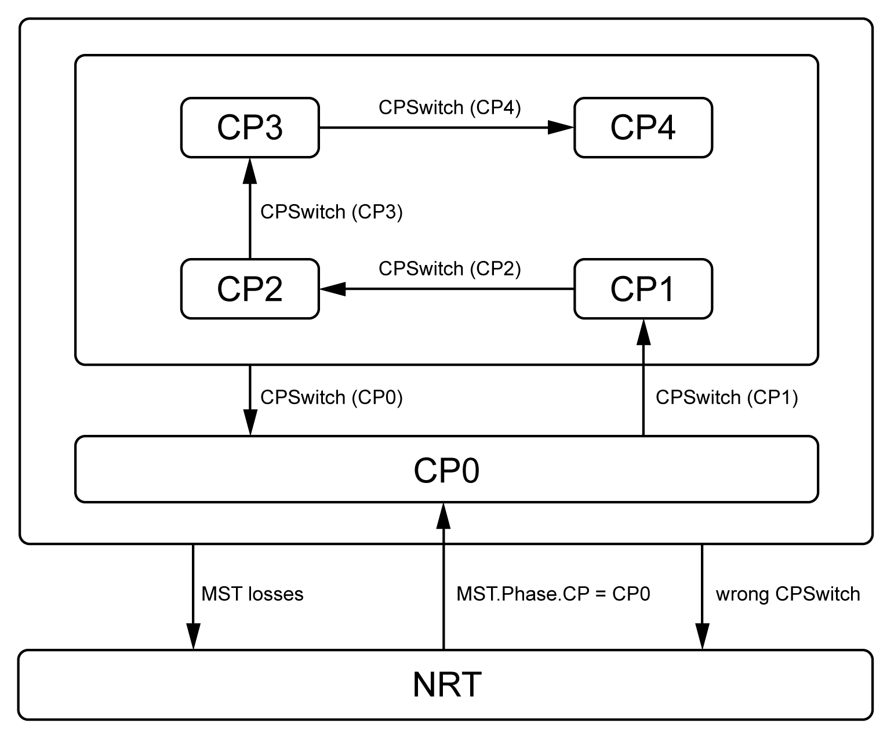

# Sercos Communication State Machine and Communication Phases

## Overview

The Sercos communication state machine uses the communication state NRT (Non-Real-Time) and five Communication Phases (CP) from CP0 to CP4.

## Communication States/Communication Phases

| Communication state/communication phase | Description |
| --- | --- |
| NRT (non-real-time) | Setup of Ethernet communication   * First state after power-on or after detected synchronization error * Ethernet communication active, master can send and subordinate devices can receive UCC telegrams (store-and-forward or cut-through) |
| Communication phase CP0 | Identification of participating subordinate devices:  MDT0 with MST is sent, AT0 acknowledges presence and returns Sercos address |
| Communication phase CP1 | Configuration of subordinate devices for non-cyclic communication over SVC:   * Master sends MDT0 and MDT1 as well as AT0 and AT1 containing C-DEV controls for subordinate devices (identification, topology) * Subordinate devices respond with appropriate status information in their allocated S-DEV controls |
| Communication phase CP2 | Configuration of Sercos communication parameters for CP3 and CP4:   * Master transmits length of MDTs and ATs with offsets for SVC and RTD of subordinate devices) * Communication over SVC * Condition for transition to CP3: procedure command S-0-0127 successful |
| Communication phase CP3 | Configuration of application parameters:   * Structure of MDT complete (offsets for SVC and RDT), configured application data not yet evaluated * Condition for transition to CP4: procedure command S-0-0128 successful |
| Communication phase CP4 | Sercos communication active:  Sercos communication fully established, bus ready for operation |

Transitions to higher communication phases are referred to as “phase-up”, transitions to lower communication phases as “phase-down”.

EIO0000005527.01