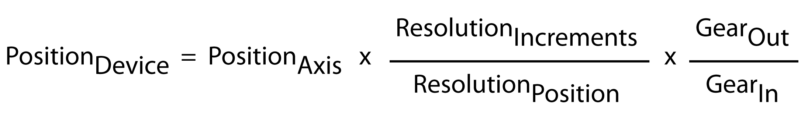

# Scaling - User Function

## Description

The user function Scaling is available for the following device objecs:

* [DRV\_Lexium62Integrated (Lexium ILM62 Drive)](DRV_Lexium62IntegratedLexiumILM62Dr-0684ED06.html), Lexium ILM62 drives
* [DRV\_Lexium62 (Lexium 62 Drive)](DRV_Lexium62Lexium62Drive-DeviceObj-0684F462.html), Lexium LXM62 drives

The user function Scaling comprises the parameters used to specify the ratio between motor rotation and axis movement according to the following equation:

## Parameter IncrementResolution

|  |  |
| --- | --- |
| Data type | DINT(1..2147483647) |
| Traceable | Yes |

The parameter IncrementResolution lets you specify the resolution in increments of a motor revolution. For scaling, the value of the parameter IncrementResolution is divided by the value of the parameter PositionResolution.

## Parameter PositionResolution

|  |  |
| --- | --- |
| Data type | LREAL |
| Traceable | Yes |

The parameter PositionResolution lets you specify the modulo position of the axis. For scaling, the value of the parameter IncrementResolution is divided by the value of the parameter PositionResolution.

## Parameter GearIn

|  |  |
| --- | --- |
| Data type | UDINT |
| Traceable | Yes |

The parameter PositionResolution lets you specify a gear factor for scaling. The value of the parameter GearIn is divided by the value of the parameter GearOut.

## Parameter GearOut

|  |  |
| --- | --- |
| Data type | UDINT |
| Traceable | Yes |

The parameter GearOut lets you specify a gear factor for scaling. The value of the parameter GearIn is divided by the value of the parameter GearOut.

## Parameter InvertDirection

|  |  |
| --- | --- |
| Data type | BOOL |
| Traceable | Yes |

The parameter InvertDirection lets you invert the direction of movement.

For details, refer to the Lexium LXM62 Drive Device Objects and Parameters guide.

## Parameter IncrementRange

|  |  |
| --- | --- |
| Data type | ULINT |
| Traceable | Yes |

The parameter IncrementRange lets you specify the range within which the positions are calculated.

## Parameter IncrementConfigurationWritable

|  |  |
| --- | --- |
| Data type | BOOL |
| Traceable | Yes |

The parameter IncrementConfigurationWritable indicates whether the parameters IncrementRange and IncrementResolution can be written.

EIO0000005527.01