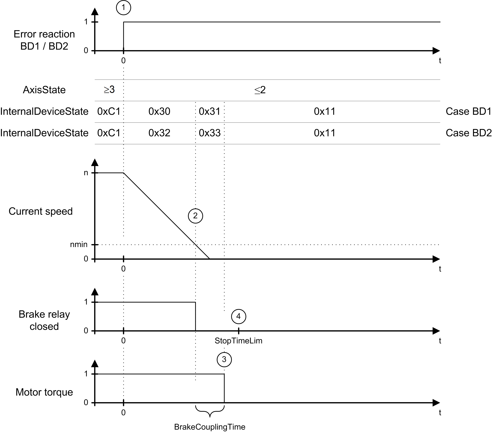

# Diagnostics-Specific Information on Lexium 62 Drives

## Error Responses

The following table lists the responses of Lexium 62 drives to detected errors, sorted by severity (from high to low).

| Device response | Diagnostic class | Subclass | Meaning |
| --- | --- | --- | --- |
| AD | 3 | 6 | * The motor torque is removed. By default, the brake engages immediately. * The behavior of the brake can be modified using the parameter BrakeMode. |
| BD1 | 3 | 5 | * Best possible stop: the drive is decelerated with the peak current MaxDrivePeakCurrent. * MaxDrivePeakCurrent can be set using UserDrivePeakCurrent.  An additional limit set with UserCurrentLimit is not applied. * The brake engages at a speed of rotation of less than 10 rpm.  The behavior of the brake can be modified using the parameter BrakeMode. * The drive no longer generates torque at the latest after StopTimeLim + BrakeCouplingTime. If the speed of rotation is greater than 10 rpm after StopTimeLim (default value: 400 ms), then the diagnostic message  [8140 Motor ramp down time exceeded](MotorStopTimeLimExceeded-03C09F39.html) is triggered. |
| BD2 | 3 | 4 | * Standstill after user-defined stop. The drive is decelerated to a standstill with the deceleration ControllerStopDec and the jerk ControllerStopJerk. * The current is limited to the peak current MaxDrivePeakCurrent. MaxDrivePeakCurrent can be set using UserDrivePeakCurrent.  An additional limit with UserCurrentLimit is not applied. * The actual values (default) or reference values are used as the start values for the deceleration profile, depending on the parameter UserDefinedStopMode. * The brake engages at a speed of rotation of less than 10 rpm.    + The drive no longer generates torque at the latest after StopTimeLim + BrakeCouplingTime. If the speed of rotation is greater than 10 rpm after StopTimeLim (default value: 400 ms), then the diagnostic message [8140 Motor StopTimeLim exceeded](MotorStopTimeLimExceeded-03C09F39.html) is triggered. |
| CD | 3 | 3 | * Standstill due to specified reference value. * The axis must be brought to a standstill by the application program. This has to be done by a user-defined motion profile. The standstill has to be reached at the latest after StopTimeLim (default value: 400 ms) and ControllerEnable must be disabled.  Otherwise, the diagnostic message [8140 Motor StopTimeLim exceeded](MotorStopTimeLimExceeded-03C09F39.html) is triggered. |
| D | 2 | 2 | Notification message to the controller. The application can be used for controlled, synchronous deceleration to a standstill.  If the controller does not trigger a response in the drive, a diagnostic message with the device responses AD, BD1, BD2, or CD may be triggered. |
| E | 1 | 1 | Message |

The device responses listed above are also triggered by the following events:

* If ControllerEnable is set to FALSE and the AxisState is greater than 2, device response BD2 is triggered by default. The response can be modified with the parameter ControllerEnableStopMode.
* If TorqueEnable is set to FALSE and the AxisState is greater than 2, the device response AD is triggered.

In the event of response BD2, you can decide whether the defined deceleration profile starts with actual or reference values. By default, the deceleration profile is started with actual values:

|  |  |
| --- | --- |
| Starting with actual values | * Detected position deviation errors are considered in the deceleration profile. * If the response is triggered by a collision with an obstacle, no movement is commanded to a position behind the obstacle. * Since no valid value is available in the drive for the actual acceleration, the value for the start acceleration is set to zero. * If the actual values differ from the reference values, a jump results with regard to the reference velocity and the reference position. |
| Starting with reference values | * No jumps occur in the reference value profile. * This mode is useful to achieve a coordinated deceleration to standstill of several drives. The reference value can be located behind an obstacle. The drive attempts to move to the target position. If it is blocked before the target position is reached, the current is limited to the peak current MaxDrivePeakCurrent. * If the drive is already blocked by the obstacle, the drive attempts to use the requested reference value profile with MaxDrivePeakCurrent. * If the drive current had been limited to the value of UserCurrentLimit before the response was triggered, the drive accelerates until the position deviation error is corrected. |

## Timing Diagram for Response AD

In the case of a detected error with the response AD ([Drive](#DeviceResponses-Drive-4F07514F)) (1), torque is removed and the brake relay is opened. The axis behavior depends on whether the motor is equipped with a holding brake.

After expiration of the BrakeCouplingTime, the axis is in the error state 0x10 or 0x11. To exit these states, the diagnostic message has to be acknowledged and the axis has to come to a standstill.

Timing diagram for response AD:

## Timing Diagram for Responses BD1 / BD2

In the case of a diagnostic message with response `BD1` or `BD2`, two scenarios can result:

* [Deceleration Within the Maximum Deceleration Time](#DeviceResponses-Drive-4F07514F__RampingDownWithinTheMaximumRamp-Dow-4F0AA6D5)
* [Deceleration Time Exceeded](#DeviceResponses-Drive-4F07514F__MaximumRamp-DownTimeExceeded-4F0AADFF)

## Deceleration Within the Maximum Deceleration Time

| If... | Then... |
| --- | --- |
| An error is detected with response BD1 (**1**). | The axis decelerates with maximum current (MaxDrivePeakCurrent). |
| An error detected with response BD2 (**1**). | The axis decelerates according to the parameters ControllerStopDec and ControllerStopJerk. |

As soon as the actual velocity falls below the velocity threshold (actual velocity < nmin) (**2**), the brake relay is switched to engage the brake.

The axis comes to a standstill before the maximum deceleration time expires (parameter StopTimeLim) (**4**). After the brake engagement time expires (parameter BrakeCouplingTime) (**3**), the torque is removed from the motor.

Timing diagram for responses BD1 / BD2 (deceleration within the maximum deceleration time):

## Deceleration Time Exceeded

| If... | Then... |
| --- | --- |
| An error is detected with response BD1 (**1**). | The axis decelerates with maximum current (MaxDrivePeakCurrent). |
| An error is detected with response BD2 (**1**). | The axis decelerates according to the parameters ControllerStopDec and ControllerStopJerk. |

The axis does not come to a standstill before the maximum deceleration time expires (parameter StopTimeLim) (**2**) (actual velocity < nmin). Therefore, diagnostic message [8140 Motor StopTimeLim exceeded](MotorStopTimeLimExceeded-03C09F39.html) is triggered.

Timing diagram for responses BD1 / BD2 (maximum deceleration time exceeded):

EIO0000005527.01