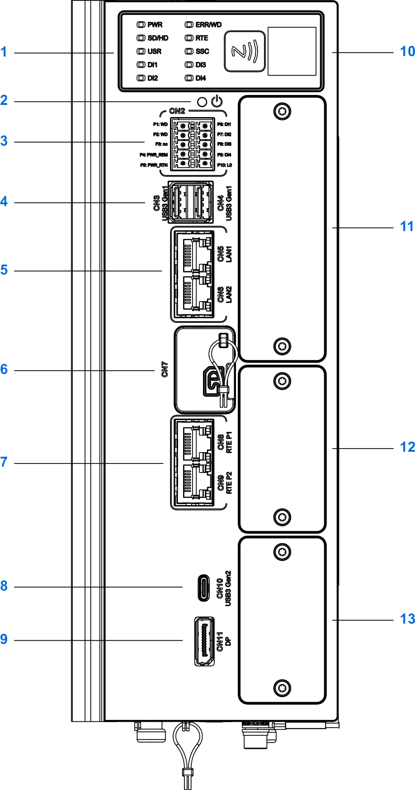
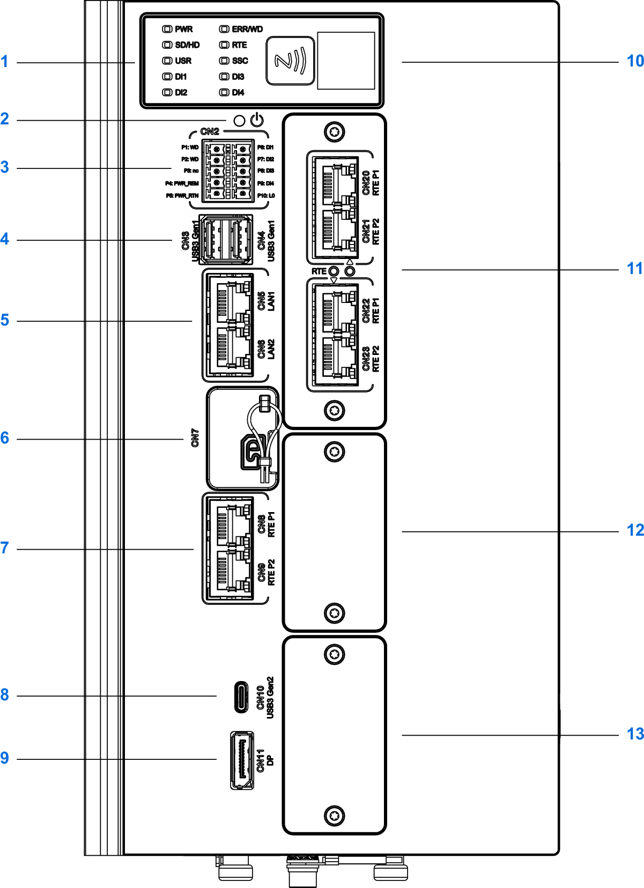
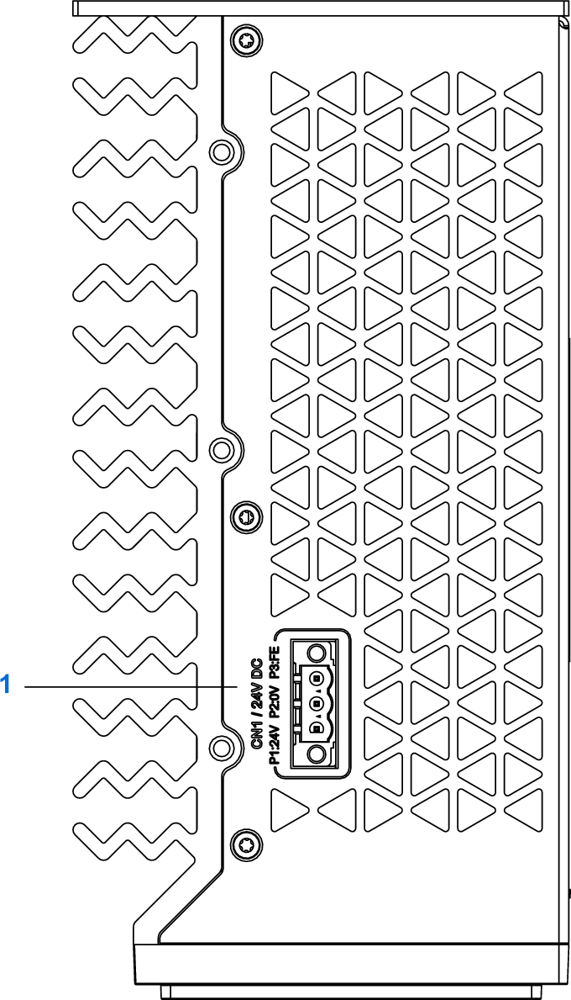
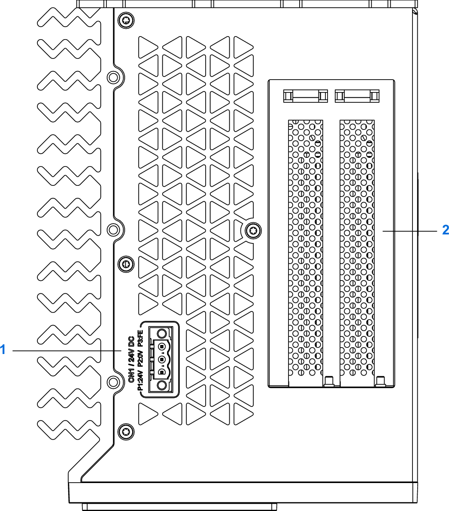
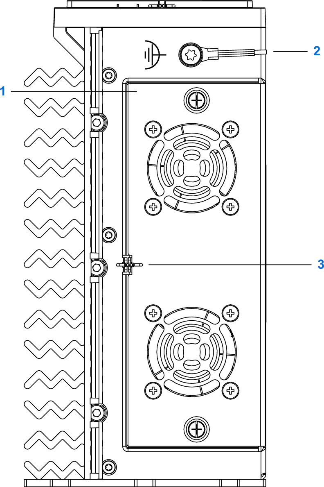
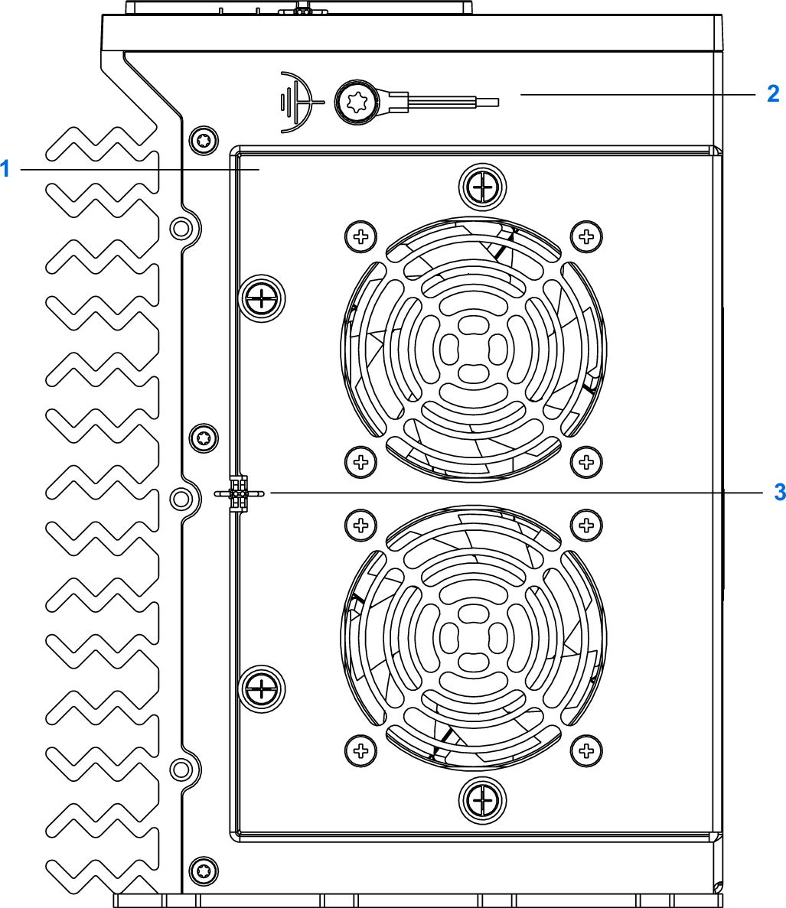

# Overview

## Front View

Front view MN660•••••••1•••:

| Item number | Item |
| --- | --- |
| 1 | Status LEDs |
| 2 | Power button |
| 3 | Digital I/Os (CN2):   * 4 digital inputs (**DI1** to **DI4** and **L0**) * Status output, watchdog (**P1: WD**, **P2: WD**) * Input for controlling power (**P4: PWR\_REM**, **P5: PWR\_RTN**) |
| 4 | USB3 ports, Gen 1, Type-A (CN3, CN4) |
| 5 | Ethernet ports LAN (CN5, CN6) |
| 6 | SD card slot (CN7), sealable (sealing wire and seal not included) |
| 7 | Real-Time Ethernet ports RTE (CN8, CN9) |
| 8 | USB3 port, Gen 2, Type-C (CN10) |
| 9 | DisplayPort (CN11) |
| 10 | Reserved |
| 11 | Slot for extensions, depending on the product reference |
| 12 | Slot 2 for modules |
| 13 | Slot 1 for modules |

The illustration depicts a controller without equipment installed either the slot for extensions or in slot 1 and slot 2. Your controller may have less or additional extensions, depending on the controller reference. Refer to [Type Code](TypeCode-E6EB6EB6.html) for details on M660 controller references.

Front view MN660•••••••2•••••:

| Item number | Item |
| --- | --- |
| 1 | Status LEDs |
| 2 | Power button |
| 3 | Digital I/Os (CN2):   * 4 digital inputs (**DI1** to **DI4** and **L0**) * Status output, watchdog (**P1: WD**, **P2: WD**) * Input for controlling power (**P4: PWR\_REM**, **P5: PWR\_RTN**) |
| 4 | USB3 ports, Gen 1, Type-A (CN3, CN4) |
| 5 | Ethernet ports LAN (CN5, CN6) |
| 6 | SD card slot (CN7), sealable (sealing wire and seal not included) |
| 7 | Real-Time Ethernet ports RTE (CN8, CN9) |
| 8 | USB3 port, Gen 2, Type-C (CN10) |
| 9 | DisplayPort (CN11) |
| 10 | Reserved |
| 11 | Slot for extensions, depending on the product reference |
| 12 | Slot 2 for modules |
| 13 | Slot 1 for modules |

The illustration depicts a controller with a Real-Time Ethernet extension ports RTE (CN20, CN21, CN22, CN23) installed, and without modules in slot 1 and slot 2. Your controller may have less or additional extensions, depending on the controller reference. Refer to [Type Code](TypeCode-E6EB6EB6.html) for details on M660 controller references.

## Top View

Top view MN660•••••••1•••:

| Item number | Item |
| --- | --- |
| 1 | Power supply connector (**CN1 / 24V DC**) |

Top view MN660•••••••2•••••:

| Item number | Item |
| --- | --- |
| 1 | Power supply connector (**CN1 / 24V DC**) |
| 2 | Slots for PCI Express cards |

## Bottom View

Bottom view MN660•••••••1•••:

| Item number | Item |
| --- | --- |
| 1 | Fan kit |
| 2 | Grounding screw for functional ground (FE) |
| 3 | Sealing lug, sealable (sealing wire and seal not included) |

The illustration shows an MN660•••••••1••• controller with an optional fan kit. Your controller may not be equipped with a fan kit. Refer to [Accessories](Accessories-E6F36BC8.html) for the fan kit.

Bottom view MN660•••••••2•••••:

| Item number | Item |
| --- | --- |
| 1 | Fan kit |
| 2 | Grounding screw for functional ground (FE) |
| 3 | Sealing lug, sealable (sealing wire and seal not included) |

EIO0000005519.02