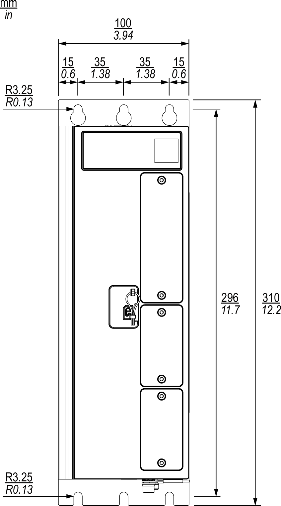
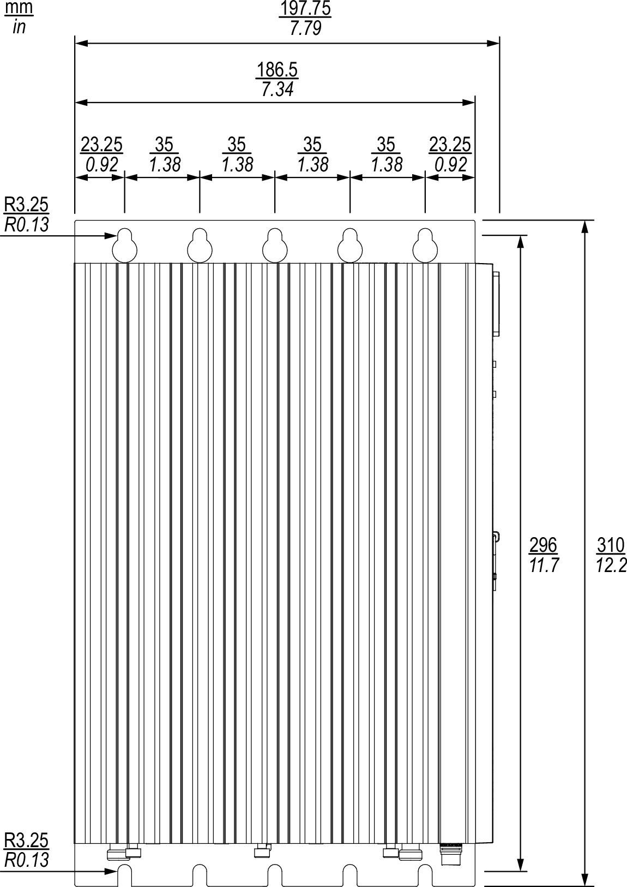
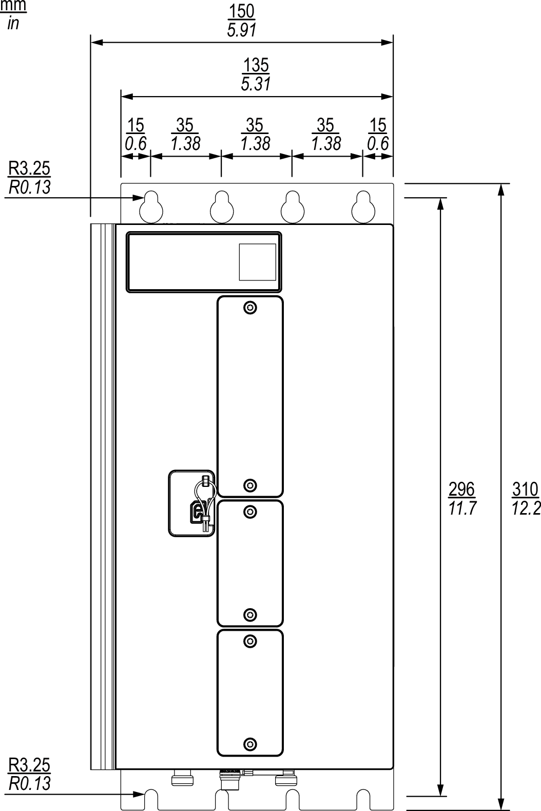

# Mechanical Data

## Dimensions MN660•••••••1••• (Narrow Housing)

Front view with mounting plate shown for rear wall mounting:

The thickness of the mounting plate is 3 mm (0.12 in).

Side view with mounting plate shown for side wall mounting:

The thickness of the mounting plate is 3 mm (0.12 in).

## Dimensions MN660•••••••2••••• (Wide Housing)

Front view with mounting plate shown for rear wall mounting:

The thickness of the mounting plate is 3 mm (0.12 in).

Side view with mounting plate shown for wall mounting:

The thickness of the mounting plate is 3 mm (0.12 in).

## Weight

|  |  |  |  |
| --- | --- | --- | --- |
| **Characteristic** | **Unit** | **Value** | |
|  |
| Maximum weight MN660C without fan kit and without mounting plate(1) | kg (lb) | 4.65 (10.25) | |
| Maximum weight MN660P without mounting plate(1) | kg (lb) | 6.0 (13.23) | |
| (**1**) The weight of the controller depends on controller reference. | | | |

EIO0000005519.02