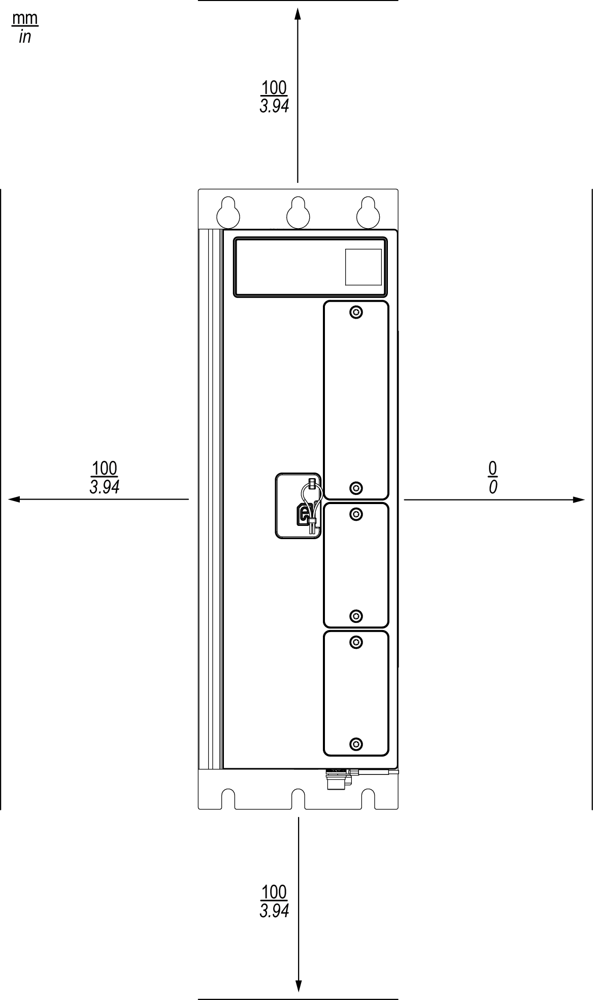
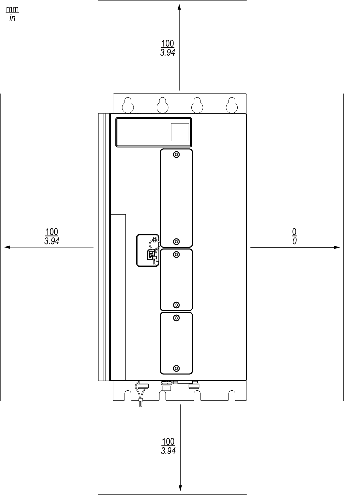
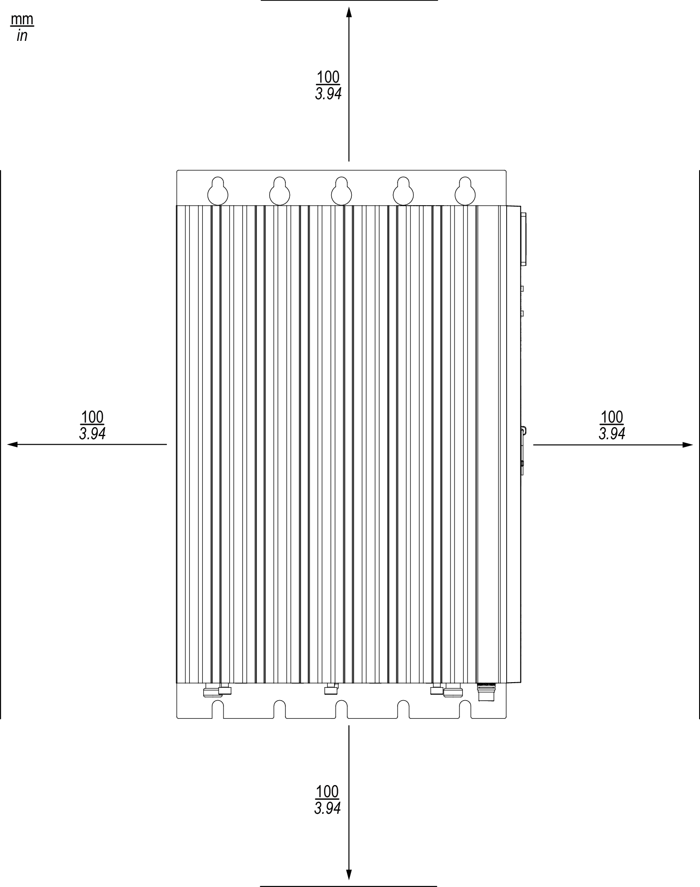

# Prerequisites and Requirements

## Inspecting the Product

Verify the product version by means of the nameplate and the [type code](TypeCode-E6EB6EB6.html#TypeCode-E6EB6EB6).

Inspect the product for visible damage.

Damaged products may cause electric shock or unintended equipment operation.

| DANGER | |
| --- | --- |
|  | ELECTRIC SHOCK OR UNINTENDED EQUIPMENT OPERATION  * Do not use damaged products. * Keep foreign objects (such as chips, screws or wire clippings) from getting into the product.  Failure to follow these instructions will result in death or serious injury. |

Contact your local Schneider Electric service representative if you detect any damage whatsoever to the products.

## Control Cabinet/Enclosure

The controller must only be operated in a control cabinet/enclosure with a minimum IP54 rating.

| WARNING | |
| --- | --- |
|  | UNINTENDED EQUIPMENT OPERATION  * Install and operate the controller in a control cabinet or enclosure that is secured by a keyed or tooled locking mechanism. * Verify that the control cabinet or enclosure meets all requirements necessary to operate the controller in the environment and under the conditions specified in the present document.  Failure to follow these instructions can result in death, serious injury, or equipment damage. |

The pollution degree of the controller is 2 and the degree of protection is IP 20. The control cabinet or enclosure must be designed in such a way as to meet the corresponding requirements.

The mounting surface in the control cabinet or enclosure must be plane (planarity tolerance: 0.5 mm (0.019 in)) and sufficiently rigid to support the controller under all operating conditions.

The ventilation or air conditioning of the control cabinet or enclosure must be sufficient so that the specified ambient conditions for the controller and the other equipment operated in the control cabinet or enclosure are complied with under all operating conditions. If additional cooling is required, use the optional fan kit (refer to [Accessories](Accessories-E6F36BC8.html)).

The efficiency of convection cooling is slightly better if the controller is mounted via its rear wall as compared to its side wall. Refer to [Mounting Types](Mounting-E7061508.html#Mounting-E7061508__MountingTypes-2BAFC7C1) for details.

## Clearances

The following minimum clearances between the controller and adjacent structures or other equipment are required for rear wall mounting:

A distance of at least 100 mm (3.94 in) is required between the controller and the door of the control cabinet or enclosure.

The following minimum clearances between the controller and adjacent structures or other equipment are required for side wall mounting:

A distance of at least 100 mm (3.94 in) is required between the controller and the door of the control cabinet or enclosure.

EIO0000005519.02