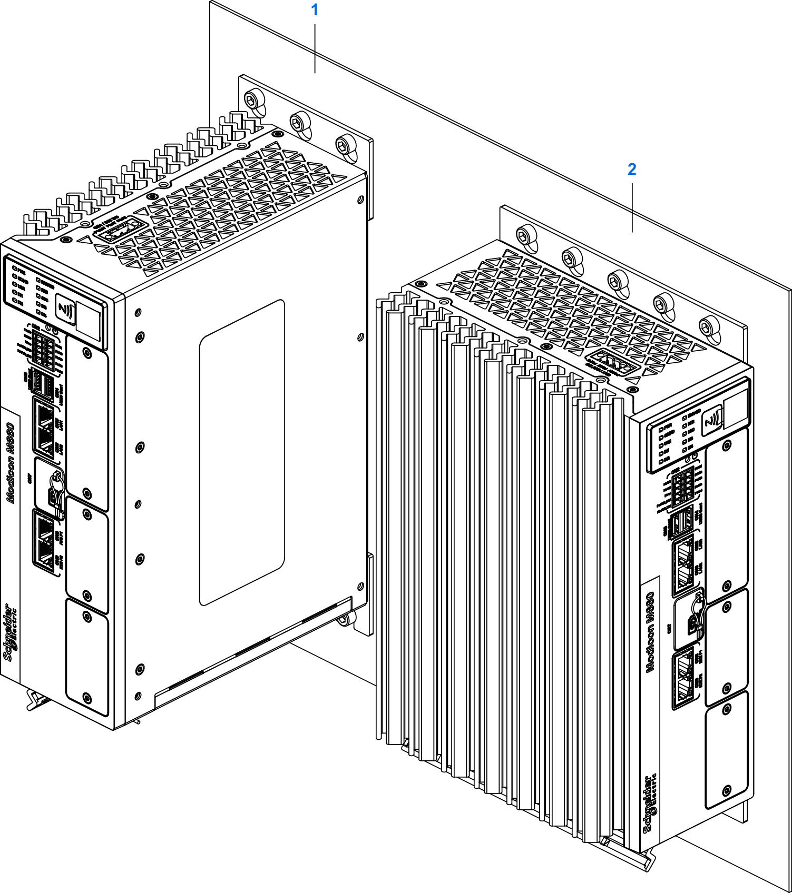

# Mounting

## Mounting Types

The controller must be mounted vertically (power supply connector CN1 at the top), regardless of the type of mounting. The controller can be mounted to the mounting surface with its rear wall or its side wall:

| Item | Type of mounting |
| --- | --- |
| 1 | Rear wall mounting |
| 2 | Side wall mounting |

NOTE: The efficiency of convection cooling is slightly better if the controller is mounted via its rear wall as compared to its side wall.

The controller is shipped with two mounting plates for rear wall mounting. An optional mounting kit allows for side wall mounting (refer to [Accessories](Accessories-E6F36BC8.html)).

## Preparing the Controller for Mounting

Procedure:

| Step | Action |
| --- | --- |
| 1 | Rear wall mounting:  * Fit the mounting plate with the holes to the top rear wall of the controller, and align the holes in the mounting plate with the threads in the controller. * Fit the mounting plate with the slots to the bottom rear wall of the controller, and align the holes in the mounting plate with the threads in the controller.  Side wall mounting:  * Fit the mounting plate to the side wall of the controller with the slots pointing down, and align the holes in the mounting plate with the threads in the controller. |
| 2 | Screw the mounting plate(s) to the controller using the M4 (TX20) screws supplied with the controller or with the side wall mounting plate with a tightening torque of 2.2 Nm (19.47 lb.in). |
| 3 | Verify that you have used screws for all holes in the mounting plate(s). |

## Mounting the Controller

The following illustration shows the grid for the drill holes in the mounting surface for rear wall mounting (MN660•••••••1•••):

The following illustration shows the grid for the drill holes in the mounting surface for rear wall mounting (MN660•••••••2•••••):

The following illustration shows the grid for the drill holes in the mounting surface for side wall mounting (MN660•••••••1••• and MN660•••••••2•••••):

Mounting procedure:

| Step | Action |
| --- | --- |
| 1 | Drill holes with a diameter of 6.3 mm into the mounting surface at all positions indicated by the grid illustrations. |
| 2 | Screw the controller to the mounting surface using M6 screws and M6 nuts. Secure the nuts with washers (ISO 7093). Use a tightening torque of 5 Nm (44.25 lb.in). The screw length depends on the thickness of the mounting surface. |
| 3 | Verify that you have used screws, nuts and washers for all holes. |
| 4 | Verify that you have not used washers between the mounting plate of the controller and the mounting surface. |
| 5 | If you have used a separate mounting surface, mount the assembly to the rear wall of your control cabinet or enclosure. |
| 6 | Verify the mechanical strength and rigidity of the entire assembly. |

EIO0000005519.02