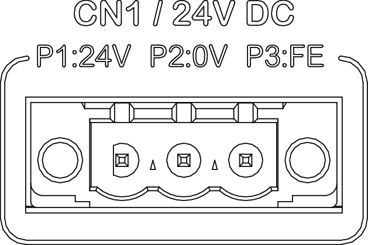

# Wiring the Power Supply

## Overview

| DANGER | |
| --- | --- |
|  | HAZARD OF ELECTRIC SHOCK, EXPLOSION OR ARC FLASH  * Disconnect all power from all equipment including connected devices prior to removing any covers or doors, or installing or removing any accessories, hardware, cables, or wires except under the specific conditions specified in the appropriate hardware guide for this equipment. * Always use a properly rated voltage sensing device to confirm the power is off where and when indicated. * Replace and secure all covers, accessories, hardware, cables, and wires and confirm that a proper ground connection exists before applying power to the equipment. * Use only the specified voltage when operating this equipment and any associated products.  Failure to follow these instructions will result in death or serious injury. |

| WARNING | |
| --- | --- |
|  | POTENTIAL OF OVERHEATING AND FIRE  * Do not connect the controller directly to mains voltage. * Use only isolated PELV power supply units and circuits to supply power to the controller1. * Verify that the wire cross sections and the length of the power supply cable are suitable for the currents specified in the present document and on the nameplate of your controller.  Failure to follow these instructions can result in death, serious injury, or equipment damage. |

1 For compliance with UL requirements, the power supply unit must also conform to the criteria of NEC Class 2, and be inherently current-limited to a maximum power output availability of less than 100 VA (approximately 4 A at nominal voltage), or not inherently limited but with an additional protection device such as a circuit breaker or fuse meeting the requirements of clause 9.4 Limited-energy circuit of UL 61010-1. In all cases, the current limit must not exceed that of the electric characteristics and wiring diagrams for the equipment described in the present document. In all cases, the power supply unit must be grounded, and you must separate Class 2 circuits from other circuits. If the indicated rating of the electrical characteristics or wiring diagrams are greater than the specified current limit, multiple Class 2 power supply units may be used.

Insufficient or improper grounding can cause Electromagnetic Interference (EMI). EMI can lead to communication interruptions and have other adverse effects on the operation of your machine/process.

| WARNING | |
| --- | --- |
|  | INSUFFICIENT OR IMPROPER GROUNDING  * Verify that you have properly connected the grounding screw of the controller to an independent grounding point in your system. * Verify that you have properly connected pin FE of connector CN1 of the controller to an independent grounding point in your system. * Do not connect grounding wires or grounding cables from the controller to grounding connections of other equipment in your system. * Verify that there are no ground loops in your system. * Verify compliance of the grounding of your system with all pertinent codes, standards and regulations applicable at the site of installation of your system.  Failure to follow these instructions can result in death, serious injury, or equipment damage. |

Multipoint grounding is permissible if connections are made to an equipotential ground plane.

The controller is supplied by an external 24 Vdc power supply unit. The power supply unit must meet the following requirements:

* Protective Extra Low Voltage (PELV) power supply unit
* Isolated power supply unit
* Regulated power supply unit if the AC input current is not constant
* No switching elements between the secondary side of the power supply unit and the controller

The power supply input of the controller is equipped with a non-replaceable internal 10 A fuse.

## Wiring Requirements, Wire Cross Sections, Stripping Length

| Characteristic | Value |
| --- | --- |
| Shielded cable | No |
| Twisted pair cable | No |
| Conductor material | Copper, rated for temperatures of 105 °C (221 °F) or higher |
| Maximum cable length | 30 m (98,43 ft) |
| Stripping length | 10 mm (0.35 in) |
| Wire cross section, single wire (solid or stranded) without wire ferrule | 1.3 … 2.5 mm2 (AWG 16 … 14) |
| Wire cross section, single wire (stranded) with insulated or uninsulated wire ferrule | 1.3 … 2.5 mm2 (AWG 16 …14) |
| Wire cross section, two wires (stranded) with insulated twin wire ferrule | 2 x 1.3 ... 1.5 mm2 (AWG 2 x 16) |

## Wiring the Power Supply Connector CN1

Pins of connector CN1:

| Designation | Function |
| --- | --- |
| **P1:24V** | 24 Vdc in |
| **P2:0V** | 0 Vdc in |
| **P3:FE** | Functional ground |

Refer to [Power supply - Technical Data](PowerSupply-E70A4DF9.html) for additional information.

EIO0000005519.02