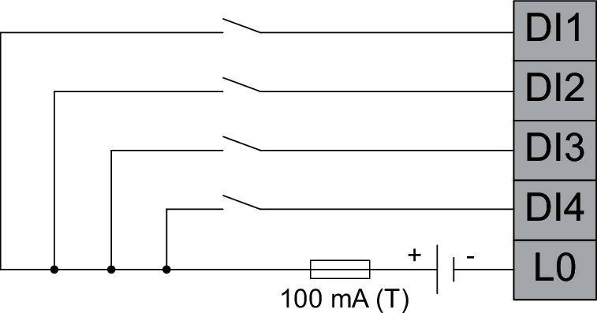

# Wiring the Digital Inputs

| WARNING | |
| --- | --- |
|  | INSUFFICIENT AND/OR INEFFECTIVE SAFETY-RELATED FUNCTIONS  * In your risk assessment, verify that the controller meets all requirements regarding the safety-related requirements and capabilities applicable to your machine/process. * Verify that your risk assessment takes into account all potential consequences that can arise from the controller becoming inoperative. * Do not use the inputs or the output to implement functions related to functional safety (for example, as per ISO 13849), or as a safety-related function (for example, as per IEC 61800-5-2). * Use only equipment expressly intended and certified for safety-related purposes to implement safety-related functions. * During the design as well as during commissioning or recommissioning of the machine/process, verify the correct operation and effectiveness of all safety-related functions and non-safety-related functions by performing comprehensive tests for all operating states, for the defined safe state of your machine/process, and for all potential error situations. * Verify that your overall machine/process in which the controller is used is properly certified and/or approved according to all standards, regulations, and directives applicable at the installation site of the machine/process.  Failure to follow these instructions can result in death, serious injury, or equipment damage. |

## Connector Overview CN2

| Pin Designation | Signal/Function |
| --- | --- |
| **P1: WD** | Status output (watchdog) |
| **P2: WD** | Status output (watchdog) |
| **P3: nc** | No connection |
| **P4: PWR\_REM** | Input for controlling power on/off/standby, 24 V |
| **P5: PWR\_RTN** | Input for controlling power on/off/standby, 0 V |
| **P6: DI1** | Digital input 1 |
| **P7: DI2** | Digital input 2 |
| **P8: DI3** | Digital input 3 |
| **P9: DI4** | Digital input 4 |
| **P10: L0** | Common for digital inputs |

## Wiring the Digital Inputs DI1 ... DI4

Connect the following pins of CN2:

* **P6: DI1**
* **P7: DI2**
* **P8: DI3**
* **P9: DI4**
* **P10: L0**

Ensure proper fusing with a 100 mA type T fuse according to the following wiring diagram:

After you have completely wired connector CN2, properly secure the wires in the control cabinet.

EIO0000005519.02