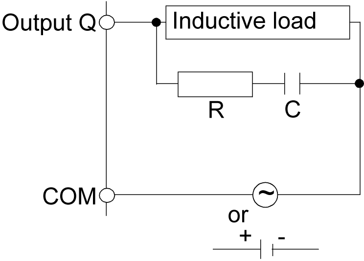
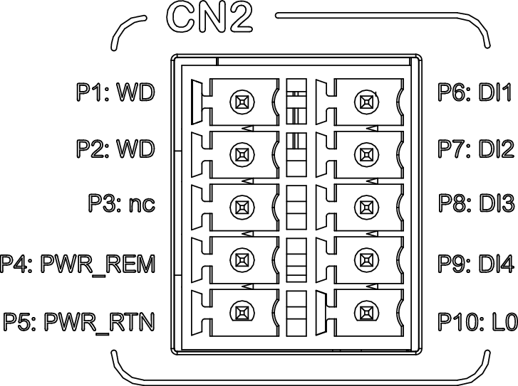

# Wiring the Status Output (Watchdog)

| WARNING | |
| --- | --- |
|  | INSUFFICIENT AND/OR INEFFECTIVE SAFETY-RELATED FUNCTIONS  * In your risk assessment, verify that the controller meets all requirements regarding the safety-related requirements and capabilities applicable to your machine/process. * Verify that your risk assessment takes into account all potential consequences that can arise from the controller becoming inoperative. * Do not use the inputs or the output to implement functions related to functional safety (for example, as per ISO 13849), or as a safety-related function (for example, as per IEC 61800-5-2). * Use only equipment expressly intended and certified for safety-related purposes to implement safety-related functions. * During the design as well as during commissioning or recommissioning of the machine/process, verify the correct operation and effectiveness of all safety-related functions and non-safety-related functions by performing comprehensive tests for all operating states, for the defined safe state of your machine/process, and for all potential error situations. * Verify that your overall machine/process in which the controller is used is properly certified and/or approved according to all standards, regulations, and directives applicable at the installation site of the machine/process.  Failure to follow these instructions can result in death, serious injury, or equipment damage. |

## Inductive Loads

The status output is not intended for directly switching inductive loads. For switching inductive loads, you must protect the relay output using additional, certified protective circuits or devices.

Inductive loads can cause contact welding of relay contacts.

| WARNING | |
| --- | --- |
|  | CONTACT WELDING OF RELAY CONTACTS  * Protect the relay output from damage caused by inductive loads using an appropriate external protective circuit or device such as a peak limiter, RC circuit or flyback diode. * Do not connect the relay output to capacitive loads.  Failure to follow these instructions can result in death, serious injury, or equipment damage. |

**RC element:** This circuit can be used for both AC and DC load power circuits.

**C** Value from 0.1 to 1 μF

**R** Resistor of approximately the same resistance value as the load

**Diode:** This circuit can be used for DC load power circuits.

Use a diode with the following ratings:

* Reverse withstand voltage: power voltage of the load circuit x 10.
* Forward current: more than the load current.

**Varistor:** This circuit can be used for both AC and DC load power circuits.

In applications where the inductive load is switched on and off frequently and/or rapidly, ensure that the continuous energy rating (J) of the varistor exceeds the peak load energy by 20 % or more.

## Connector Overview CN2

| Pin Designation | Signal/Function |
| --- | --- |
| **P1: WD** | Status output (watchdog) |
| **P2: WD** | Status output (watchdog) |
| **P3: nc** | No connection |
| **P4: PWR\_REM** | Input for controlling power on/off/standby, 24 V |
| **P5: PWR\_RTN** | Input for controlling power on/off/standby, 0 V |
| **P6: DI1** | Digital input 1 |
| **P7: DI2** | Digital input 2 |
| **P8: DI3** | Digital input 3 |
| **P9: DI4** | Digital input 4 |
| **P10: L0** | Common for digital inputs |

## Cable Requirements, Wire Cross Sections, Stripping Length

| Characteristic | Value |
| --- | --- |
| Shielded cable | No |
| Twisted pair cable | No |
| Conductor material | Copper, 75 °C (167 °F) |
| Maximum cable length | 30 m (98.43 ft) |
| Stripping length | 9 mm (0.35 in) |
| Wire cross section, single wire (solid or stranded) without wire ferrule | 1.0 … 1.5 mm2 (AWG 17 … 16) |
| Wire cross section, single wire (stranded) with uninsulated wire ferrule | 1.0 … 1.5 mm2 (AWG 17 … 16) |

## Wiring the Status Output (Watchdog)

Connect the following pins at CN2 to an appropriate output device:

* **P1: WD**
* **P2: WD**

After you have completely wired connector CN2, bundle the cables connected to CN2 and secure them properly in the control cabinet.

EIO0000005519.02