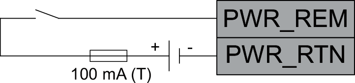

# Wiring the Input for Controlling Power On/Off/Standby

## Connector Overview CN2

| Pin Designation | Signal/Function |
| --- | --- |
| **P1: WD** | Status output (watchdog) |
| **P2: WD** | Status output (watchdog) |
| **P3: nc** | No connection |
| **P4: PWR\_REM** | Input for controlling power on/off/standby, 24 V |
| **P5: PWR\_RTN** | Input for controlling power on/off/standby, 0 V |
| **P6: DI1** | Digital input 1 |
| **P7: DI2** | Digital input 2 |
| **P8: DI3** | Digital input 3 |
| **P9: DI4** | Digital input 4 |
| **P10: L0** | Common for digital inputs |

## Wiring Requirements, Wire Cross Sections, Stripping Length

| Characteristic | Value |
| --- | --- |
| Shielded cable | No |
| Twisted pair cable | No |
| Conductor material | Copper, 75 °C (167 °F) |
| Maximum cable length | 30 m (98.43 ft) |
| Stripping length | 9 mm (0.35 in) |
| Wire cross section, single wire (solid or stranded) without wire ferrule | 0.5 … 1.5 mm2 (AWG 20 … 16) |
| Wire cross section, single wire (stranded) with uninsulated wire ferrule | 0.5… 1.5 mm2 (AWG 20 … 16) |
| Wire cross section, single wire (stranded) with insulated wire ferrule | 0.5 … 0.75 mm2 (AWG 20 … 18) |

Connect the following pins at CN2 to an appropriate input device:

* **P4: PWR\_REM**
* **P5: PWR\_RTN**

Ensure proper fusing with a 100 mA type T fuse according to the following wiring diagram:

After you have completely wired connector CN2, bundle the cables connected to CN2 and secure them properly in the control cabinet.

| WARNING | |
| --- | --- |
|  | UNINTENDED EQUIPMENT OPERATION  Verify that your machine/process is in a defined safe state before changing the power state of the controller.  Failure to follow these instructions can result in death, serious injury, or equipment damage. |

EIO0000005519.02